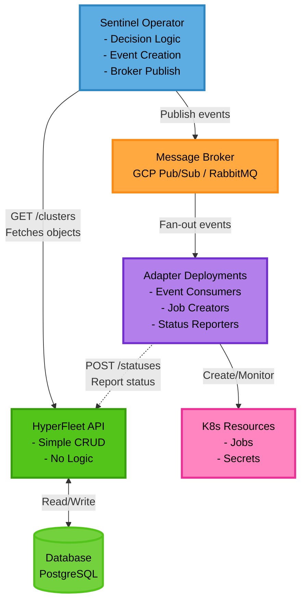
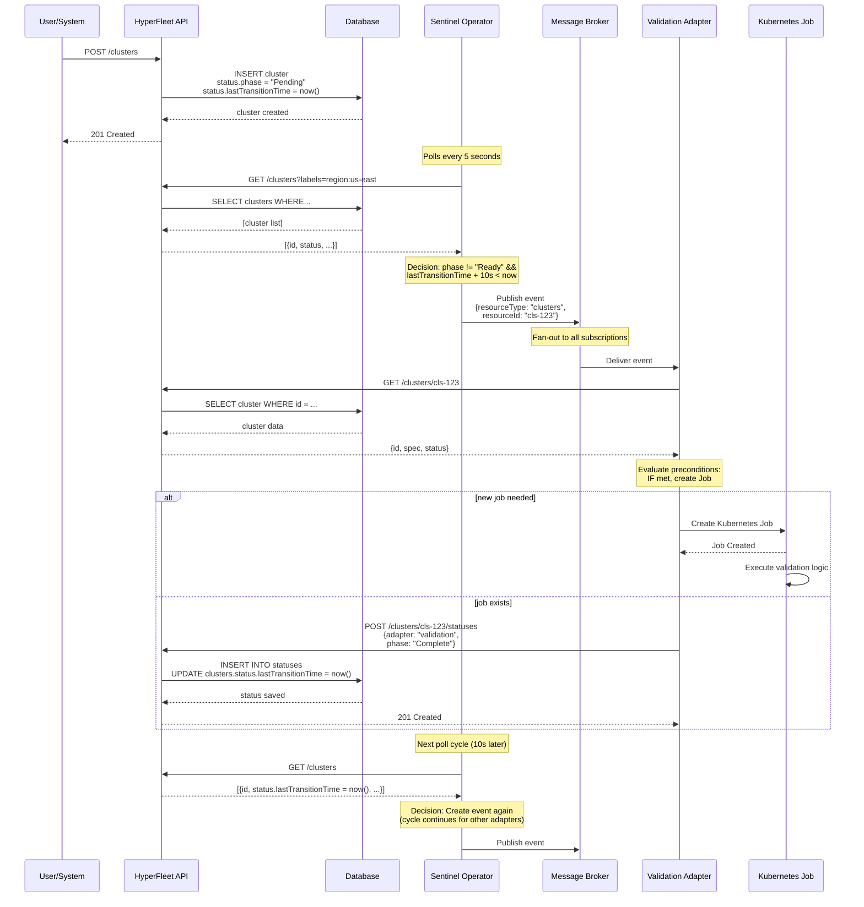
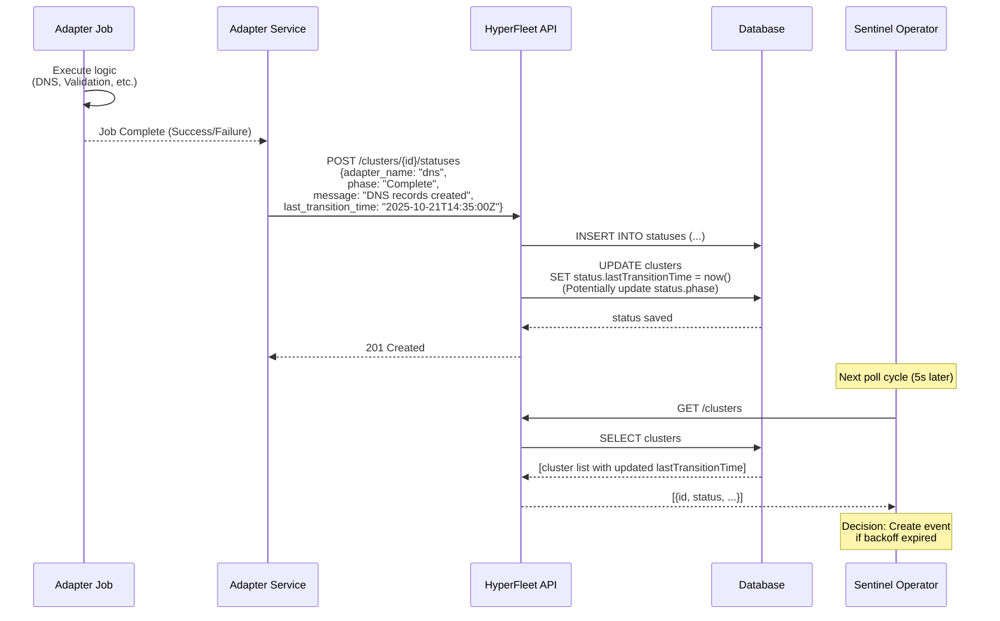

# HyperFleet v2 Architecture Summary

---

## Overview

HyperFleet v2 represents a significant architectural simplification from v1, removing the Outbox Pattern and consolidating business logic into the Sentinel Operator. This design reduces complexity while maintaining the event-driven, scalable nature of the system.

**Key Principle**: Separation of concerns - API for data storage, Sentinel for orchestration logic, Adapters for execution.

---

## Architecture Changes from v1

| Aspect | v1 Architecture | v2 Architecture |
|--------|----------------|-----------------|
| **Event Creation** | API creates outbox entries | Sentinel creates and publishes events |
| **Business Logic** | Distributed (API + Outbox Reconciler) | Centralized in Sentinel |
| **Message Publishing** | Outbox Reconciler polls and publishes | Sentinel publishes directly |
| **API Complexity** | Transactional writes + outbox management | Simple CRUD operations |
| **Components** | API + Database + Outbox Reconciler + Broker + Sentinel + Adapters | API + Database + Sentinel + Broker + Adapters |
| **Latency** | Lower (outbox polling delay) | Higher (Sentinel query/process N clusters) |

**Result**: Removed 1 component (Outbox Reconciler), simplified 2 components (API, Sentinel), reduced operational complexity.

---

## Component Architecture

For detailed visual diagrams, see:
- [Component Architecture Diagram](component-architecture-diagram.md) - Detailed Mermaid diagram showing all components and relationships
- [Data Flow Diagrams](data-flow-diagram.md) - Sequence diagrams for cluster creation, status updates, and decision logic

### High-Level Overview



---

## Components

### 1. HyperFleet API

**What**: Simple REST API providing:
- CRUD operations for HyperFleet resources (clusters, node pools, etc.) and their statuses.
- Computed cluster state/phase

**Why**:
- **Simplicity**: No business logic, just data persistence
- **Standard Patterns**: RESTful design with sub-resource pattern for statuses
- **Scalability**: Stateless API can scale horizontally without coordination
- **Separation of Concerns**: API focuses solely on data storage and retrieval

**Responsibilities**:
- Accept cluster creation/update/delete requests
- Persist cluster data to PostgreSQL database
- Accept status updates from adapters (via POST /clusters/{id}/statuses)
- Serve cluster  data to adapters(via GET /clusters)
- Serve statuses data to adapters(via GET /clusters/{id}/statuses)
- Serve cluster data to Sentinel Operator (via GET /clusters)
- No event creation, no outbox pattern, no business logic

**Key Endpoints**:
```
# Cluster CRUD
GET    /clusters
POST   /clusters
GET    /clusters/{id}
PATCH  /clusters/{id}
DELETE /clusters/{id}

# Status Sub-resource (Adapters post here)
GET    /clusters/{id}/statuses
POST   /clusters/{id}/statuses
GET    /clusters/{id}/statuses/{id}
PATCH  /clusters/{id}/statuses/{id}
DELETE /clusters/{id}/statuses/{id}
```

**Benefits**:
- Easy to test (no side effects)
- Easy to scale (stateless)
- Easy to maintain (minimal logic)
- Clear API contract (standard REST)

---

### 2. Database (PostgreSQL)

**What**: Persistent storage for cluster resources and adapter status updates.

**Why**:
- **Single Source of Truth**: All cluster state centralized
- **Query Flexibility**: Sentinel can filter by labels, status, region, etc.
- **Audit Trail**: Status history provides debugging and compliance records
- **Transactional Consistency**: ACID guarantees for data integrity

**Schema**:
```
clusters
  - id (uuid, primary key)
  - name (string)
  - spec (jsonb) - cluster configuration
  - custom-spec (jsonb) - provider specific configuration 
  - status (jsonb) - aggregated status with phase and lastTransitionTime
  - labels (jsonb) - for sharding and filtering
  - created_at (timestamp)
  - updated_at (timestamp)

statuses
  - id (uuid, primary key)
  - cluster_id (uuid, foreign key)
  - adapter_name (string) - e.g., "validation", "dns", "placement"
  - phase (string) - e.g., "Pending", "Running", "Complete", "Failed"
  - message (text) - human-readable status message
  - last_transition_time (timestamp) - when this status changed
  - created_at (timestamp)
```

**Key Design Decisions**:
- `clusters.status.lastTransitionTime` updated whenever ANY adapter posts status
- Status history preserved in `statuses_history` table for debugging
- Labels stored as JSONB for flexible querying by Sentinel shards

---

### 3. Sentinel Service

**What**: Service that continuously polls HyperFleet API, decides when resources need reconciliation, creates events, and publishes them to the message broker.

**Why**:
- **Centralized Orchestration Logic**: Single component decides "when" to reconcile
- **Simple Backoff Strategy**: Time-based decisions using status.lastTransitionTime
- **Horizontal Scalability**: Sharding via label selectors (by region, environment, etc.)
- **Broker Abstraction**: Pluggable event publishers (GCP Pub/Sub, RabbitMQ, Stub)
- **Self-Healing**: Continuously retries without manual intervention

**Responsibilities**:
1. **Fetch Resources**: Poll HyperFleet API for resources matching shard selector
2. **Decision Logic**: Determine if resource needs reconciliation based on:
   - `status.phase` (Ready vs Not Ready)
   - `status.lastTransitionTime` (time since last adapter update)
   - Configured backoff intervals (10s for not-ready, 30m for ready)
3. **Event Publishing**: Publish event to configured message broker
4. **Metrics & Observability**: Expose Prometheus metrics for monitoring

**Configuration** (via SentinelConfig CRD):
```yaml
apiVersion: hyperfleet.redhat.com/v1alpha1
kind: SentinelConfig
metadata:
  name: cluster-sentinel-us-east
spec:
  resourceType: clusters
  shardSelector:
    matchLabels:
      region: us-east
  backoffNotReady: 10s
  backoffReady: 30m
  hyperfleetAPI:
    url: http://hyperfleet-api:8080
  broker:
    type: gcp-pubsub
    topic: hyperfleet.clusters.changed.v1
```

**Decision Algorithm**:
```
FOR EACH resource in FetchResources(resourceType, shardSelector):
  IF resource.status.phase != "Ready":
    backoff = backoffNotReady (10s)
  ELSE:
    backoff = backoffReady (30m)

  IF now >= resource.status.lastTransitionTime + backoff:
    event = CreateEvent(resource)
    PublishEvent(broker, event)
```

**Benefits**:
- Removes Outbox Pattern complexity
- Direct publish to broker (lower latency)
- Easy to test decision logic in isolation
- Clear separation: Sentinel orchestrates, Adapters execute

---

### 4. Message Broker

**What**: Message broker implementing fan-out pattern to distribute reconciliation events to multiple adapters.

**Why**:
- **Decoupling**: Sentinel and Adapters don't know about each other
- **Fan-out Pattern**: Single event triggers multiple adapters
- **Scalability**: Adapters can scale independently
- **Flexibility**: Support multiple broker implementations

**Supported Implementations**:
- **GCP Pub/Sub** (production) - Cloud-native, highly available
- **RabbitMQ** (on-premise) - Self-hosted option
- **Stub** (testing) - In-memory for local development

**Topic/Subscription Pattern**:
```
Topic: hyperfleet.clusters.changed.v1

Subscriptions:
  - validation-adapter-sub  → Validation Adapter
  - dns-adapter-sub         → DNS Adapter
  - placement-adapter-sub   → Placement Adapter
  - pullsecret-adapter-sub  → Pull Secret Adapter
  - hypershift-adapter-sub  → HyperShift Adapter
```

**Event Format** (CloudEvents 1.0):
```json
{
  "specversion": "1.0",
  "type": "com.redhat.hyperfleet.cluster.reconcile.v1",
  "source": "sentinel-operator/cluster-sentinel-us-east",
  "id": "evt-abc-123",
  "time": "2025-10-21T14:30:00Z",
  "datacontenttype": "application/json",
  "data": {
    "resourceType": "clusters",
    "resourceId": "cls-abc-123",
    "reason": "backoff-expired"
  }
}
```

**Benefits**:
- Easy to add new adapters (just add subscription)
- Broker handles retry and dead-letter queues
- Message ordering within subscription (if needed)

---

### 5. Adapter Deployments

**What**: Event-driven services that consume reconciliation events, evaluate preconditions, create Kubernetes Jobs, and report status back to HyperFleet API.

**Why**:
- **Separation of Concerns**: Each adapter handles one aspect of provisioning
- **Independent Scaling**: Adapters scale based on their workload
- **Precondition Logic**: Adapters decide "if" they should run based on cluster state
- **Job Pattern**: Long-running operations run as Kubernetes Jobs, not adapter pods

**Adapter Types** (MVP):
1. **Validation Adapter** - Validates cluster spec against policies
2. **DNS Adapter** - Creates DNS records and certificates
3. **Placement Adapter** - Selects optimal infrastructure placement
4. **Pull Secret Adapter** - Manages image pull secrets
5. **HyperShift Adapter** - Creates HyperShift control plane

**Adapter Workflow**:
```
1. Consume event from broker subscription
2. Fetch cluster and statuses details from API: GET /clusters/{id}, GET /clusters/{id}/statuses
3. Evaluate preconditions:
   - Check adapter-specific requirements
   - Check dependencies (e.g., DNS requires Validation complete)
   - Evaluate generation of event (discard for old generation)
4. IF preconditions met:
     - Create Kubernetes Job with cluster context
     - Job executes adapter logic (e.g., call cloud provider APIs)
     - Monitor job completion
5. Report status: POST /clusters/{id}/statuses
   {
     "adapter_name": "dns",
     "phase": "Complete",
     "message": "DNS records created",
     "last_transition_time": "2025-10-21T14:35:00Z"
   }
6. Acknowledge message to broker
```

**Configuration** (via AdapterConfig CRD):
```yaml
apiVersion: hyperfleet.redhat.com/v1alpha1
kind: AdapterConfig
metadata:
  name: validation-adapter
  namespace: hyperfleet-system
spec:
  adapterType: validation

  # Precondition criteria for when adapter should run
  criteria:
    preconditions:
      - expression: "cluster.status.phase != 'Ready'"
    dependencies: []

  # HyperFleet API configuration
  hyperfleetAPI:
    url: http://hyperfleet-api:8080
    timeout: 10s

  # Message broker configuration
  broker:
    type: gcp-pubsub
    subscription: validation-adapter-sub

  # Job template configuration
  jobTemplate:
    image: quay.io/hyperfleet/validation-job:v1.0.0
    resources:
      requests:
        cpu: 100m
        memory: 128Mi
      limits:
        cpu: 500m
        memory: 512Mi
```

**Benefits**:
- Config-driven (no code changes for new preconditions)
- Job pattern isolates failures
- Status updates drive Sentinel decisions
- Horizontal scaling (multiple adapter replicas)

---

### 6. Kubernetes Resources

**What**: Kubernetes Jobs and Secrets created by adapters to execute provisioning tasks.

**Why**:
- **Job Pattern**: Long-running tasks run as Jobs, not in adapter pods
- **Isolation**: Job failures don't crash adapter service
- **Observability**: Kubernetes native monitoring (pod logs, job status)
- **Resource Management**: Jobs get CPU/memory limits, timeout enforcement

**Resource Types**:
- **Jobs**: Execute adapter logic (e.g., call AWS API to create VPC)
- **Secrets**: Store credentials for cloud providers (e.g., AWS credentials)

**Note**: Adapter configuration is managed via AdapterConfig CRD (not ConfigMaps), providing type safety, validation, and Kubernetes-native integration.

**Example Job**:
```yaml
apiVersion: batch/v1
kind: Job
metadata:
  name: dns-adapter-cls-abc-123
  labels:
    adapter: dns
    cluster-id: cls-abc-123
spec:
  backoffLimit: 3
  template:
    spec:
      restartPolicy: Never
      containers:
      - name: dns-job
        image: quay.io/hyperfleet/dns-adapter-job:v1.0.0
        env:
        - name: CLUSTER_ID
          value: "cls-abc-123"
        - name: HYPERFLEET_API
          value: "http://hyperfleet-api:8080"
        resources:
          requests:
            cpu: 100m
            memory: 128Mi
          limits:
            cpu: 500m
            memory: 512Mi
```

**Benefits**:
- Jobs can be retried by Kubernetes (backoffLimit)
- Jobs have clear success/failure status
- Job logs available via kubectl/UI
- Jobs can run to completion without blocking adapter pod

Downside:
- Keep large amount of finished jobs to maintain their status

---

## Data Flow

### 1. Cluster Creation Flow



### 2. Status Update Flow



---

## Benefits of Architecture

### 1. Reduced Complexity
- **Removed Outbox Pattern**: No need for outbox table, outbox reconciler, transactional writes
- **Simpler API**: Just CRUD, no business logic, no event creation
- **Fewer Components**: 5 components instead of 6

### 2. Lower Latency
- **Direct Publish**: Sentinel publishes directly to broker (no outbox polling delay)
- **Faster Event Creation**: Decision logic runs in-process (no separate reconciler)

### 3. Better Separation of Concerns
- **API = Data Layer**: Storage and retrieval only
- **Sentinel = Orchestration Layer**: "When" to reconcile
- **Adapters = Execution Layer**: "How" to provision

### 4. Easier Testing
- **API Testing**: Simple HTTP request/response tests, no side effects
- **Sentinel Testing**: Decision logic unit tests with mock API
- **Adapter Testing**: Mock events from broker, verify job creation

### 5. Improved Observability
- **Centralized Decision Logic**: All backoff/retry logic in one place (Sentinel)
- **Clear Metrics**: Sentinel exposes events_created, resources_pending, etc.
- **Status History**: Database stores full adapter status timeline

### 6. Operational Simplicity
- **Fewer Failure Modes**: No outbox reconciler failures, no transactional complexity
- **Easy to Scale**: API and Sentinel scale independently
- **Clear Responsibilities**: Each component has single responsibility

---

## Trade-offs

### What We Gain
- Simpler architecture (fewer components)
- Lower latency (direct publish)
- Easier to understand and maintain
- Better separation of concerns

### What We Lose
- At-least-once semantics**: Outbox Pattern provided guaranteed event delivery. v2 uses at-most-once (broker semantics).
- **Transactional coupling**: API write + event creation was atomic in v1. v2 has eventual consistency (Sentinel polls periodically).

### Why Trade-offs Are Acceptable
- **At-most-once is sufficient**: Sentinel will retry
- **Eventual consistency is acceptable**: 5-10 second polling delay is acceptable for cluster provisioning use case
- **Simpler system is more maintainable**: Reduced complexity outweighs strict consistency guarantees

---

## Configuration & Deployment

### Sentinel Configuration Example

```yaml
# Multiple Sentinel deployments for horizontal scaling
---
apiVersion: hyperfleet.redhat.com/v1alpha1
kind: SentinelConfig
metadata:
  name: cluster-sentinel-us-east
spec:
  resourceType: clusters
  shardSelector:
    matchLabels:
      region: us-east
  backoffNotReady: 10s
  backoffReady: 30m
  pollInterval: 5s
  hyperfleetAPI:
    url: http://hyperfleet-api:8080
  broker:
    type: gcp-pubsub
    topic: hyperfleet.clusters.changed.v1
    projectID: hyperfleet-prod
---
apiVersion: hyperfleet.redhat.com/v1alpha1
kind: SentinelConfig
metadata:
  name: cluster-sentinel-eu-west
spec:
  resourceType: clusters
  shardSelector:
    matchLabels:
      region: eu-west
  backoffNotReady: 15s
  backoffReady: 1h
  broker:
    type: rabbitmq
    exchange: hyperfleet.clusters
    routingKey: clusters.changed
```

### API Deployment

```yaml
apiVersion: apps/v1
kind: Deployment
metadata:
  name: hyperfleet-api
spec:
  replicas: 3
  template:
    spec:
      containers:
      - name: api
        image: quay.io/hyperfleet/api:v2.0.0
        env:
        - name: DATABASE_URL
          valueFrom:
            secretKeyRef:
              name: postgres-credentials
              key: connection-string
        - name: LOG_LEVEL
          value: info
```

### Adapter Deployment

```yaml
# Adapter CRD configuration
apiVersion: hyperfleet.redhat.com/v1alpha1
kind: AdapterConfig
metadata:
  name: validation-adapter
  namespace: hyperfleet-system
spec:
  adapterType: validation
  criteria:
    preconditions:
      - expression: "cluster.status.phase != 'Ready'"
  hyperfleetAPI:
    url: http://hyperfleet-api:8080
  broker:
    type: gcp-pubsub
    subscription: validation-adapter-sub
  jobTemplate:
    image: quay.io/hyperfleet/validation-job:v1.0.0
---
# Adapter service deployment
apiVersion: apps/v1
kind: Deployment
metadata:
  name: validation-adapter
  namespace: hyperfleet-system
spec:
  replicas: 2
  selector:
    matchLabels:
      app: validation-adapter
  template:
    metadata:
      labels:
        app: validation-adapter
    spec:
      serviceAccountName: validation-adapter
      containers:
      - name: adapter
        image: quay.io/hyperfleet/validation-adapter:v1.0.0
        args:
        - --config=validation-adapter  # Name of AdapterConfig CR
        - --namespace=hyperfleet-system
```


---

## Security Considerations

### API Security
- **Authentication**: API requires JWT tokens (OIDC integration)
- **Authorization**: RBAC for cluster operations (create, read, update, delete)
- **Input Validation**: Cluster specs validated against JSON schema
- **Rate Limiting**: Prevent abuse (e.g., 100 requests/minute per user)

### Sentinel Security
- **Service Account**: Kubernetes ServiceAccount with minimal RBAC
- **API Credentials**: Read-only access to HyperFleet API (for GET /clusters)
- **Broker Credentials**: Publish-only access to broker topic

### Adapter Security
- **Service Account**: Minimal RBAC to create Jobs and Secrets in adapter namespace
- **CRD Access**: Read-only access to AdapterConfig CR
- **API Credentials**: Write access to status endpoint only (POST /clusters/{id}/statuses)
- **Job Isolation**: Jobs run with separate ServiceAccount (no access to adapter credentials)
- **Cloud Credentials**: Stored in Kubernetes Secrets, mounted to jobs only

---

## Monitoring & Alerting

### Key Metrics

**Sentinel**:
- `hyperfleet_sentinel_resources_pending{resource_type, shard}` - Resources awaiting reconciliation
- `hyperfleet_sentinel_events_created_total{resource_type, shard}` - Events published
- `hyperfleet_sentinel_publish_errors_total{resource_type, shard}` - Broker publish failures

**API**:
- `hyperfleet_api_requests_total{method, path, status}` - Request rate and status codes
- `hyperfleet_api_request_duration_seconds{method, path}` - Request latency
- `hyperfleet_api_clusters_total{phase}` - Cluster count by phase

**Adapters**:
- `hyperfleet_adapter_events_consumed_total{adapter}` - Events received
- `hyperfleet_adapter_jobs_created_total{adapter}` - Jobs created
- `hyperfleet_adapter_job_duration_seconds{adapter, result}` - Job execution time

### Alerting Rules

```yaml
groups:
- name: hyperfleet-v2
  rules:
  - alert: SentinelPublishFailures
    expr: rate(hyperfleet_sentinel_publish_errors_total[5m]) > 0.1
    annotations:
      summary: "Sentinel failing to publish events"

  - alert: APIHighErrorRate
    expr: rate(hyperfleet_api_requests_total{status=~"5.."}[5m]) > 0.05
    annotations:
      summary: "API returning 5xx errors"

  - alert: AdapterJobFailures
    expr: rate(hyperfleet_adapter_job_duration_seconds{result="failed"}[10m]) > 0.2
    annotations:
      summary: "Adapter jobs failing at high rate"
```

---

## Open Questions

1. **Event Ordering**: Do adapters require strict ordering of events? (Likely no, since they evaluate preconditions)
2. **Broker Dead Letter Queue**: How long should failed messages remain in DLQ before alert/manual intervention?
3. **Status Aggregation**: Should API automatically update cluster.status.phase based on adapter statuses, or is this Sentinel's responsibility?
4. **Multi-Tenancy**: How do we isolate clusters by tenant in shared API deployment?
5. **API Versioning**: When/how do we introduce v2 API endpoints (/v2/clusters)?

---

## Next Steps

1. Update JIRA epic for Sentinel to reflect direct broker publish (remove outbox references)
2. Create API epic with simplified responsibilities (no outbox)
3. Update adapter framework design to include status posting to API
4. Create broker abstraction library for Sentinel (support GCP Pub/Sub, RabbitMQ, Stub)
5. Define CloudEvents schema for reconciliation events (AsyncAPI spec)
