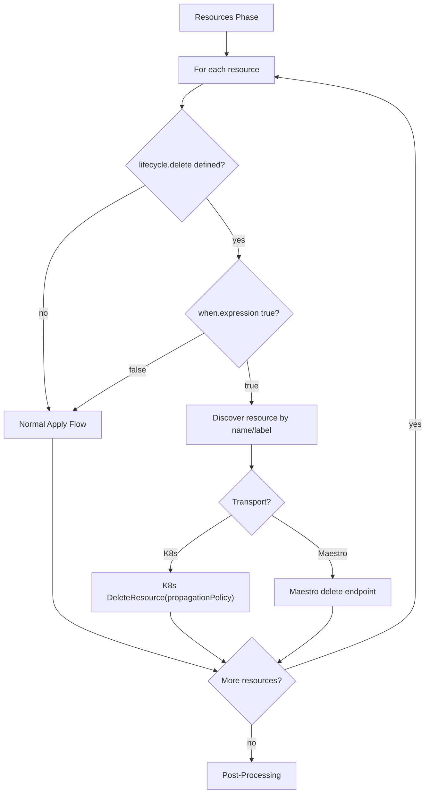
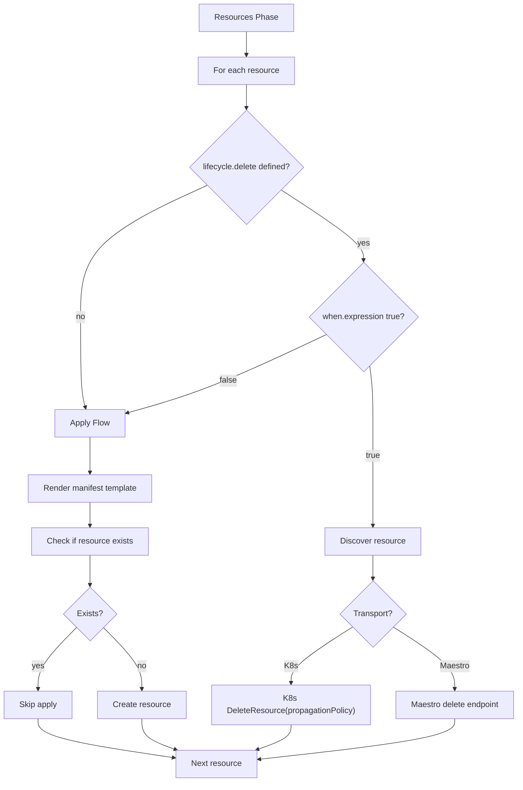
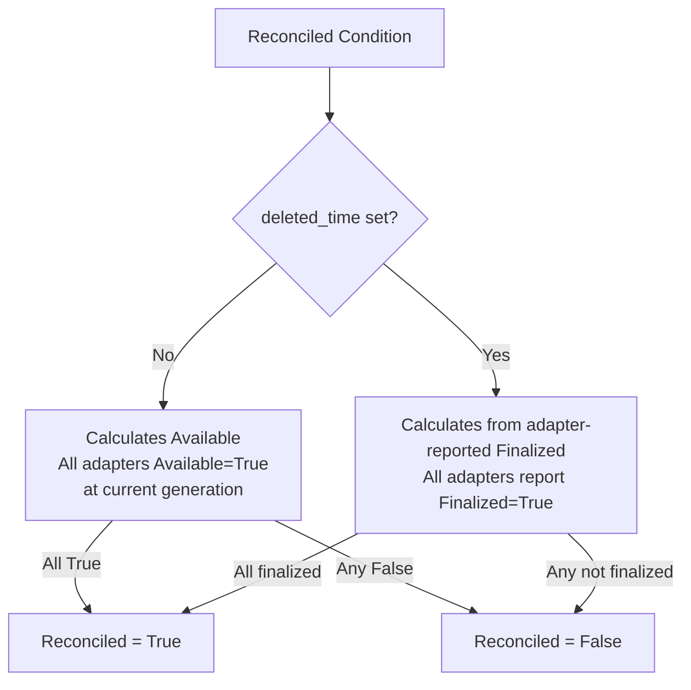
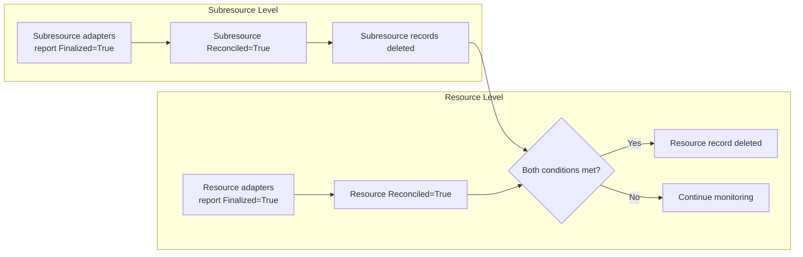

# Adapter Deletion Flow Design

**Jira**: [HYPERFLEET-560](https://issues.redhat.com/browse/HYPERFLEET-560)

## Terminology

| Term | Definition | In HyperFleet |
|------|-----------|---------------|
| **Soft Delete** | Add a column (e.g., `is_deleted`) to mark records as deleted. Records stay in the DB permanently and are filtered from normal queries. A data retention pattern. | Not used in HyperFleet. We don't retain deleted records permanently — records are removed from the DB after cleanup is confirmed. |
| **Pending Deletion** | Set `deleted_time` to signal deletion intent. Records remain in the DB while dependents are cleaned up, then are permanently removed. | API sets `deleted_time` on the resource and subresources. Records stay in the DB while adapters clean up Kubernetes resources, then are hard-deleted once cleanup is confirmed. |
| **Hard Delete** | Permanently remove records from the database. The data is gone and cannot be recovered. | API removes the resource, subresource, and adapter status rows from the DB when `deleted_time` is set and deletion `Reconciled=True`. |

**In short:** HyperFleet deletion uses **pending deletion** — set `deleted_time` to signal intent, let adapters clean up Kubernetes resources, then **hard delete** the DB records once cleanup is confirmed.

---

## What & Why

**What**: Design the deletion workflow for resources and subresources, defining how the adapter framework handles resource cleanup when an API resource is marked for deletion (`deleted_time` set).

**Why**: The adapter framework currently supports resource creation but has no mechanism for resource cleanup during deletion. Without a clear deletion flow:
- Adapters don't know when to clean up Kubernetes resources they created
- Resources could remain orphaned after a resource is deleted from the API
- No way to track deletion progress or coordinate cleanup across multiple adapters
- The API cannot safely delete records without confirmation that cleanup is complete

**Related Documentation:**
- [Adapter Framework Design](./adapter-frame-design.md) - Current framework architecture
- [Adapter Status Contract](./adapter-status-contract.md) - Status reporting patterns
- [Adapter Flow Diagrams](./adapter-flow-diagrams.md) - Current event flow

### Scope

- Resource and subresource deletion flow between API and adapters
- Adapter framework DSL changes (`lifecycle` per resource)
- API pending deletion and hard-delete signal logic
- Status reporting patterns during deletion
- Deletion ordering within a single adapter

### Out of Scope

- **Force deletion** — behavior and approach (e.g., immediate hard delete, graceful escalation, manual intervention) requires a separate spike; depends on peer team requirements
- **API hard-deletion mechanism** — the actor and pattern for hard-deleting DB records (inline, background job, customer-triggered, retention window) is covered by [HYPERFLEET-904](https://redhat.atlassian.net/browse/HYPERFLEET-904)
- Cleanup job support (run a job before deleting resources) — future enhancement
- Per-resource deletion retry — Sentinel reconciliation loop re-triggers the full adapter; fine-grained per-resource retry is a future enhancement
- Deletion cancellation — not supported in 1.0.0
- Specific stuck-deletion timeout values — to be determined during implementation
- Cross-adapter deletion ordering — handled by existing preconditions
- Sentinel changes — Sentinel continues to publish the same event format
- API implementation details (database schema, pending deletion mechanism) — covered by API design docs

---

## How

### Overview

Deletion is a two-step process: **mark for deletion** (set `deleted_time`), then **hard delete** (remove DB records after cleanup). The existing Sentinel polling and adapter event flow handles everything in between — no new event types or Sentinel changes needed.

See the [End-to-End Deletion Sequence diagram](./adapter-flow-diagrams.md#end-to-end-deletion-sequence) for the full 4-phase visual walkthrough:

1. **Mark for deletion** — User calls `DELETE /resources/{id}`, API sets `deleted_time` on resource + subresources, increments `generation`
2. **Event propagation** — Sentinels detect the generation change and publish CloudEvents (same format as creation)
3. **Adapter cleanup** — Adapter receives event, sees `deleted_time`, evaluates each resource's `lifecycle.delete.when`, deletes Kubernetes resources in dependency order
4. **Hard delete** — API computes `Reconciled` from adapter-reported `Finalized`, then removes records from DB when `deleted_time` is set and `Reconciled=True`

### API Deletion Handling

#### Step 1: Mark for Deletion

On `DELETE /resources/{id}`, the API sets `deleted_time` on the resource **and all its subresources**, and increments `generation`. Records remain in the database and are still queryable.

- `deleted_time` is the canonical delete intent signal — customer-facing `Finalizing` state is derived from it at read time
- The generation increment is intended to trigger Sentinel reconciliation (`observed_generation < generation` → `Reconciled=False`) with current Sentinel behavior.
- Validate this contract in integration testing during rollout; if deployment-specific Sentinel filters diverge, add an explicit deletion-selector query as a fallback.
- The `Reconciled` condition adapts based on resource lifecycle: calculates from `Available` normally, and from adapter-reported `Finalized` when `deleted_time` is set. See [Reconciled Condition and Finalized](#reconciled-condition-and-finalized)

#### Step 2: Hard Delete (Hierarchical)

The API hard-deletes records bottom-up:
- **Subresource records**: deleted when `deleted_time` is set and subresource `Reconciled=True`
- **Resource record**: deleted when `deleted_time` is set, resource `Reconciled=True`, and all subresource records are already gone

See the [API Delete Signal diagram](./adapter-flow-diagrams.md#api-delete-signal-hierarchical) for the full flowchart.

### Sentinel Behavior

No Sentinel code or event-format changes are required. Sentinel continues to publish the same CloudEvent format regardless of resource state — the adapter decides what to do based on `deleted_time`.

**Config change required**: The API replaces the `Ready` condition with `Reconciled`. Sentinel `message_decision` configs must be updated to reference `condition("Reconciled")` instead of `condition("Ready")`.

**Operational note**: Subresource deletion requires a separate Sentinel deployment per subresource `resource_type` (deployment/config change, not code change).

### Adapter Framework Changes

#### DSL Changes

One addition to the adapter task configuration:

**`lifecycle`** (per resource) — Defines the deletion behavior for a resource, including the CEL expression that determines when the resource should be deleted and the Kubernetes propagation policy. Each resource independently controls its own deletion lifecycle.

#### lifecycle

A per-resource block that combines the deletion trigger and ordering into a single `when` expression:

```yaml
resources:
  - name: clusterJob
    manifest: ...
    lifecycle:
      delete:
        propagationPolicy: Background
        when:
          expression: "is_deleting"

  - name: clusterConfigMap
    manifest: ...
    lifecycle:
      delete:
        propagationPolicy: Background
        when:
          expression: "is_deleting && !resources.?clusterJob.hasValue()"

  - name: clusterNamespace
    manifest: ...
    lifecycle:
      delete:
        propagationPolicy: Background
        when:
          expression: "is_deleting && !resources.?clusterConfigMap.hasValue() && !resources.?clusterJob.hasValue()"
```

**Fields:**

| Field | Required | Type | Default | Description |
|-------|----------|------|---------|-------------|
| `lifecycle.delete.propagationPolicy` | NO | string | `Background` | Kubernetes propagation policy: `Background`, `Foreground`, or `Orphan` |
| `lifecycle.delete.when.expression` | **YES** | string (CEL) | — | CEL expression evaluated each reconciliation loop. Resource is deleted only when expression evaluates to `true`. Required when `lifecycle.delete` is configured — the adapter validator rejects configs where it is absent. |

- Evaluated after parameter extraction and preconditions (needs captured variables)
- When `lifecycle.delete.when.expression` is `true`: executor discovers and deletes the resource
- When `lifecycle.delete.when.expression` is `false`: executor runs normal apply flow (resource is not being deleted yet)
- If `lifecycle` is not specified on a resource: normal apply flow (backward compatible)

**Important**: `lifecycle.delete.when.expression` should be driven by the `is_deleting` named capture variable, not derived status fields. `is_deleting` is set in preconditions via `has(preconditionName.deleted_time)` and is the canonical deletion trigger. Ordering conditions (e.g., `!resources.?clusterJob.hasValue()`) are combined with `is_deleting` in a single expression.

```yaml
# Capture is_deleting using the named-map-variable approach — no separate deleted_time capture needed.
# has(preconditionName.deleted_time) returns false cleanly when the field is absent (non-deleting case)
# without logging a WARN on every reconciliation.
capture:
  - name: is_deleting
    expression: "has(checkClusterState.deleted_time)"
```

**Evaluation order in the executor:**
1. Parameter extraction
2. Preconditions (API calls, captures, `when` evaluation)
3. Resources phase — for each resource:
   - If `lifecycle.delete` is defined and `when` evaluates to `true` → discover and delete the resource
   - If `lifecycle.delete` is defined and `when` evaluates to `false` → normal apply flow (resource is not being deleted yet)
   - If `lifecycle` is not defined → normal apply flow (existing behavior)
4. Post-processing (always runs)

#### Propagation Policies



`propagationPolicy` is a standard Kubernetes deletion parameter (`metav1.DeletionPropagation`) passed to the K8s delete API call. It controls how K8s handles dependent resources (via ownerReferences), not the adapter's behavior:

| Propagation Policy | K8s Behavior | Use Case |
|--------------------|----------|----------|
| `Background` | Delete the resource. K8s garbage collector cleans up dependents asynchronously. | Default. Individual resources or resources where async cleanup is acceptable |
| `Foreground` | K8s deletes all dependents first, then deletes the owner. Blocks until fully removed. | Resources with dependents via owner references (Deployments with ReplicaSets, Jobs with Pods) |
| `Orphan` | Delete the resource but leave its dependents (removes ownerReferences from children). | Resources whose dependents are managed by other systems or intentionally preserved |

#### Deletion Ordering

Deletion ordering is controlled by the `when.expression` CEL expression in `lifecycle.delete`. The expression combines the deletion trigger (`is_deleting`) with ordering conditions (e.g., `!resources.?clusterJob.hasValue()`). Resources are deleted only when their full expression evaluates to `true`.

Example ordering for a typical adapter:

```yaml
# Creation order:  Job (no deps) -> ConfigMap (no deps) -> Namespace (no deps)
# Deletion order:  Job first, then ConfigMap, then Namespace
resources:
  - name: clusterJob
    lifecycle:
      delete:
        when:
          expression: "is_deleting"                                   # deleted first
  - name: clusterConfigMap
    lifecycle:
      delete:
        when:
          expression: "is_deleting && !resources.?clusterJob.hasValue()"    # wait for Job to be gone
  - name: clusterNamespace
    lifecycle:
      delete:
        when:
          expression: "is_deleting && !resources.?clusterConfigMap.hasValue() && !resources.?clusterJob.hasValue()"  # wait for all to be gone
```

The `when.expression` is evaluated each reconciliation loop. Once a resource is deleted and discovery stores a nil value for it, `!resources.?clusterJob.hasValue()` evaluates to `true`, unblocking dependent resources on the next loop iteration. Use `!resources.?X.hasValue()` rather than `has()` or direct access — see the CEL note in the example task config for details.

### Executor Behavior Change

The existing 4-phase executor flow remains unchanged:

```
Parameter Extraction -> Preconditions -> Resources -> Post-Processing
```

The change is within the **Resources** phase. Each resource independently determines its behavior based on whether `lifecycle.delete` is defined:



### Reconciled Condition and Finalized

`Reconciled` is a single aggregate condition that adapts its meaning based on lifecycle:

| `deleted_time` | `Reconciled` calculates | Meaning |
|---|---|---|
| Not set | **Available** — all adapters `Available=True` at current generation | Resource is provisioned and operational |
| Set | **Adapter-reported Finalized** — all adapters report `Finalized=True` | All adapter cleanup is complete |



**Why one condition?** Sentinel stays simple — it just sees `Reconciled=False` and publishes events, unaware of whether it's a creation or deletion scenario. Lifecycle logic stays centralized in the API.

### Generation Behavior During Deletion

The API increments `generation` on delete. The adapter reports `observed_generation` equal to the current API `generation` — same as during creation/update. Deletion is just another reconciliation of the resource's desired state.

```
Before deletion:  resource.generation = 5, adapter.observed_generation = 5
After DELETE:     resource.generation = 6, adapter.observed_generation = 6
```

The generation increment triggers Sentinel (`observed_generation < generation` → `Reconciled=False`). The adapter receives the event, sees `deleted_time`, cleans up resources, and reports `observed_generation = 6` with the new status.

### Status Reporting During Deletion

The existing status contract is unchanged — `Applied`, `Available`, and `Health` reflect the real state of managed resources as observed by the adapter, regardless of whether `deleted_time` is set. They are not deletion-aware and do not use deletion-specific reasons. Only `Finalized` is deletion-specific. The adapter always reports `observed_generation` equal to the current API `generation` (see [Generation Behavior During Deletion](#generation-behavior-during-deletion)). The `is_deleting` variable used in post-processing is a named capture set in preconditions via `has(preconditionName.deleted_time)`.

#### Pattern: Deletion In Progress

Resources still exist in K8s — Applied/Available reflect that.

```json
{
  "adapter": "validation",
  "observed_generation": 5,
  "observed_time": "2026-03-25T10:00:00Z",
  "conditions": [
    {
      "type": "Applied",
      "status": "True",
      "reason": "ConfigMapApplied",
      "message": "Applied"
    },
    {
      "type": "Available",
      "status": "True",
      "reason": "ConfigMapAvailable",
      "message": "ConfigMap available"
    },
    {
      "type": "Health",
      "status": "True",
      "reason": "NoErrors",
      "message": "Adapter is healthy"
    },
    {
      "type": "Finalized",
      "status": "False",
      "reason": "CleanupInProgress",
      "message": "Resource cleanup not yet confirmed"
    }
  ]
}
```

#### Pattern: Deletion Complete

All managed resources are gone — Applied/Available reflect that naturally.

```json
{
  "adapter": "validation",
  "observed_generation": 5,
  "observed_time": "2026-03-25T10:00:05Z",
  "conditions": [
    {
      "type": "Applied",
      "status": "False",
      "reason": "ConfigMapNotFound",
      "message": "Resource not found"
    },
    {
      "type": "Available",
      "status": "False",
      "reason": "ConfigMapNotFound",
      "message": "Resource not found"
    },
    {
      "type": "Health",
      "status": "True",
      "reason": "NoErrors",
      "message": "Adapter is healthy"
    },
    {
      "type": "Finalized",
      "status": "True",
      "reason": "CleanupConfirmed",
      "message": "All managed resources deleted and verified"
    }
  ]
}
```

#### Optional Conditions (Observability Only)

Adapters MAY include extra conditions for operator visibility. These are informational and MUST NOT gate API hard-delete decisions.

| Type | Source | Purpose | Example Reason |
|------|--------|---------|----------------|
| `Terminating` | `metadata.deletionTimestamp` on managed resource | Explicitly surface that cleanup is in progress | `DeletionTimestampSet` |
| `FinalizersPending` | `metadata.finalizers` length > 0 | Explain why a resource is still present | `WaitingForFinalizers` |
| `DeleteBlocked` | Kind-specific status/conditions from managed CR | Highlight known blockers (RBAC, dependency, webhook, etc.) | `DependencyNotReady` |

Example with optional conditions (resources still exist, deletion in progress):

```json
{
  "adapter": "validation",
  "observed_generation": 5,
  "observed_time": "2026-03-25T10:00:03Z",
  "conditions": [
    { "type": "Applied", "status": "True", "reason": "ConfigMapApplied", "message": "Applied" },
    { "type": "Available", "status": "True", "reason": "ConfigMapAvailable", "message": "ConfigMap available" },
    { "type": "Health", "status": "True", "reason": "NoErrors", "message": "Adapter is healthy" },
    { "type": "Finalized", "status": "False", "reason": "CleanupInProgress", "message": "Resource cleanup not yet confirmed" },
    { "type": "Terminating", "status": "True", "reason": "DeletionTimestampSet", "message": "Managed resource has deletionTimestamp set" },
    { "type": "FinalizersPending", "status": "True", "reason": "WaitingForFinalizers", "message": "Finalizers still present on managed resource" }
  ]
}
```

The hard-delete gate is always: `deleted_time` set + `Reconciled=True`. Optional conditions don't change this.

### API Hard-Delete Signal

This section defines **when** hard deletion happens (the gate conditions). **How** the API performs hard deletion (the actor, retention window, failure handling) is a separate concern covered by [HYPERFLEET-904](https://redhat.atlassian.net/browse/HYPERFLEET-904).

The API hard-deletes records hierarchically — subresources first, then the resource.

**Subresource hard-delete** when: `deleted_time` set + subresource `Reconciled=True`. Each subresource is evaluated independently.

**Resource hard-delete** when: `deleted_time` set + resource `Reconciled=True` + **all subresource records already hard-deleted**.

**Why `Reconciled=True` as the API gate?** The API should gate on one lifecycle-level signal (`Reconciled`) and let aggregation map lifecycle semantics (`Available` in create/update, adapter-reported `Finalized` in deletion).



#### Adapter Finalization Decision Matrix (Input to Reconciled)

| Applied | Available | Health | Finalized | Meaning | API Action |
|---------|-----------|--------|-----------|---------|------------|
| `Any` | `Any` | `Any` | `True` | Cleanup confirmed for this adapter | Contributes to deletion `Reconciled=True` |
| `Any` | `Any` | `Any` | `False` | Not finalized yet — adapter has not confirmed cleanup | **Wait** for retry/reconciliation |

**Finalized contract**: `Finalized` is reported by adapters and used by API aggregation to compute `Reconciled` when `deleted_time` is set.

If `deleted_time` is not set in an API resource, `Finalized` value is meaningless for computing `Reconciled`.

During deletion, `Available`, `Health`, `Applied` are informational for operators and does not participate in hard-delete gating. The API gates on `Reconciled=True`.

### Example Task Config with Deletion

```yaml
params:
  - name: clusterId
    required: true
    source: event.id
    type: string

preconditions:
  - name: clusterStatus
    api_call:
      method: GET
      url: /clusters/{{ .clusterId }}
      timeout: 10s
    capture:
      - name: is_deleting
        expression: "has(clusterStatus.deleted_time)"
      - name: clusterName
        field: name
      - name: generation
        field: generation

resources:
  - name: clusterNamespace
    manifest:
      apiVersion: v1
      kind: Namespace
      metadata:
        name: '{{ .clusterId | lower }}'
        labels:
          hyperfleet.io/cluster-id: '{{ .clusterId }}'
          hyperfleet.io/managed-by: hyperfleet-adapter
    discovery:
      by_name: '{{ .clusterId | lower }}'
    lifecycle:
      delete:
        propagationPolicy: Background
        when:
          expression: "is_deleting && !resources.?clusterConfigMap.hasValue() && !resources.?clusterJob.hasValue()"

  - name: clusterConfigMap
    manifest:
      apiVersion: v1
      kind: ConfigMap
      metadata:
        name: cluster-{{ .clusterId }}-config
        namespace: '{{ .clusterId | lower }}'
    discovery:
      by_name: cluster-{{ .clusterId }}-config
      namespace: '{{ .clusterId | lower }}'
    lifecycle:
      delete:
        propagationPolicy: Background
        when:
          expression: "is_deleting && !resources.?clusterJob.hasValue()"

  - name: clusterJob
    manifest:
      apiVersion: batch/v1
      kind: Job
      metadata:
        name: validation-{{ .clusterId }}-gen{{ .generation }}
        namespace: '{{ .clusterId | lower }}'
    discovery:
      by_name: validation-{{ .clusterId }}-gen{{ .generation }}
      namespace: '{{ .clusterId | lower }}'
    lifecycle:
      delete:
        propagationPolicy: Background
        when:
          expression: "is_deleting"

post:
  payloads:
    - name: clusterStatusPayload
      build:
        adapter: '{{ .adapter.name }}'
        conditions:
          - type: Applied
            status:
              expression: |
                has(resources.clusterConfigMap.metadata.resourceVersion) ? "True" : "False"
            reason:
              expression: |
                has(resources.clusterConfigMap.metadata.resourceVersion) ? "ConfigMapApplied" : "ConfigMapPending"
            message:
              expression: |
                has(resources.clusterConfigMap.metadata.resourceVersion) ? "Applied" : "Pending"
          - type: Available
            status:
              expression: |
                has(resources.clusterConfigMap.metadata.resourceVersion) ? "True" : "False"
            reason:
              expression: |
                has(resources.clusterConfigMap.metadata.resourceVersion) ? "ConfigMapAvailable" : "ConfigMapPending"
            message:
              expression: |
                has(resources.clusterConfigMap.metadata.resourceVersion) ? "ConfigMap available" : "ConfigMap pending"
          - type: Finalized
            status:
              expression: |
                is_deleting && adapter.?executionStatus.orValue("") == "success"
                  ? (!resources.?clusterNamespace.hasValue()
                      && !resources.?clusterConfigMap.hasValue()
                      && !resources.?clusterJob.hasValue()
                    ? "True" : "False")
                  : "False"
            reason:
              expression: |
                is_deleting && adapter.?executionStatus.orValue("") == "success"
                  ? (!resources.?clusterNamespace.hasValue()
                      && !resources.?clusterConfigMap.hasValue()
                      && !resources.?clusterJob.hasValue()
                    ? "CleanupConfirmed" : "CleanupInProgress")
                  : ""
            message:
              expression: |
                is_deleting && adapter.?executionStatus.orValue("") == "success"
                  ? (!resources.?clusterNamespace.hasValue()
                      && !resources.?clusterConfigMap.hasValue()
                      && !resources.?clusterJob.hasValue()
                    ? "All managed resources deleted and verified" : "Resource cleanup in progress")
                  : ""
          - type: Health
            status:
              expression: |
                adapter.?errorMessage.orValue("") == "" ? "True" : "False"
            reason:
              expression: |
                adapter.?errorReason.orValue("") != "" ? adapter.?errorReason.orValue("") : "NoErrors"
            message:
              expression: |
                adapter.?errorMessage.orValue("") != "" ? adapter.?errorMessage.orValue("") : "Adapter is healthy"
        observed_generation:
          # Always reports the current API generation — deletion is just another reconciliation.
          # See "Generation Behavior During Deletion" section.
          expression: generation
        observed_time: '{{ now | date "2006-01-02T15:04:05Z07:00" }}'
  post_actions:
    - name: updateStatus
      api_call:
        method: POST
        url: /clusters/{{ .clusterId }}/statuses
        body: '{{ .clusterStatusPayload }}'
```

**Note on CEL complexity**: The `is_deleting` ternary branching adds complexity to post-processing expressions. The `is_deleting` variable is a named capture set in preconditions via `has(preconditionName.deleted_time)`. Mitigate with descriptive `reason` values and testing both creation/deletion paths.

**CEL resource presence pattern — use `!resources.?X.hasValue()`, not `has()`**: When checking whether a managed resource has been deleted, always use `!resources.?resourceName.hasValue()`, not `has(resources.resourceName)` or `resources.resourceName == null`.

- **`has()` is wrong**: When the executor discovers a deleted resource and stores `NotFound`, it records `execCtx.Resources[name] = nil` — the map key exists with a nil value. CEL's `has()` on a dynamic map tests key existence only, not whether the value is nil. So `has(resources.clusterJob)` returns `true` even after the resource is deleted, causing `Finalized` to be permanently stuck at `"False"`.
- **Direct access is unsafe**: `resources.clusterJob == null` fails with an error if the key was never added to the map — for example when the executor fails before reaching that resource in the loop (resource #3 of 3, failure on #2).
- **`!resources.?X.hasValue()` is correct**: The optional `?` operator safely accesses the map without erroring on a missing key, and `.hasValue()` checks whether the value is non-nil. Negating gives a clean "resource is absent" check that handles all states: key missing (never processed → `true`), key present with nil (deleted → `true`), key present with object (exists → `false`).

**Health guard in `Finalized` — required**: The `adapter.?executionStatus.orValue("") == "success"` guard prevents a false `Finalized=True` when the executor failed before processing some resources. If a resource was never processed (key absent from map), optional chaining returns `null == null → true`, making it appear deleted. The health guard ensures `Finalized=True` is only reported when the full execution loop completed successfully.

**Required test cases for `lifecycle.delete.when`**: `deleted_time` null/missing → `false`, valid timestamp → `true`. The framework must treat null/missing `deleted_time` as not-deleting.

### Subresource Deletion

Subresources are cleaned up before the resource (hierarchical hard-delete). See [Resource + Subresource Deletion Flow diagram](./adapter-flow-diagrams.md#resource--subresource-deletion-flow).

1. API marks resource AND all subresources for deletion simultaneously (sets `deleted_time`)
2. Resource-level and subresource-level adapters clean up **in parallel**
3. API hard-deletes each subresource record as its adapters confirm cleanup
4. API hard-deletes resource record only after resource adapters confirm **AND** all subresource records are gone

### Observability

Deletion introduces new observable states that should be tracked alongside existing adapter metrics (see [Adapter Metrics](./adapter-metrics.md)).

Key areas to instrument:
- **Adapter-level**: deletion operation counts, duration, and in-progress gauges
- **API-level**: resources in Finalizing state, time from `deleted_time` to hard delete, stuck deletion gauges

Detailed metric naming, labels, alert thresholds, and SLO/SLI definitions will be specified in a separate document — these require their own design discussion.

---

## Edge Cases

### Summary

| # | Edge Case | Decision | Impact |
|---|-----------|----------|--------|
| 1 | Resource already gone | Treat "not found" as success | Low |
| 2 | **Stale Applied=False before `deleted_time`** | **API gates on aggregate `Reconciled` (computed from adapter `Finalized`), never on individual adapter `Applied`** | **Critical** |
| 3 | Creation in-flight when deletion starts | Discovery handles naturally on next event | Low |
| 4 | Which adapters must confirm? | Only adapters with existing status entries | Medium |
| 5 | Stuck in Finalizing (`deleted_time` set but can't hard-delete) | Configurable timeout + alerting (force deletion covered separately) | Medium |
| 6 | Concurrent deletion events | Idempotent operations, K8s handles safely | Low |
| 7 | Independent subresource deletion | Same pattern, check subresource `deleted_time` | Low |
| 8 | Cancel deletion | Not cancellable in 1.0.0 | Low |
| 9 | Maestro-managed resources | Transport layer handles transparently | Low |
| 10 | Multi-generation resources | Use label selectors to discover all | Medium |
| 11 | **Deletion error reporting** | **Adapter reports `Finalized=False` when unhealthy; API gates hard-delete on aggregate `Reconciled=True`** | **Critical** |
| 12 | **API rejects mutations during Finalizing** | **Return 409 Conflict** | **Critical** |
| 13 | Cross-adapter deletion ordering | Handled by existing preconditions | Low |

### Critical Edge Cases

#### Stale Applied=False Before Pending Deletion (#2)

An adapter whose preconditions were never met already reports `Applied=False`. Without safeguards, if the API were to gate directly on individual adapter `Applied` status, it could see `deleted_time` + `Applied=False` and hard-delete immediately — before the adapter processes the deletion event.

**Decision**: The API never gates directly on individual adapter conditions (`Applied`, `Available`). It gates on the aggregate `Reconciled=True` condition, which during deletion is computed from adapter-reported `Finalized` across all adapters. This eliminates the stale-status risk entirely.

#### Deletion Error Reporting (#11)

Two failure modes require different reporting:

**A) Adapter can connect but deletion fails** (RBAC denied, resource stuck) — resources are confirmed to still exist:

```json
{
  "conditions": [
    { "type": "Applied", "status": "True", "reason": "ConfigMapApplied", "message": "Applied" },
    { "type": "Available", "status": "True", "reason": "ConfigMapAvailable", "message": "ConfigMap available" },
    { "type": "Health", "status": "False", "reason": "DeletionError", "message": "Delete operation failed: RBAC denied" },
    { "type": "Finalized", "status": "False", "reason": "AdapterUnhealthy", "message": "Cannot confirm finalization while unhealthy" }
  ]
}
```

**B) Adapter cannot connect** (K8s API unreachable) — discovery returns nothing, resource state unknown:

```json
{
  "conditions": [
    { "type": "Applied", "status": "False", "reason": "ConfigMapUnknown", "message": "Cannot determine state" },
    { "type": "Available", "status": "False", "reason": "ConfigMapUnknown", "message": "Cannot determine state" },
    { "type": "Health", "status": "False", "reason": "ConnectionFailure", "message": "Failed to connect to Kubernetes API" },
    { "type": "Finalized", "status": "False", "reason": "AdapterUnhealthy", "message": "Cannot confirm finalization while unhealthy" }
  ]
}
```

In both failure modes, `Finalized=False` prevents the aggregate `Reconciled` from becoming `True`, blocking hard-delete until the adapter recovers and confirms cleanup. See the [API Hard-Delete Signal](#api-hard-delete-signal) section for the full decision matrix.

#### API Rejects Mutations During Finalizing (#12)

The API **must reject** all mutations (PUT, PATCH) to resources/subresources marked for deletion (`deleted_time` set) with `409 Conflict`. This prevents new generation events from triggering resource creation while deletion cleanup is in progress. Reads (GET, LIST) remain allowed.

### Other Edge Cases

<details>
<summary>Click to expand non-critical edge cases</summary>

#### Resource Already Gone (#1)

Treat "not found" as successfully deleted. The executor should handle `NotFound` from discovery as a no-op and proceed to the next resource.

#### Creation In-Flight When Deletion Starts (#3)

Handled naturally. The adapter processes events sequentially per resource. On the next event, each resource's `lifecycle.delete.when` evaluates to `true`, the executor discovers the just-created resource, and deletes it. Discovery rules match resources regardless of when they were created.

#### Which Adapters Must Report Finalized=True? (#4)

All adapters participate in deletion `Reconciled`. The API waits for `Reconciled=True` on the target object, which requires every adapter to report `Finalized=True`.

- **Resource-owning adapters** report `Finalized=True` after confirming all managed resources are deleted.
- **Non-resource-owning adapters** (e.g., validation-only adapters) report `Finalized=True` immediately upon receiving a deletion event (`deleted_time` set), since they have nothing to clean up.

This eliminates the need for a separate "participating set" computation in the API. Every adapter is expected to report `Finalized`; the distinction is only in how quickly they can confirm it.

No grace period is needed — deletion `Reconciled` remains `False` until all adapters positively report `Finalized=True`.

#### Stuck in Finalizing (#5)

If a resource stays in Finalizing (`deleted_time` set) beyond a configurable timeout (e.g., 30 minutes): log which adapters haven't confirmed and expose stuck state via API. Force deletion behavior is out of scope for this design and requires a separate spike. The approach (e.g., immediate hard delete, graceful escalation, or manual intervention) depends on peer team requirements and has not been decided yet.

#### Concurrent Events During Deletion (#6)

Deletion operations are idempotent. Multiple delete calls for the same K8s resource are safe — Kubernetes returns `NotFound` for already-deleted resources, which the executor treats as success. Sentinel re-triggers re-evaluate current state.

**Note**: The current broker subscriber runs parallel handlers without resource-key serialization. Concurrent events for the same resource may be processed in parallel. This is safe for deletion because: (1) K8s delete is idempotent, (2) discovery + delete is atomic per resource, (3) post-processing status reports are last-writer-wins. If stricter ordering is needed in the future, resource-key serialization can be added to the subscriber.

#### Independent Subresource Deletion (#7)

Same pattern as resource deletion. The API marks just the subresource for deletion (sets `deleted_time`), subresource-level adapters handle cleanup.

**Trigger contract**: Subresource deletion must be keyed off the `is_deleting` named capture variable (set via `has(preconditionName.deleted_time)`) in each resource's `lifecycle.delete.when.expression`:

```yaml
# Canonical delete signal per resource
lifecycle:
  delete:
    when:
      expression: "is_deleting"
```

#### Customer-Visible Deletion State

For customers, the API should indicate a resource/subresource is being deleted when `deleted_time` is set.

- **Control-plane signal**: `deleted_time` (authoritative)
- **Presentation signal**: `deleted_time` presence in GET responses indicates the resource is being deleted
- **Progress signal**: adapter statuses (`Applied`, `Health`, `observed_time`) indicate deletion progress

#### Cancel Deletion (#8)

Not cancellable in 1.0.0. Consistent with Kubernetes behavior (namespace deletion is not cancellable). Future enhancement could add a grace period before adapters start cleanup.

#### Maestro-Managed Resources (#9)

The `lifecycle.delete.propagationPolicy` only applies to direct K8s transport, where the adapter controls the delete call. For Maestro transport, the adapter calls Maestro's delete endpoint and Maestro manages deletion through ManifestWork with its own propagation/cleanup semantics — the adapter's `propagationPolicy` is not used.

- **K8s transport**: calls `DeleteResource()` with the specified `propagationPolicy`
- **Maestro transport**: calls Maestro delete endpoint; propagation is managed by ManifestWork, not by the adapter's `lifecycle.delete`

#### Multi-Generation Resources (#10)

During deletion, use **label selectors** rather than exact name matching to discover all resources across generations:

```yaml
discovery:
  by_selectors:
    label_selector:
      hyperfleet.io/cluster-id: '{{ .clusterId }}'
      hyperfleet.io/managed-by: '{{ .adapter.name }}'
```

#### Cross-Adapter Deletion Ordering (#13)

Not required. Each adapter only cleans up its own resources. Unlike creation (where adapters have data dependencies), deletion is self-contained.

</details>

---

## Trade-offs

### What We Gain
- Adapters can clean up Kubernetes resources when API resources are deleted
- API can safely delete records when objects marked for deletion reach `Reconciled=True`
- Deletion ordering prevents dependency violations (e.g., Job deleted before ServiceAccount)
- Three propagation policies (Background, Foreground, Orphan) align with Kubernetes `metav1.DeletionPropagation` conventions
- No changes to Sentinel or broker event format
- Backward compatible — existing adapters without `lifecycle` continue to work
- Per-resource `lifecycle.delete` keeps deletion behavior co-located with the resource definition, making it easier to reason about each resource's lifecycle independently
- Edge cases addressed: stale status disambiguation, resource-not-found handling, concurrent event idempotency, stuck deletion timeout

### What We Lose / What Gets Harder
- Resources phase executor becomes more complex (per-resource lifecycle evaluation)
- Post-processing CEL expressions become more complex (must handle both creation and deletion states via `is_deleting`)
- `lifecycle.delete.when` expressions are evaluated each reconciliation loop to determine deletion readiness
- Each resource's `lifecycle.delete.when` must include the `is_deleting` capture variable, leading to some repetition across resources
- Adapter config authors must think about deletion when designing adapters

---

## Alternatives Considered

### Separate Deletion Adapter

**What**: Deploy a dedicated deletion adapter per adapter type. Both creation and deletion adapters subscribe to the same broker topic via separate subscriptions, each using preconditions to filter by `deleted_time` presence.

**Why Not Chosen**:
- Both approaches require framework changes — the executor doesn't support deletion today either way
- Doubles operational overhead: every adapter type needs a paired deletion adapter (5 types → 10 deployments)
- Config drift risk: resource names, labels, and discovery rules must be kept in sync across two configs; a rename in the creation adapter that isn't mirrored in the deletion adapter means cleanup fails silently
- The `lifecycle` approach co-locates creation and deletion in a single config per resource, making reviews and debugging simpler

### Kubernetes Finalizers on HyperFleet API Objects

**What**: Adapters register finalizers on resource objects in the HyperFleet API. The API won't delete until all finalizers are removed.

**Why Not Chosen**: HyperFleet API resources are stored in a relational database, not as Kubernetes objects. Implementing a finalizer pattern on database records adds complexity without clear benefit over the current pending deletion + `Reconciled` gate model. Maestro follows the same `deleted_time` two-phase pattern without finalizers.

### Sentinel Publishes Different Event Type for Deletion

**What**: Sentinel detects `deleted_time` and publishes a `DeleteEventType` event (separate from creation events), routed to a different topic.

**Why Not Chosen**: This requires Sentinel changes and complicates the event model. The current design keeps Sentinel simple - it publishes the same event format regardless of resource state. The adapter is the right place to evaluate resource state and decide on action, consistent with the existing precondition evaluation pattern.

### Top-Level when Keyword for Workflow Branching

**What**: Introduce a top-level `when` keyword that branches the entire workflow (preconditions, resources, post-processing) based on resource state.

**Why Not Chosen**: This is a significant restructuring of the adapter framework, changing the executor from a single linear flow to a branching workflow engine. The per-resource `lifecycle` approach keeps branching scoped to individual resources within the resources phase, keeping the overall executor flow unchanged.

### Top-Level when_deleting Mode Switch

**What**: A single top-level `when_deleting` CEL expression that switches the entire resources phase from creation mode to deletion mode.

**Why Not Chosen**: A global mode switch is confusing — it's a top-level variable that changes the behavior of the resources phase but isn't defined within it. Per-resource `lifecycle.delete` keeps deletion behavior co-located with each resource definition, makes it clear which resources participate in deletion, and allows different resources to have different deletion triggers if needed.

### Per-Resource when + action Keywords

**What**: Add `when` (CEL expression) and `action` (create/delete) to each resource definition, allowing conditional execution per resource.

**Why Not Chosen**: While more flexible, this approach adds more DSL complexity than needed for the deletion use case. The `lifecycle.delete` approach is purpose-built for deletion, clearly communicating intent without introducing a generic action dispatch mechanism.

---

## Migration & Compatibility

### DSL Changes Required

The following field must be added to the adapter framework's `AdapterTaskConfig` resource type:

| Field | Location | Type | Description |
|-------|----------|------|-------------|
| `lifecycle.delete` | Per resource | `struct { PropagationPolicy string; When string }` | Deletion behavior: CEL expression for when to delete and Kubernetes propagation policy |

The field is optional with backward-compatible defaults:
- `lifecycle` not set → apply-only behavior (existing adapters unchanged)
- `lifecycle.delete.when.expression` → **required** when `lifecycle.delete` is configured; the adapter validator rejects configs where it is absent
- `lifecycle.delete.propagationPolicy` not set → defaults to `Background`

### Status Contract Change

The `Finalized` condition is a **new required field** in adapter status reports. This is a contract change:
- All adapters must include `Finalized` in their status conditions
- When not deleting: `Finalized=False` reason/message is meaningless, you can send empty message or `"NotDeleting"`
- When deleting: `Finalized=True` after cleanup confirmed, `Finalized=False` while in progress or unhealthy
- The API must accept and store `Finalized` as a new condition type
- Existing adapters must be updated to include `Finalized` before the deletion feature is enabled

### API Changes Required

The `DELETE /resources/{id}` endpoint must be implemented (currently returns `NotImplemented`). Required changes:
1. Pending deletion handler: set `deleted_time`, cascade to subresources, increment `generation`
2. `Reconciled` status aggregation: compute `Reconciled` from adapter `Finalized` signals when `deleted_time` is set (distinct from normal `Reconciled` which aggregates `Available`)
3. Hard-delete signal: trigger hard-delete when deletion `Reconciled=True` (all adapters report `Finalized=True`)
4. `409 Conflict` rejection for mutations on resources/subresources marked for deletion

### Rollout Order

1. **Adapter framework**: Add `lifecycle.delete` to resource config types and executor
2. **Adapter configs**: Update individual adapter task configs to include deletion fields and verify deletion status behavior
3. **Sentinel**: Deploy separate instance for each subresource `resource_type` (if subresource deletion is needed)
4. **API**: Implement `DELETE` endpoint (set `deleted_time` + hard-delete signal) behind a rollout gate
5. **Enable DELETE** only after steps 1-3 are live in the target environment

Existing adapters continue to work unchanged during rollout — deletion support is opt-in per adapter config.

---

## References

- [HYPERFLEET-560](https://issues.redhat.com/browse/HYPERFLEET-560) - SPIKE: Design deletion flow between API and Adapters
- [HYPERFLEET-543](https://issues.redhat.com/browse/HYPERFLEET-543) - Implement Cluster DELETE endpoint with cascade cleanup
- [HYPERFLEET-544](https://issues.redhat.com/browse/HYPERFLEET-544) - Implement NodePool DELETE endpoint
- [HYPERFLEET-904](https://redhat.atlassian.net/browse/HYPERFLEET-904) - SPIKE: Design API hard-deletion mechanism
- [Maestro Resource Deletion](https://github.com/openshift-online/maestro) - Two-phase deletion pattern reference
- [Kubernetes Deletion](https://kubernetes.io/docs/concepts/architecture/garbage-collection/) - Kubernetes garbage collection and propagation policies
