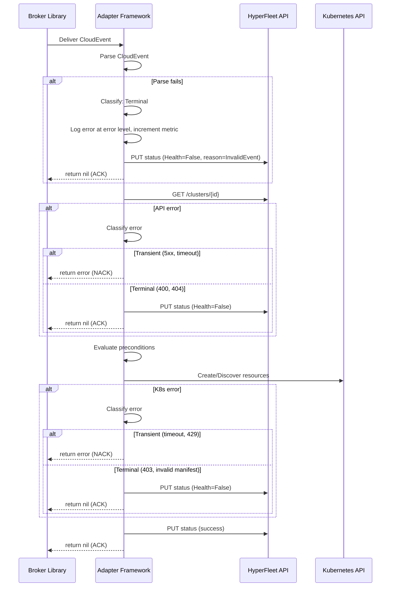

# Adapter Error Handling Guide

## Table of Contents

- [Overview](#overview)
- [Error Classification](#error-classification)
  - [HyperFleet API Errors (HTTP)](#hyperfleet-api-errors-http)
  - [Kubernetes API Errors](#kubernetes-api-errors)
  - [Cloud Provider API Errors](#cloud-provider-api-errors)
  - [Broker Errors](#broker-errors)
  - [Internal Adapter Errors](#internal-adapter-errors)
- [Error Classification Helper](#error-classification-helper)
- [Status Reporting on Terminal Errors](#status-reporting-on-terminal-errors)
- [Error Handling Flow](#error-handling-flow)
- [DLQ Routing Strategy](#dlq-routing-strategy)
  - [Broker-Level DLQ Configuration](#broker-level-dlq-configuration)
  - [Retry Budget](#retry-budget)
  - [What Happens to DLQ Messages](#what-happens-to-dlq-messages)
- [Observability](#observability)
  - [Metrics](#metrics)
  - [Alerting Rules](#alerting-rules)
  - [Logging](#logging)

---

## Overview

This document is the implementation guide for [ADR-0017 — Selective Message Acknowledgment in Adapters](../../../adrs/0017-adapter-error-taxonomy.md). It defines the error mapping tables, DLQ configuration, observability requirements, and processing flow for the adapter framework's error classification model.

---

## Error Classification

Every error during event processing MUST be classified as **Transient** or **Terminal**. The tables below define the classification for each error source.

### HyperFleet API Errors (HTTP)

Adapters call the HyperFleet API to fetch cluster data and report status.

| Error | HTTP Status | Classification | Rationale |
|-------|-------------|----------------|-----------|
| Rate limit exceeded | 429 | Transient | Will succeed after backoff; respect `Retry-After` header |
| Internal server error | 500 | Transient | Server-side issue likely to recover |
| Bad gateway | 502 | Transient | Upstream service returned invalid response, may recover |
| Service unavailable | 503 | Transient | Temporary unavailability |
| Gateway timeout | 504 | Transient | Upstream timeout, may recover |
| Connection refused / timeout | — | Transient | Network-level failure, may recover |
| Bad request | 400 | Terminal | Invalid request payload — retrying won't fix it |
| Unauthorized | 401 | Terminal | Invalid or expired credentials — requires credential rotation |
| Forbidden | 403 | Terminal | Insufficient permissions — requires RBAC changes |
| Not found | 404 | Terminal | Resource does not exist — retrying won't create it |
| Conflict | 409 | Terminal | Resource state conflict — requires investigation |
| Unprocessable entity | 422 | Terminal | Semantic validation failure — request is structurally wrong |

### Kubernetes API Errors

Adapters interact with the Kubernetes API to create, discover, and delete resources.

| Error | Classification | Rationale |
|-------|----------------|-----------|
| `ServerTimeout` / `ServiceUnavailable` | Transient | API server overloaded, will recover |
| `TooManyRequests` (429) | Transient | API priority and fairness throttling |
| `InternalError` (500) | Transient | API server internal error, may recover |
| `Unauthorized` (401) | Terminal | Service account token invalid — requires pod restart or RBAC fix |
| `Forbidden` (403) | Terminal | Missing RBAC permissions — requires ClusterRole/Role update |
| `NotFound` (404) — resource type | Terminal | CRD not installed or API group not available |
| `NotFound` (404) — resource instance | Transient | Resource may not exist yet (race with creation); adapter retries via reconciliation loop |
| `Conflict` (409) | Transient | Optimistic concurrency conflict — retry with fresh resource version |
| `Invalid` / `BadRequest` (400) | Terminal | Malformed manifest template — requires config fix |
| `AlreadyExists` (409) | Success (idempotent) | Resource already exists — adapter treats as success and ACKs without error reporting. Not counted as a failure |

### Cloud Provider API Errors

When adapters invoke cloud provider APIs (directly or via workload pods), these errors propagate through status reporting.

| Error | Classification | Rationale |
|-------|----------------|-----------|
| HTTP 429 / `RESOURCE_EXHAUSTED` | Transient | Rate limiting, will succeed after backoff |
| HTTP 500–504 / `UNAVAILABLE` | Transient | Provider infrastructure issue |
| Network timeout / connection reset | Transient | Network-level failure |
| HTTP 400 / `INVALID_ARGUMENT` | Terminal | Invalid request — API contract violation |
| HTTP 401/403 / `UNAUTHENTICATED` / `PERMISSION_DENIED` | Terminal | Credential or IAM issue — requires manual fix |
| HTTP 404 / `NOT_FOUND` | Terminal | Requested cloud resource does not exist |
| Quota exceeded (soft) | Transient | May free up after other workloads complete |
| Quota exceeded (hard) | Terminal | Account-level limit reached — requires quota increase |

### Broker Errors

Errors in message delivery and processing within the broker library.

| Error | Classification | Rationale |
|-------|----------------|-----------|
| Connection lost / timeout | Transient | Broker reconnection handled by library with backoff |
| Subscription not found | Terminal | Misconfiguration — subscription must be created |
| Malformed CloudEvent | Terminal | Event payload cannot be parsed — retrying won't fix it |
| Invalid event data (missing required fields) | Terminal | Event is structurally invalid |
| Message too large | Terminal | Event exceeds broker message size limit |

### Internal Adapter Errors

Errors within the adapter framework itself.

| Error | Classification | Rationale |
|-------|----------------|-----------|
| Configuration load failure | Terminal (startup) | Fails fast — pod won't start |
| CEL expression compilation error | Terminal (startup) | Fails fast — pod won't start |
| CEL expression evaluation error | Terminal | Expression logic error on this specific event data |
| Template rendering error | Terminal | Template variables missing or malformed for this event |
| JSON marshaling/unmarshaling error | Terminal | Data structure incompatible |
| Context deadline exceeded (per-event) | Transient | Event processing took too long — may succeed on retry with less load |
| Out of memory (per-goroutine) | Transient | Memory pressure — may succeed when other goroutines complete |
| Panic recovery | Terminal | Unexpected runtime error — log, report, and move on |

---

## Error Classification Helper

The adapter framework MUST implement a classification function with the following contract:

```go
// IsTransient returns true if the error should be retried (nack).
// Returns false if the error is terminal (ack + report).
// Location: pkg/errors/classify.go in the adapter framework repository.
func IsTransient(err error) bool
```

Classification logic:

1. Check if the error wraps a known transient type (e.g., `net.Error` with `Timeout() == true`)
2. Check HTTP status code if available (5xx, 429 → transient)
3. Check Kubernetes API status code (see mapping table above)
4. Default: **Terminal** — unknown errors are safer to ACK than to retry indefinitely

---

## Status Reporting on Terminal Errors

When a terminal error occurs, the adapter MUST report status to the HyperFleet API:

- **Health**: `False` — indicates the adapter encountered an error
- **Applied**: `False` — resources were not successfully applied
- **Available**: `False` — work was not completed
- **Reason**: Error-specific reason code (e.g., `InvalidManifest`, `AuthenticationFailed`)
- **Message**: Human-readable error description

This ensures the cluster status reflects the failure, and Sentinel's reconciliation loop will re-publish events. On the next reconciliation cycle, if the root cause is fixed, the adapter will succeed.

---

## Error Handling Flow

The adapter framework's `processEvent` function wraps all processing in error classification:



---

## DLQ Routing Strategy

The DLQ routing is implemented at two levels:

1. **Broker-level DLQ** (infrastructure): Configured per subscription. After max delivery attempts, the broker routes unacknowledged messages to a dead-letter topic/queue.

2. **Application-level signaling** (adapter framework): The adapter classifies errors and decides whether to NACK (transient) or ACK (terminal). For terminal errors, the adapter reports via status and metrics.

### Broker-Level DLQ Configuration

Each broker implementation configures its own DLQ mechanism:

#### Google Cloud Pub/Sub

> Note: This is the native Pub/Sub subscription configuration, typically managed by infrastructure. The `hyperfleet-broker` library config field is `dead_letter_topic` (snake_case) — see [broker documentation](../../broker/broker.md).

```yaml
# Subscription-level dead-letter policy (Pub/Sub native config)
deadLetterPolicy:
  deadLetterTopic: "projects/{project}/topics/hyperfleet-events-dlq"
  maxDeliveryAttempts: 5
```

#### RabbitMQ

```yaml
# Queue-level dead-letter exchange (RabbitMQ native config)
arguments:
  x-dead-letter-exchange: "hyperfleet-events-dlx"
  x-dead-letter-routing-key: "dlq"
  x-message-ttl: 300000  # 5 minutes per retry
```

### Retry Budget

| Setting | Value | Rationale |
|---------|-------|-----------|
| Max broker delivery attempts | 5 | Balances retry coverage with unprocessable protection |
| Backoff between retries | Broker-managed (exponential) | Pub/Sub uses automatic exponential backoff; RabbitMQ uses message TTL per retry |
| Per-event processing timeout | 120 seconds | Prevents a single event from blocking the worker pool |

### What Happens to DLQ Messages

Messages that land in the DLQ MUST be:

1. **Monitored**: Alert on DLQ depth > 0 (see [Alerting Rules](#alerting-rules))
2. **Inspectable**: Operators can view event payload, error reason, and retry count
3. **Replayable**: Operators can re-publish DLQ messages to the main topic after fixing the root cause
4. **Expirable**: DLQ messages expire after 7 days (configurable) to prevent unbounded growth

---

## Observability

### Metrics

New Prometheus metrics for error classification:

| Metric | Type | Labels | Description |
|--------|------|--------|-------------|
| `hyperfleet_adapter_errors_total` | Counter | `adapter`, `classification`, `error_type` | Total errors by classification (transient/terminal) and type |
| `hyperfleet_adapter_terminal_errors_total` | Counter | `adapter`, `error_type`, `source` | Terminal errors that were ACK'd and reported |
| `hyperfleet_adapter_nacks_total` | Counter | `adapter` | Messages NACK'd for retry |
| `hyperfleet_adapter_dlq_messages_total` | Counter | `adapter` | Messages routed to DLQ (max retries exceeded) |

### Alerting Rules

```yaml
# Terminal errors indicate issues requiring investigation
- alert: AdapterTerminalErrors
  expr: rate(hyperfleet_adapter_terminal_errors_total[5m]) > 0
  for: 5m
  labels:
    severity: warning
  annotations:
    summary: "Adapter {{ $labels.adapter }} has terminal errors"

# DLQ depth indicates unresolvable failures
- alert: AdapterDLQNotEmpty
  expr: hyperfleet_adapter_dlq_messages_total > 0
  for: 1m
  labels:
    severity: critical
  annotations:
    summary: "Dead-letter queue has unprocessed messages for {{ $labels.adapter }}"
```

### Logging

Error classification MUST be included in structured log output:

```json
{
  "level": "error",
  "msg": "Event processing failed",
  "adapter": "validation",
  "event_id": "evt-123",
  "cluster_id": "cls-456",
  "error_classification": "terminal",
  "error_type": "InvalidManifest",
  "error": "template rendering failed: missing variable 'vpcId'",
  "action": "ack_and_report"
}
```

---

## References

- [ADR-0017 — Selective Message Acknowledgment in Adapters](../../../adrs/0017-adapter-error-taxonomy.md)
- [Adapter Framework Design — Error Handling Strategy](adapter-frame-design.md#error-handling-strategy)
- [Adapter Status Contract — Pattern 6: Adapter Error](adapter-status-contract.md#pattern-6-adapter-error)
- [HyperFleet Error Model and Codes Standard](../../../standards/error-model.md)
- [HyperFleet Broker Design](../../broker/broker.md)
- [Google Cloud Pub/Sub Dead-Letter Topics](https://cloud.google.com/pubsub/docs/dead-letter-topics)
- [RabbitMQ Dead Letter Exchanges](https://www.rabbitmq.com/docs/dlx)
