# HyperFleet Adapter Framework - Design Document

## Overview

This document describes the design of the HyperFleet Adapter Framework, a config-driven Go-based framework for building cloud provider adapters. The framework enables adapters to consume CloudEvents from message brokers, evaluate conditions, create Kubernetes resources, and report status back to the HyperFleet API.

**Related Documentation:**
- [Adapter Flow Diagrams](./adapter-flow-diagrams.md) - **Complete system workflow, adapter lifecycle sequence, and event flow patterns**
- [Adapter Config Template MVP](./adapter-config-template-MVP.yaml) - MVP configuration template
- [Adapter Config Template Post-MVP](./adapter-config-template-post-MVP.yaml) - Post-MVP configuration template with advanced features
- [Adapter Status Contract](./adapter-status-contract.md) - Status reporting contract
- [Adapter Metrics](./adapter-metrics.md) - Required metrics for observability and monitoring
- [Adapter Design Decisions](./adapter-design-decisions.md) - Architecture decisions and trade-offs
- [Adapter Deployment Guide](./adapter-deployment.md) - Deployment and operations guide

## Architecture


## Components

### Code Structure

```
hyperfleet-adapter/
├── cmd/
│   └── adapter/          # Main application entry point
│       └── main.go       # Service initialization and startup
├── pkg/
│   ├── errors/           # Error handling utilities
│   │   └── error.go      # Structured error types and codes
│   └── logger/           # Structured logging with context
│       └── logger.go     # Context-aware logging
├── internal/
│   ├── config_loader/    # Configuration loading logic
│   ├── criteria/         # Precondition evaluation (CEL)
│   ├── broker_consumer/  # Message broker consumer implementations
│   ├── hyperfleet_api/   # HyperFleet API client
│   └── k8s_objects/      # Kubernetes object management
├── data/
│   └── adapter-config-template.yaml  # Configuration template
├── charts/               # Helm chart for deployment
└── test/                 # Integration tests
```

### 1. Config Loader and Criteria Evaluator

#### Purpose
- Load and parse adapter configuration from YAML files
- Validate configuration structure and required fields
- Extract parameters from environment variables and CloudEvent data
- Compile and evaluate CEL expressions for filtering, preconditions, and status evaluation

#### Design

**Config Loader (`internal/config_loader/`)**

- **Load(path string)**: Reads YAML configuration file and unmarshals into `Config` struct (called once at startup)
- **Validate()**: Validates required fields and configuration consistency
- **GetParameterValue(name, env, eventData)**: Extracts parameter values from environment or event data based on source specification

**Key Structures:**
- `Config`: Root configuration structure matching adapter-config-template-MVP.yaml
- `ParamConfig`: Defines parameter extraction rules (env.* or event.* sources)
- `PreconditionConfig`: Defines API calls with `apiCall`, `capture`, `conditions`/`expression`
- `ResourceConfig`: Defines resources with `manifest`, `discovery`, `recreateOnChange`
- `PostConfig`: Defines `payloads` (with `build`/`buildRef`) and `postActions`

**Configuration Lifecycle:**

1. **Startup (One-Time)**:
   - Load adapter configuration from YAML file
   - Parse and validate configuration structure
   - Compile CEL expressions for performance
   - Configuration stays in memory as template

2. **Per-Event (Dynamic)**:
   - Extract parameters from CloudEvent (clusterId, resourceId, etc.)
   - Extract parameters from environment variables
   - Merge with fetched API data (cluster details)
   - Build variable map for template rendering
   - Render Kubernetes resource specs using templates + variables
   - Evaluate expressions with event-specific data

**Example:**
```go
// Loaded ONCE at startup
config := LoadConfig("/etc/adapter/config/adapter-config.yaml")

// For EACH event received from broker
for event := range broker.Subscribe() {
    // Extract dynamic values from THIS event
    params := ExtractParams(event, config.Params)
    // params["clusterId"] = "cluster-123"  ← Different per event
    // params["resourceId"] = "resource-456" ← Different per event
    
    // Render templates with event-specific values
    resources := RenderResources(config.Resources, params)
    // Generated: "cluster-cluster-123-namespace" ← Dynamic!
    
    // Create resources in Kubernetes
    CreateResources(resources)
}
```

**Key Insight**: 
- **Config = Static Template** (loaded once, defines the structure)
- **Event Data = Dynamic Values** (different per event, fills in the template)
- **Result = Dynamic Resources** (generated for each specific cluster/resource)

**Configuration Loading Strategy:**

Configuration is deployed and managed via Helm charts with **multiple Kubernetes ConfigMaps** for separation of concerns:

**Configuration Layers:**
1. **Adapter Logic ConfigMap** (`adapter-config`): Business logic, resource templates, preconditions
2. **Broker ConfigMap** (`adapter-broker-config`): Message broker settings
3. **Environment ConfigMap** (`adapter-env-config`): Environment-specific settings (API URLs, timeouts)
4. **Observability ConfigMap** (`adapter-observability`): Logging, metrics, health checks, tracing

**Implementation:**
```go
config, err := config.Load("/etc/adapter/config/adapter-config.yaml", log)
```

**Deployment:**
```yaml
spec:
  containers:
    - name: adapter
      volumeMounts:
        - name: adapter-config
          mountPath: /etc/adapter/config
          readOnly: true
      envFrom:
        - configMapRef:
            name: validation-adapter-broker-config
        - configMapRef:
            name: validation-adapter-env-config
        - configMapRef:
            name: adapter-observability
  volumes:
    - name: adapter-config
      configMap:
        name: validation-adapter-config
```

**Characteristics:**
- Configuration mounted via multiple Kubernetes ConfigMaps
- Managed through Helm chart templates
- Kubernetes-native, secure, auditable
- No network dependencies at runtime
- Fast pod startup
- Config changes require Helm upgrade + pod restart
- Version-controlled through Helm chart versioning
- Layered architecture for flexibility and reusability

**Criteria Evaluator (`internal/criteria/`)**

- **New(strictTypes, log)**: Creates evaluator instance with CEL engine
- **Compile(name, expression, env)**: Compiles CEL expressions at startup for performance
- **Evaluate(name, variables)**: Evaluates compiled expression with provided variables
- **EvaluateExpression(expression, variables)**: Evaluates expression directly (for dynamic expressions)
- **EvaluateBool(name/variables)**: Convenience methods for boolean evaluations
- **EvaluateField(field, data)**: Translates simple field paths to CEL and evaluates

**Variable Building:**
- `BuildVariables(env, eventData, resources, parameters)`: Constructs variable map for expression evaluation
- Variables include: `event`, `resources.*` (tracked), `env.*`, and custom parameters

**Expression Compilation:**
- Compile expressions at startup when `compileOnStartup: true`
- Use strict type checking when `strictTypes: true`
- Store compiled programs in map for reuse

**Integration with CEL (Common Expression Language):**
- Uses `github.com/google/cel-go` for expression evaluation
- CEL is the standard expression language used in Kubernetes
- Supports all CEL built-in functions and operators
- Custom functions can be registered for adapter-specific logic

**CEL Optional Chaining:**
- Use `?.` for safe field access on potentially missing fields
- Use `.orValue(default)` to provide a default value when field is missing
- Example: `resources.?clusterNamespace.?status.?phase.orValue("")`
- Prevents null pointer errors when resources don't exist yet

**Template Design Philosophy:**

The adapter configuration uses a **dual-syntax approach** for flexibility and clarity:

1. **Go Templates (`{{ .var }}`)**: Used throughout for variable interpolation
   - Consistent syntax for all value substitution
   - Example: `"{{ .hyperfleetApiBaseUrl }}/api/hyperfleet/{{ .hyperfleetApiVersion }}/clusters/{{ .clusterId }}"`
   - Supports Sprig template functions (date, lower, random, string manipulation)

2. **`field` (Simple Path)**: For straightforward JSON path extraction
   - Example: `field: "status.phase"` or `field: "name"`
   - Internally translated to CEL expression by the adapter
   - More readable for common cases
   - Recommended for simple field access

3. **`expression` (CEL)**: For complex logic, filtering, and transformations
   - Example: `expression: "resources.?clusterNamespace.?status.?phase.orValue(\"\") == \"Active\""`
   - Full CEL power for conditional logic, filtering, null-safety with optional chaining
   - Required for complex operations (filter, map, has, size, etc.)

**Design Benefits:**
- ✅ **Clarity**: `field` is simpler and more readable for common cases
- ✅ **Power**: `expression` provides full CEL capabilities when needed
- ✅ **Consistency**: Go templates handle all variable interpolation uniformly
- ✅ **Implementation**: Single CEL engine evaluates both (field paths are translated to CEL)
- ✅ **Kubernetes Alignment**: CEL is the standard expression language in Kubernetes

**When to Use Each:**

```yaml
# Use 'field' for simple path extraction (in precondition capture)
capture:
  - name: "clusterPhase"
    field: "status.phase"  # Simple, readable

# Use 'expression' for complex logic (in post conditions)
expression: |
  status.adapters.filter(a, a.name == '{{ .metadata.name }}')[0].installed

# Use Go templates for variable interpolation (note: /api/hyperfleet/ prefix)
url: "{{ .hyperfleetApiBaseUrl }}/api/hyperfleet/{{ .hyperfleetApiVersion }}/clusters/{{ .clusterId }}"
```

**Condition Syntax:**

The `when` block supports two syntaxes for maximum flexibility:

**Option 1: Expression Syntax (CEL)**
- Full CEL expressions for complex logic
- Recommended for conditions with multiple checks, null-safety, or complex logic

```yaml
# Simple condition
when:
  expression: |
    clusterPhase == "Terminating"
  description: "Execute when cluster is terminating"

# Complex condition with null-safety
when:
  expression: |
    has(activeWorkloads) && activeWorkloads.count == 0
  description: "No active workloads remain"

# Multiple conditions
when:
  expression: |
    validationAvailableStatus == true &&
    adapterInstalled != true &&
    clusterPhase in ["Provisioning", "Installing", "Ready"]
  description: "Execute when validation available and adapter not yet installed"
```

**Option 2: Structured Conditions (Field + Operator + Value)**
- Declarative syntax for simple comparisons
- More readable for basic field checks
- Internally translated to CEL by the adapter

```yaml
# Simple equality check
when:
  conditions:
    - field: "clusterPhase"
      operator: "equals"
      value: "Terminating"
      description: "Cluster must be in Terminating phase"
  description: "Execute cleanup when cluster is terminating"

# List membership check
when:
  conditions:
    - field: "cloudProvider"
      operator: "in"
      value: ["aws", "gcp", "azure"]
      description: "Only check quota for cloud providers"
  description: "Fetch quota when using supported cloud provider"

# Existence check
when:
  conditions:
    - field: "resources.clusterConfigMap"
      operator: "exists"
      description: "ConfigMap exists and should be deleted"
```

**Supported Operators:**
- `equals` - Field equals value
- `notEquals` - Field does not equal value
- `in` - Field value is in list
- `notIn` - Field value is not in list
- `contains` - Field (string/array) contains value
- `exists` - Field exists (has value)
- `notExists` - Field does not exist
- `greaterThan` - Field > value (numeric comparison)
- `lessThan` - Field < value (numeric comparison)
- `greaterThanOrEqual` - Field >= value
- `lessThanOrEqual` - Field <= value

**When to Use Each:**
- Use **expression** for: Complex logic, null-safety, filtering, transformations
- Use **conditions** for: Simple field comparisons, existence checks, list membership

### 2. HyperFleet API Client

#### Purpose
- Make HTTP requests to HyperFleet API for fetching cluster details and reporting status
- Support retry logic with configurable backoff strategies
- Handle authentication (future: Service Account tokens)
- Template variable substitution in endpoints

#### Design

**API Client (`internal/hyperfleet_api/`)**

- **NewClient(config, log)**: Creates API client with base URL and timeout
- **Get(ctx, endpoint, headers)**: Performs GET request
- **Post(ctx, endpoint, body, headers)**: Performs POST request
- **Put/Delete**: Additional HTTP methods as needed

**Features:**
- Configurable timeout from `hyperfleetApi.timeout`
- Retry logic with exponential/linear/constant backoff (post-MVP)
- Template variable substitution in endpoints (e.g., `{{ .hyperfleetApiBaseUrl }}/api/hyperfleet/{{ .hyperfleetApiVersion }}/clusters/{{ .clusterId }}`)
- JSON request/response handling
- Error handling with status code checking

**Configuration:**
- Base URL from `HYPERFLEET_API_BASE_URL` environment variable
- API version from `HYPERFLEET_API_VERSION` environment variable
- Token from `HYPERFLEET_API_TOKEN` environment variable (for Authorization header)

### 3. Message Broker Consumer and Event Handler

#### Purpose
- Consume CloudEvents from message broker (Pub/Sub, SQS, RabbitMQ)
- Import and use HyperFleet broker library for Publish/Subscribe operations
- Handle message acknowledgment and error handling
- Parse CloudEvents and route to event handlers

#### Design

**Broker Consumer (`internal/broker_consumer/`)**

The adapter framework **imports and uses** the HyperFleet broker library rather than implementing broker clients directly.

**Architecture:**

```mermaid
graph TB
    subgraph AdapterFramework["Adapter Framework (This Component)"]
        BrokerConsumer["internal/broker_consumer/<br/><br/>- Imports broker library<br/>- Uses Publish/Subscribe interfaces<br/>- Handles CloudEvents<br/>- Routes to event handlers"]
    end
    
    subgraph BrokerLibrary["HyperFleet Broker Library<br/>github.com/openshift-hyperfleet/hyperfleet-broker"]
        direction TB
        Interface["Broker Interfaces (Pub/Sub)"]
        
        Subscriber["type Subscriber interface {<br/>  Subscribe(ctx, topic, handler)<br/>  Close() error<br/>}"]
        
        Publisher["type Publisher interface {<br/>  Publish(ctx, topic, event)<br/>}"]
        
        Implementations["Implementations:<br/>• PubSubClient (Google Cloud Pub/Sub)<br/>• SQSClient (AWS SQS)<br/>• RabbitMQClient (RabbitMQ)"]
        
        Interface --> Subscriber
        Interface --> Publisher
        Interface --> Implementations
    end
    
    BrokerConsumer -->|import & use| Interface
    
    style AdapterFramework fill:#e1f5ff,stroke:#0066cc,stroke-width:3px
    style BrokerLibrary fill:#fff4e1,stroke:#cc8800,stroke-width:3px
    style BrokerConsumer fill:#fff,stroke:#0066cc,stroke-width:2px
    style Interface fill:#ffe1e1,stroke:#cc0000,stroke-width:2px
    style Subscriber fill:#f0f0f0
    style Publisher fill:#f0f0f0
    style Implementations fill:#e1ffe1
```



**Broker Library Responsibilities:**
- ✅ **Broker configuration loading** (reads from environment variables/ConfigMap)
- ✅ Connection management (connect, reconnect, backoff)
- ✅ Message delivery (publish, subscribe)
- ✅ Acknowledgment handling (ack, nack)
- ✅ Retry logic (exponential backoff)
- ✅ Error handling and circuit breakers
- ✅ Multiple broker implementations (Pub/Sub, SQS, RabbitMQ)

**Adapter Framework Responsibilities:**
- ✅ Import broker library
- ✅ Initialize broker client (broker library handles config loading)
- ✅ Parse CloudEvents from messages
- ✅ Route events to adapter event handlers
- ✅ Process events (evaluate preconditions, create resources, report status)
- ✅ Handle adapter-specific business logic

**Broker Configuration (Handled by Broker Library)**

The broker library reads configuration directly from environment variables (set by ConfigMap):

```go
import "github.com/openshift-hyperfleet/hyperfleet-broker/pkg/broker"

// Adapter initializes broker client
// Broker library handles config loading internally
subscriber, err := broker.NewSubscriber()  // Reads from env vars
if err != nil {
    return err
}

// Adapter uses the subscriber
subscriber.Subscribe(ctx, handler)
```

**Environment Variables (Set by validation-adapter-broker-config ConfigMap):**
- Required: `BROKER_TYPE` (pubsub, awsSqs, rabbitmq)
- Broker-specific variables:
  - **Pub/Sub**: `BROKER_PROJECT_ID`, `BROKER_SUBSCRIPTION_ID`
  - **SQS**: `BROKER_REGION`, `BROKER_QUEUE_URL`
  - **RabbitMQ**: `BROKER_HOST`, `BROKER_PORT`, `BROKER_QUEUE_NAME`, `BROKER_USERNAME`, `BROKER_PASSWORD`

The adapter framework does **not** need to implement broker config loading logic - it's all handled by the broker library.

**Event Processing:**
- Parse incoming messages as CloudEvents
- Extract event data and parameters
- Route to main event handler

**Adapter Concurrency Control:**

The adapter framework controls how many events it processes **concurrently** (not the broker):

```go
// Adapter configuration (adapter-config.yaml)
messageBroker:
  maxConcurrency: 100  # Max events processed concurrently by adapter
```

**How it Works:**
1. **Broker library** delivers messages one at a time (or in small batches)
2. **Adapter framework** maintains a worker pool with bounded concurrency
3. Each event is processed by an available worker
4. Worker pool ensures max `maxConcurrency` events are processed simultaneously

**Implementation:**
```go
// Adapter controls concurrency with semaphore/worker pool
semaphore := make(chan struct{}, config.MessageBroker.MaxConcurrency)

subscriber.Subscribe(ctx, func(ctx context.Context, msg []byte) error {
    // Acquire semaphore (blocks if maxConcurrency reached)
    semaphore <- struct{}{}
    
    go func() {
        defer func() { <-semaphore }() // Release semaphore
        
        // Process event (preconditions, resources, status)
        processEvent(ctx, msg)
    }()
})
```

**Why Adapter Controls Concurrency:**
- ✅ Adapter knows its resource limits (CPU, memory)
- ✅ Protects Kubernetes API from overload
- ✅ Prevents memory exhaustion from too many concurrent events
- ✅ Independent of broker message delivery rate

**Typical Values:**
- **Development**: `maxConcurrency: 10` (low load)
- **Production**: `maxConcurrency: 100` (high throughput)
- **Resource-constrained**: `maxConcurrency: 5` (limited CPU/memory)

### 4. Kubernetes Client and Resource Management

#### Purpose
- Create and manage Kubernetes resources based on configuration templates
- Track resources for status evaluation
- Discover resources by name or label selectors
- Monitor resource status for post-processing

#### Design

**Kubernetes Client (`internal/k8s_objects/`)**

- **NewClient(config, log)**: Creates Kubernetes client (in-cluster or kubeconfig)
- **CreateResource(ctx, resourceConfig, variables)**: Creates a Kubernetes resource
- **GetResource(ctx, namespace, kind, name)**: Gets a resource by name
- **ListResources(ctx, namespace, kind, selector)**: Lists resources by label selector
- **UpdateResource(ctx, resource)**: Updates an existing resource
- **DeleteResource(ctx, namespace, kind, name)**: Deletes a resource

**Resource Creation:**
- Parse resource manifests (inline YAML or external template via `ref`)
- Substitute template variables (e.g., `{{ .clusterId }}`, `{{ .vpcId }}`)
- Apply resource to Kubernetes cluster
- Track resource by name for status reporting

**Resource Configuration:**
- Each resource has:
  - `name`: Resource identifier for referencing in status evaluation (e.g., `resources.clusterNamespace`)
  - `manifest`: Inline YAML spec or `ref` to external template file
  - `discovery`: Rules for discovering existing resources
  - `recreateOnChange`: Optional flag to recreate resource when generation changes (e.g., for Jobs)
- Store resources in map: `resources[name] = resourceStatus`

**Resource Discovery:**
- `namespace`: Target namespace for resource lookup (supports templating)
- `bySelectors.labelSelector`: Label key-value pairs to match resources
- Used for finding resources created in previous events or by other adapters

**Template Processing:**
- Support inline YAML in config or external template files
- Use Go text/template or similar for variable substitution
- Handle nested structures and arrays

**Status Extraction:**
- Extract status fields from Kubernetes resources
- Convert to map[string]interface{} for expression evaluation
- Handle different resource types (Namespace, Deployment, Service, etc.)

### 5. Status Reporter Utilities

#### Purpose
- Evaluate tracked Kubernetes resources using CEL expressions
- Build status payload with conditions (applied, available, health) and custom data
- Report status to HyperFleet API via POST requests
- Support conditional reporting based on expression evaluation
- **Always executes**, even when preconditions fail or resources weren't created

#### Design

**Status Reporter (integrated in `internal/hyperfleet_api/`)**

- **NewReporter(apiClient, evaluator, log)**: Creates status reporter
- **EvaluateStatus(ctx, trackedResources, config)**: Evaluates status from tracked resources
- **ReportStatus(ctx, endpoint, payload, headers)**: Reports status to API

**Status Evaluation:**
- **Always executes** as part of post-processing, regardless of precondition results
- Build variables map from tracked resources (may be empty if no resources were created)
- Evaluate condition expressions (applied, available, health):
  - `status`: Boolean expression evaluating resource status (may be False if resources don't exist)
  - `reason`: Expression for status reason (with null coalescence)
  - `message`: Expression for status message (with null coalescence)
- Evaluate data expressions for custom fields
- Build final status payload:
  ```json
  {
    "adapter": "example-adapter",
    "conditions": [
      { "type": "Applied", "status": "False", "reason": "PreconditionsNotMet", "message": "Waiting for dependencies" },
      { "type": "Available", "status": "False", "reason": "ResourcesNotCreated", "message": "..." },
      { "type": "Health", "status": "True", "reason": "Healthy", "message": "Adapter is healthy" }
    ],
    "data": { ... },
    "observed_generation": 5,
    "observed_time": "2025-01-01T00:00:00Z"
  }
  ```
- When preconditions fail, conditions will typically evaluate to False, allowing proper status reporting
- `observed_generation` tracks which event generation was processed for idempotency


**Conditional Reporting:**
- Evaluate `when` expression in postActions
- Only execute action if expression evaluates to true
- Support multiple postActions with different conditions
- Allows selective reporting (e.g., only report when status changes, or always report False conditions)

**Template Variable Substitution:**
- Substitute variables in endpoint URLs and headers
- Use parameters built during status evaluation

### 6. Main Service Implementation

#### Purpose
- Orchestrate all components and implement the main adapter workflow
- Handle event processing pipeline
- Manage lifecycle and graceful shutdown
- Provide health check and metrics endpoints

#### Design

**Main Service (`cmd/adapter/main.go`)**

- **main()**: Entry point - initializes service, sets up signal handling
- **initializeService()**: Creates service instance, loads config, initializes components
- **startService(ctx)**: Starts the service (subscribes to broker, starts HTTP servers)
- **shutdown(ctx)**: Gracefully shuts down the service

**Supporting Packages:**
- `pkg/logger`: Context-aware structured logging with operation IDs
- `pkg/errors`: Structured error handling with error codes and references

**Component Initialization:**
1. Load adapter configuration from YAML file
2. Create evaluator and compile expressions (if `compileOnStartup: true`)
3. Create API client with config
4. Initialize broker consumer (broker library loads config from env vars)
5. Create Kubernetes client (in-cluster or kubeconfig)
6. Create status reporter

### Event Processing Flow

> **📋 For complete system workflow and detailed sequence diagrams, see [Adapter Flow Diagrams](./adapter-flow-diagrams.md)**

**High-Level Processing Steps:**

1. Receive CloudEvent from broker
2. Extract parameters from event and environment
3. Fetch full cluster object from HyperFleet API (anemic events pattern)
4. Evaluate preconditions (execute API calls, extract fields, evaluate expressions)
5. **Decision:** If preconditions NOT met → Report `Applied=False`, acknowledge, exit
6. **Decision:** If preconditions MET → Check if resources already exist
7. **Decision:** If resources do NOT exist → Create resources, report `Applied=True`, acknowledge, exit
8. **Decision:** If resources EXIST → Evaluate post conditions/data, report status, acknowledge, exit

**Precondition Evaluation:**
- Execute API calls in order (if configured)
- Store responses as parameters (e.g., `clusterDetails`)
- Extract fields into parameters (e.g., `cloudProvider`, `vpcId`)
- Evaluate `when` expression with all available variables
- If preconditions fail: Skip resource creation, but still report status
- If preconditions pass: Proceed to resource existence check

**Resource Existence Check:**
- **Only executes when preconditions are met**
- Check if resources already exist before creating
- Use discovery rules from resource `discovery` configuration:
  - `namespace`: Target namespace for resource lookup
  - `bySelectors.labelSelector`: Label selector to find matching resources
- If resources exist: Skip creation, proceed to post-processing (evaluate post conditions/data and report)
- If resources don't exist: Create new resources, then report

**Resource Creation:**
- Only executes if all preconditions pass AND resources don't exist
- Process each resource in `resources` list
- Substitute template variables (cluster data, parameters)
- Create resource in Kubernetes
- Track resource if `track` configuration exists
- Handle errors and retries
- After creation: Report status `Applied=True, Available=False, Health=True` to HyperFleet API
- Acknowledge message and exit (no post-processing needed for newly created resources)

**Post-Processing (When Resources Exist):**
- **Only executes when preconditions are met AND resources already exist**
- Discover tracked resources using resource `discovery` configuration:
  - Look up resources by namespace and label selectors
  - Fetch resource status from Kubernetes API
- Build variables map for expression evaluation:
  - `resources.*`: Tracked Kubernetes resources (by resource name)
  - Captured variables: Values from precondition `capture` fields (e.g., `clusterName`, `vpcId`)
  - Parameters: All extracted parameters (from event, API calls, etc.)
- Evaluate post conditions (from `post.payloads[].build.conditions`):
  - **applied**: Expression evaluating if resources are applied (e.g., Deployment Available, Service Ready)
  - **available**: Expression evaluating if resources are available (e.g., LoadBalancer ingress exists, replicas ready)
  - **health**: Expression evaluating resource health (e.g., no failures, phase not Terminating)
- Evaluate post data (from `post.payloads[].build.data`):
  - Custom data expressions for additional status information
  - May reference external resources from other namespaces
- Build status payload with evaluated conditions and data
- Execute postActions (from `post.postActions`):
  - Evaluate `when` condition (if specified)
  - POST status payload to HyperFleet API endpoint
  - Execute additional actions (e.g., logging)
- Acknowledge message to broker

**Status Reporting Patterns:**
- **Preconditions NOT met**: `Applied=False, Available=False, Health=True`
  - Adapter cannot act yet (dependencies not satisfied)
  - Report immediately, acknowledge message, exit
- **Resources created** (resources didn't exist): `Applied=True, Available=False, Health=True`
  - Resources created, but outcome not yet known
  - Report immediately after creation, acknowledge message, exit
  - Post-processing will happen on next event when resources exist
- **Resources exist** (preconditions met, resources already exist):
  - Evaluate post conditions and data
  - Report status based on evaluated conditions:
    - **Workload in progress** (postconditions not met): `Applied=True, Available=False, Health=True`
      - Resources running, postconditions haven't been satisfied yet
    - **Workload succeeded** (postconditions met, all conditions True): `Applied=True, Available=True, Health=True`
      - Successfully completed, all postconditions satisfied
    - **Workload failed** (postconditions met, but conditions indicate failure): `Applied=True, Available=False, Health=True`
      - Applied intent but workload failed
  - Acknowledge message, exit
- **Adapter error**: `Applied=False, Available=False, Health=False`
  - Internal error (can't connect to K8s API, config error, timeout)
  - Report error status, acknowledge message (or nack if retry needed)

**Key Workflow Points:**
- When preconditions meet AND resources don't exist: Create resources → Report → Exit
- When preconditions meet AND resources exist: Evaluate post conditions/data → Report → Exit
- Post-processing (evaluating post conditions and data) only happens when resources already exist
- Each event triggers a fresh evaluation of resource status

**HTTP Servers:**
- Metrics server on `observability.metricsPort` (Prometheus metrics)
- Health server on `observability.healthPort` (`/healthz`, `/readyz`)

**Error Handling:**
- Log errors at appropriate levels
- Retry transient failures
- Nack messages on permanent failures
- Continue processing other events on individual failures

**Graceful Shutdown:**

> **📋 See [Graceful Shutdown Standard](../../../standards/graceful-shutdown.md) for complete shutdown specifications**

- Listen for SIGTERM/SIGINT
- Stop accepting new events
- Wait for in-flight events to complete
- Close broker connection
- Shutdown HTTP servers

## Data Flow

> **📋 See [Adapter Flow Diagrams](./adapter-flow-diagrams.md) for complete system overview, adapter lifecycle sequence, and event flow patterns**

### Configuration Lifecycle

#### Startup (One-Time Configuration Loading)


#### Per-Event Processing (Dynamic Values)

```mermaid
graph LR
    subgraph Event1["Event 1: cluster-abc123"]
        E1[CloudEvent] --> X1[Extract clusterId:<br/>cluster-abc123]
        X1 --> F1[Fetch cluster data<br/>GET /clusters/cluster-abc123]
        F1 --> R1[Render templates:<br/>name: cluster-{{ .clusterId }}<br/>→ cluster-cluster-abc123]
        R1 --> C1[Create resources:<br/>cluster-abc123-ns<br/>cluster-abc123-job]
    end
    
    subgraph Event2["Event 2: cluster-xyz789"]
        E2[CloudEvent] --> X2[Extract clusterId:<br/>cluster-xyz789]
        X2 --> F2[Fetch cluster data<br/>GET /clusters/cluster-xyz789]
        F2 --> R2[Render templates:<br/>name: cluster-{{ .clusterId }}<br/>→ cluster-cluster-xyz789]
        R2 --> C2[Create resources:<br/>cluster-xyz789-ns<br/>cluster-xyz789-job]
    end
    
    Config[Static Config Template<br/>Loaded Once at Startup] -.->|Used by| R1
    Config -.->|Used by| R2
    
    style Config fill:#e1f5ff
    style E1 fill:#e1ffe1
    style E2 fill:#ffe1e1
```

**Key Insight:**


**Key Points:**
- **Config = Static Template** (loaded once, defines structure)
- **Event Data = Dynamic Values** (different per event, provides clusterId, resourceId)
- **Resources = Dynamically Rendered** (template + event data → cluster-specific resources)
- Adapters always fetch full cluster object from HyperFleet API (anemic events pattern)
- Preconditions determine if adapter can act (evaluated with event-specific data)
- **Resource existence check only happens when preconditions are met**
- **Post-processing (evaluating post conditions/data) only happens when resources already exist**
- If resources don't exist: Create → Report → Exit (no post-processing)
- If resources exist: Discover → Evaluate post conditions/data → Report → Exit
- Each event triggers a fresh evaluation of resource status
- Status reporting follows specific patterns based on workflow state

## Key Patterns

These patterns align with the workflow described in [Adapter Flow Diagrams](./adapter-flow-diagrams.md):

### Anemic Events Pattern
- CloudEvents contain **only** minimal fields (using **snake_case** naming convention)
- Adapters **always** fetch full resource data from HyperFleet API using `href` or constructing endpoint from `resource_type`/`resource_id`
- Single source of truth: HyperFleet API database
- Prevents event payload bloat and ensures data consistency

**Event Structure (CloudEvent Data):**
```json
{
  "id": "11111111-1111-1111-1111-111111111111",
  "kind": "NodePool",
  "href": "https://api.hyperfleet.com/v1/clusters/111.../nodepools/222...",
  "generation": 5,
  "owned_reference": {
    "id": "11111111-1111-1111-1111-111111111111",
    "kind": "Cluster",
    "href": "https://api.hyperfleet.com/v1/clusters/111..."
  }
}
```

**Field Usage:**
- `id` - Unique ID of resource itself
- `kind` - Type of resource (Cluster, NodePool, etc.)
- `owned_reference.id` - For dependent resources: parent resource ID (e.g., Cluster ID for NodePool)
- `generation` - Resource version for idempotency and stale event detection
- `href` - Reference URL to fetch full resource data
- `owned_reference` - Reference to the owner resource (if any)

**API Response Structure (snake_case):**
- All API responses use snake_case for field names
- Example: `spec.vpc_id`, `spec.node_count`, `status.validation_conditions`
- Kubernetes standard fields remain unchanged: `metadata.name`, `status.phase`

### Status Upsert Pattern
- Adapters POST status updates to HyperFleet API: `POST /api/hyperfleet/v1/clusters/{resourceId}/statuses`
- API handles create-or-update logic server-side (idempotent)
- Same POST multiple times = same result
- Prevents race conditions between adapters

### Idempotency Pattern
- Adapters check if resources already exist before creating (GET by name/labels)
- Resource naming convention: `{adapter-name}-{clusterId-short}-gen{generation}`
- If resources exist: Check postconditions to determine current state
- If resources don't exist: Create new resources
- Handles adapter restarts and duplicate events gracefully
- Each event triggers a fresh evaluation of resource status

### Reconciliation Loop
- Sentinel continuously polls HyperFleet API (every 5 seconds)
- For each cluster, Sentinel checks `status.phase` (Ready vs Not Ready)
- Sentinel applies backoff interval based on phase (10s for Not Ready, 30m for Ready)
- When cluster requires event (backoff period passed), Sentinel publishes CloudEvent to broker
- Adapters receive events, fetch cluster, evaluate preconditions
- Loop continues - Sentinel keeps polling and publishing events, adapters respond to each event

## Configuration Processing

### Parameter Resolution Order

1. **Environment Variables**: Loaded from `env.*` sources
2. **Event Data**: Extracted from CloudEvent `data` field using `event.*` source prefix (mapping `data` payload directly to `event`)
3. **Full Cluster Object**: Fetched from HyperFleet API (GET /clusters/{resourceId})
4. **API Responses**: Stored from precondition API calls
5. **Extracted Fields**: From API response field paths
6. **Template Variables**: Available in all resource templates

### Expression Evaluation Context

Expressions have access to different variables depending on the stage:

**Preconditions Stage:**
- `event`: CloudEvent object (Type, Source, Data)
- `env`: Environment variables map
- Custom parameters: All extracted parameters
- Cluster data: Full cluster object from HyperFleet API

**Post-Processing Stage:**
- `event`: CloudEvent object (Type, Source, Data)
- `env`: Environment variables map
- `resources.*`: Tracked Kubernetes resources created by adapter (by alias)
- Custom parameters: All extracted and built parameters
- Cluster data: Full cluster object from HyperFleet API


## Memory Management

### Memory Footprint Analysis

**Static Memory (Loaded Once):**
- Config YAML structure: ~1-10 KB (typical adapter config)
- Compiled CEL programs: ~5-50 KB (depends on expression complexity)
- Framework code: ~20-50 MB (Go binary + libraries)
- **Total Static**: ~30-60 MB (acceptable, doesn't grow)

**Per-Event Memory (Temporary):**
- CloudEvent object: ~1-5 KB
- Cluster object from API: ~10-50 KB (depends on cluster size)
- Template rendering context: ~20-100 KB (variables, parameters)
- Generated Kubernetes resources: ~10-50 KB (YAML specs)
- **Per-Event Total**: ~50-200 KB
- **Concurrent events (100)**: ~5-20 MB (within limits)

### Potential Memory Issues

#### ❌ **Issue 1: Unbounded Resource Tracking**

**Problem:**
```go
// BAD: Accumulates forever
var trackedResources = make(map[string]Resource)

for event := range events {
    resources := CreateResources(event)
    for _, r := range resources {
        trackedResources[r.ID] = r  // ← Never cleaned up!
    }
}
```

**Solution:**
```go
// GOOD: Per-event tracking, cleared after processing
func ProcessEvent(event CloudEvent) {
    // Tracking only for this event's lifecycle
    tracker := NewResourceTracker()
    
    resources := CreateResources(event, tracker)
    ReportStatus(event, resources)
    
    // tracker goes out of scope, GC'd
}
```

#### ❌ **Issue 2: Caching Cluster Data Without Expiration**

**Problem:**
```go
// BAD: Cache grows unbounded
var clusterCache = make(map[string]*Cluster)

func FetchCluster(id string) *Cluster {
    if cached, ok := clusterCache[id]; ok {
        return cached  // ← Old data, never expires
    }
    cluster := apiClient.Get(id)
    clusterCache[id] = cluster  // ← Grows forever
    return cluster
}
```

**Solution:**
```go
// GOOD: No caching (MVP), always fetch fresh
func FetchCluster(id string) *Cluster {
    return apiClient.Get(id)  // Fresh data, no memory accumulation
}

// OR: Post-MVP with TTL cache
var clusterCache = NewTTLCache(maxSize: 1000, ttl: 5*time.Minute)
```

#### ❌ **Issue 3: Goroutine Leaks**

**Problem:**
```go
// BAD: Goroutines never cleaned up
for event := range events {
    go ProcessEvent(event)  // ← No tracking, no cleanup
}
```

**Solution:**
```go
// GOOD: Worker pool with bounded concurrency
workers := NewWorkerPool(maxConcurrency: 100)
for event := range events {
    workers.Submit(func() {
        ProcessEvent(event)
    })
}
```

### Memory Management Strategy

#### MVP Approach (Stateless Processing)

**Design Principle: No Persistent State**

```go
func ProcessEvent(ctx context.Context, event CloudEvent) error {
    // 1. Extract parameters (small, temporary)
    params := ExtractParameters(event)
    
    // 2. Fetch cluster (temporary, GC'd after function)
    cluster := apiClient.GetCluster(params.ClusterID)
    
    // 3. Evaluate preconditions (temporary variables)
    if !EvaluatePreconditions(cluster, params) {
        ReportStatus(Failed)
        return nil  // Early exit, memory released
    }
    
    // 4. Render templates (temporary)
    resources := RenderResources(config.Resources, params, cluster)
    
    // 5. Create resources (Kubernetes API call, no local storage)
    CreateResources(resources)
    
    // 6. Report status (HTTP call, no local storage)
    ReportStatus(Success)
    
    // All variables go out of scope, GC'd
    return nil
}
```

**Memory Characteristics:**
- ✅ **No global state** accumulation
- ✅ **Variables scoped to function** (GC'd when function exits)
- ✅ **No caching** (MVP simplicity)
- ✅ **Bounded concurrency** (max 100 concurrent events)

#### Memory Limits

**Recommended Pod Resources:**
```yaml
resources:
  requests:
    memory: 128Mi  # Startup + ~50 concurrent events
  limits:
    memory: 512Mi  # Max ~200 concurrent events + headroom
```

**Memory Usage Calculation:**
```
Base (framework + config):        ~50 MB
Per concurrent event:             ~200 KB
Max concurrent (100 events):      ~20 MB
Overhead (GC, buffers):           ~30 MB
Total typical usage:              ~100 MB
Maximum usage (under load):       ~150 MB
Limit with safety margin:         512 MB
```

#### Monitoring and Alerts

**Metrics to Track:**
```go
// Memory usage
go_memstats_alloc_bytes          // Current allocated memory
go_memstats_heap_inuse_bytes     // Heap memory in use
go_memstats_sys_bytes            // Total memory from OS

// Goroutines
go_goroutines                    // Number of goroutines (should be ~constant)

// GC performance
go_gc_duration_seconds           // GC pause time
rate(go_gc_duration_seconds[5m]) // GC frequency
```

**Alert Thresholds:**
```yaml
# Memory approaching limit
- alert: AdapterHighMemoryUsage
  expr: container_memory_usage_bytes / container_memory_limit_bytes > 0.8
  
# Goroutine leak
- alert: AdapterGoroutineLeak
  expr: rate(go_goroutines[5m]) > 0  # Should be constant

# Excessive GC
- alert: AdapterExcessiveGC
  expr: rate(go_gc_duration_seconds_count[5m]) > 10  # >10 GC/second
```

### Post-MVP Optimizations

If memory becomes a concern, consider:

1. **Resource Pooling**
   ```go
   var bufferPool = sync.Pool{
       New: func() interface{} {
           return new(bytes.Buffer)
       },
   }
   ```

2. **Streaming Processing** (for large cluster objects)
   ```go
   // Instead of loading entire cluster into memory
   stream := apiClient.StreamCluster(id)
   for field := range stream {
       ProcessField(field)
   }
   ```

3. **Bounded Caching** (with LRU eviction)
   ```go
   cache := lru.New(maxEntries: 1000)  // Max 1000 clusters
   ```

4. **Memory Profiling**
   ```bash
   # Enable pprof endpoint
   go tool pprof http://adapter:6060/debug/pprof/heap
   
   # Analyze memory allocations
   go tool pprof -alloc_space http://adapter:6060/debug/pprof/allocs
   ```

### Best Practices

**Recommended:**
- Use function-scoped variables (auto GC'd)
- Limit concurrent event processing (worker pool)
- Set memory limits in Pod spec
- Monitor memory metrics
- Use pprof for profiling in development

**Avoid:**
- Storing cluster data in global maps without expiration
- Creating unbounded goroutines
- Accumulating resources without cleanup
- Caching without size/TTL limits
- Ignoring memory limit alerts

### Memory Safety Characteristics

**Design Properties:**
- Config loaded once (static, small)
- Per-event processing (temporary, GC'd)
- No persistent state (stateless)
- Bounded concurrency (worker pool)
- Memory limits enforced (512 MB)

**Anti-Patterns to Avoid:**
- Caching without limits
- Global state accumulation
- Unbounded goroutines
- Resource leaks

---

## Error Handling Strategy

1. **Configuration Errors**: Fail fast at startup
2. **Expression Compilation Errors**: Fail fast at startup (if `compileOnStartup: true`)
3. **Broker Connection Errors**: Retry with exponential backoff
4. **API Call Errors**: Retry based on config (post-MVP)
5. **Kubernetes Errors**: Log and continue (may retry based on error type)
6. **Expression Evaluation Errors**: Log error, skip condition/data evaluation
7. **Status Reporting Errors**: Log error, may retry (post-MVP)
8. **Memory Limit Exceeded**: Kubernetes OOMKill, pod restarts (should not happen with proper limits)

## Observability

### Configuration

Observability settings are managed via the **Observability ConfigMap** (`adapter-observability`), which provides environment-specific configuration for:
- Logging (level, format)
- Metrics (enabled, port, path)
- Health checks (enabled, port, paths)
- Tracing (enabled, endpoint, sample rate)

**See:** [adapter-observability-config-template.yaml](./adapter-observability-config-template.yaml)

**Environment Variables (from ConfigMap):**
```yaml
# Logging
LOG_LEVEL: "info"           # debug, info, warn, error
LOG_FORMAT: "json"          # json, console

# Metrics
METRICS_ENABLED: "true"
METRICS_PORT: "9090"
METRICS_PATH: "/metrics"

# Health Checks
HEALTH_ENABLED: "true"
HEALTH_PORT: "8080"
HEALTH_LIVENESS_PATH: "/healthz"
HEALTH_READINESS_PATH: "/readyz"

# Tracing
TRACE_ENABLED: "true"
TRACE_ENDPOINT: "http://otel-collector.hyperfleet-system.svc.cluster.local:4318/v1/traces"
TRACE_SAMPLE_RATE: "0.1"    # 10% sampling in production
```

### Metrics (Prometheus)

**Endpoint:** `http://adapter:9090/metrics`

**Event Processing:**
- `adapter_events_processed_total{adapter, status}`: Total events processed
- `adapter_event_processing_duration_seconds{adapter}`: Event processing latency
- `adapter_events_in_flight{adapter}`: Currently processing events

**API Calls:**
- `adapter_api_calls_total{adapter, method, endpoint, status}`: API call count
- `adapter_api_call_duration_seconds{adapter, method, endpoint}`: API call latency

**Kubernetes Operations:**
- `adapter_k8s_operations_total{adapter, operation, kind, status}`: K8s operation count
- `adapter_k8s_operation_duration_seconds{adapter, operation, kind}`: K8s operation latency

**Resource Management:**
- `adapter_resources_created_total{adapter, kind, status}`: Resources created
- `adapter_resources_tracked_total{adapter}`: Currently tracked resources

**Status Reporting:**
- `adapter_status_reports_total{adapter, status}`: Status report count
- `adapter_status_report_duration_seconds{adapter}`: Status report latency

**Memory and Performance:**
- `go_memstats_alloc_bytes`: Current allocated memory
- `go_memstats_heap_inuse_bytes`: Heap memory in use
- `go_goroutines`: Number of goroutines
- `go_gc_duration_seconds`: GC pause duration
- `process_resident_memory_bytes`: Process RSS

### Logging

- Structured logging with zap
- Log level from `LOG_LEVEL` environment variable
- Log format from `LOG_FORMAT` environment variable (json, console)
- Contextual fields: event ID, cluster ID, adapter name, processing time

**Example:**
```json
{
  "level": "info",
  "ts": "2025-11-20T10:30:45.123Z",
  "caller": "adapter/main.go:123",
  "msg": "Event processed successfully",
  "event_id": "abc123",
  "cluster_id": "cluster-xyz",
  "adapter": "validation-adapter",
  "duration_ms": 234
}
```

### Tracing (OpenTelemetry)

- Distributed tracing when `TRACE_ENABLED: "true"`
- Trace endpoint from `TRACE_ENDPOINT` environment variable
- Sample rate from `TRACE_SAMPLE_RATE` environment variable
- Trace spans for:
  - Event processing
  - API calls
  - Kubernetes operations
  - Status evaluation
  - Template rendering

**Typical Sample Rates:**
- Development: `1.0` (100% sampling)
- Staging: `0.1` (10% sampling)
- Production: `0.01` (1% sampling)

> **See:** [HyperFleet Tracing Standard](../../../standards/tracing.md) for complete tracing conventions, required spans, and configuration details.

### Health Checks

**Endpoints:**
- `/healthz`: Liveness probe (service is running) - Port 8080
- `/readyz`: Readiness probe (ready to process events, broker connected) - Port 8080
- `/metrics`: Prometheus metrics endpoint - Port 9090
- `/debug/pprof/*`: Memory profiling (if enabled) - Port 6060

**Kubernetes Probes:**
```yaml
livenessProbe:
  httpGet:
    path: /healthz
    port: 8080
  initialDelaySeconds: 10
  periodSeconds: 10

readinessProbe:
  httpGet:
    path: /readyz
    port: 8080
  initialDelaySeconds: 5
  periodSeconds: 5
```

## Dependencies

### External Libraries

**Core Dependencies:**
- `github.com/google/cel-go`: CEL (Common Expression Language) evaluation engine
- `github.com/cloudevents/sdk-go/v2`: CloudEvents handling
- `k8s.io/client-go`: Kubernetes client library
- `k8s.io/api`: Kubernetes API types
- `k8s.io/apimachinery`: Kubernetes API machinery
- `gopkg.in/yaml.v3`: YAML parsing
- `github.com/Masterminds/sprig/v3`: Template functions (date, random, regex, string manipulation)

**Logging and Observability:**
- `go.uber.org/zap`: Structured logging (implemented in `pkg/logger`)
- Custom error handling (`pkg/errors`)

**Message Broker:**
- `github.com/openshift-hyperfleet/hyperfleet-broker`: HyperFleet broker library (Publish/Subscribe interfaces)
  - **Imported and used by adapter framework**
  - Provides broker-agnostic Pub/Sub interfaces
  - Supports multiple broker implementations (Pub/Sub, SQS, RabbitMQ)
  - Handles connection management, retries, acknowledgments

**Testing:**
- `github.com/testcontainers/testcontainers-go`: Integration testing
- `sigs.k8s.io/controller-runtime/pkg/envtest`: Kubernetes envtest

**Optional (Post-MVP):**
- `go.opentelemetry.io/otel`: OpenTelemetry SDK for tracing
- `github.com/prometheus/client_golang`: Prometheus client for metrics

## MVP vs Post-MVP Features

### MVP Scope

**Error Handling:**
- ✅ All action failures **block** by default (no `onFailure` configuration)
- ✅ Simple error logging and reporting
- ✅ Message acknowledgment on completion

**Retry and Timeout:**
- ✅ Global API client timeout and retry configuration (`hyperfleetApi.timeout`, `hyperfleetApi.retryAttempts`)
- ✅ Per-precondition timeout and retry for API calls
- ❌ **NOT** per-resource timeout and retry (post-MVP)
- ❌ **NOT** handler-level timeout (broker ack timeout handles this)

**Resource Management:**
- ✅ Create resources based on preconditions
- ✅ Track resources for status evaluation
- ✅ Discover resources by name or label selectors
- ✅ Delete resources in `onTerminating` handler

**Status Reporting:**
- ✅ Report status with conditions (applied, available, health)
- ✅ Conditional reporting based on expressions
- ✅ Always execute post-processing, even when preconditions fail

### Post-MVP Enhancements

**Advanced Resource Management:** (HIGH)
- **Resource Management `onFailure`**: Configurable behavior when the *workload* represented by the resource fails (e.g., Job pod fails, Deployment crashes) after successful resource creation/update.
- **Resource Management `onNewGeneration`**: Handling logic when a new resource generation is detected (update existing vs. recreate).
- **Resource Management `onDeleting`**: Cleanup logic when parent resource is deleting (cascading deletion, finalizer removal).
- **Resource Security**: Reconciliation and restoration of lost/deleted Custom Resources (CRs) to ensure state matches intent (drift detection).

**Advanced Error Handling:** (HIGH)
- `onFailure` configuration per action (block, warn, continue)
- Granular error handling strategies
- Error recovery workflows

**Resource-Level Controls:** (MEDIUM)
- Per-resource `timeout` configuration
- Per-resource `retry` strategy (attempts, backoff)
- Resource-level `onFailure` actions

**Additional Features:** (MEDIUM)
1. **Authentication**: Service Account token support for API calls
2. **Resource Updates**: Handle update events, not just create
3. **Template Caching**: Cache compiled templates for performance
4. **Batch Processing**: Process multiple events in batch
5. **Rate Limiting**: Rate limit API calls and K8s operations
6. **Webhook Support**: Support webhook-based event delivery
7. **Advanced Observability**: Distributed tracing, custom metrics

**Config Template DSL Enhancements:** (LOW)

1. **Condition Match Result Export**: Export precondition evaluation results for downstream usage in resources and post-processing. Access pattern: `adapter.preconditions.<conditionName>.matched` (boolean), with nested access support.

2. **Resource Dependency (`when` or `runAfter`)**: Introduce `when` or `runAfter` to resources for dependency resolution and conditional creation. Enables parallel resource creation where dependencies allow.

3. **Action Dependency (`when` or `runAfter` for Preconditions and PostActions)**: Support parallel execution of preconditions and post-actions with dependency management. Actions without dependencies execute in parallel.

**Security Enhancements:** (LOW)

1. **Namespace-Scoped RBAC**: Replace ClusterRole with namespace-scoped Role for adapters. Adapters should only have permissions in namespaces they manage, following the principle of least privilege. Requires dynamic Role/RoleBinding creation per managed namespace.

**Scalability Enhancements:** (LOW)

1. **Queue-Based Autoscaling**: Scale adapter pods based on message queue depth/stress. Proposed solutions:
   - **KEDA**: Kubernetes Event-Driven Autoscaling with native queue triggers (Pub/Sub, SQS, RabbitMQ)
   - **Metrics-Based HPA**: Use Horizontal Pod Autoscaler with custom metrics from queue monitoring (e.g., Prometheus metrics for queue length/lag)

## Testing Strategy

### Unit Tests

**Location**: Adjacent to implementation files
**Coverage**: Component-level testing

- Config loading and validation
- Expression compilation and evaluation
- Template rendering
- Error handling (`pkg/errors/error.go`)
- Logger functionality (`pkg/logger/logger.go`)

**Run:**
```bash
make test
```

### Integration Tests

**Location**: `test/` directory
**Tools**: `testcontainers-go`, `envtest`

- Broker integration (Pub/Sub, RabbitMQ)
- Kubernetes API interactions
- End-to-end event processing
- Configuration loading from multiple sources

**Run:**
```bash
make test-integration
```

### Test Coverage

**Generate coverage report:**
```bash
make test-coverage        # Terminal output
make test-coverage-html   # HTML report
```

### Expression Tests

- Test CEL expression evaluation with various inputs
- Test `field` to CEL translation
- Validate expression compilation errors
- Test built-in CEL functions and custom functions
- Test null-safety patterns (`has()`, `size()`)
- Test Go template rendering with variables

### Template Tests

- Test resource template processing
- Validate variable substitution
- Test template error handling
