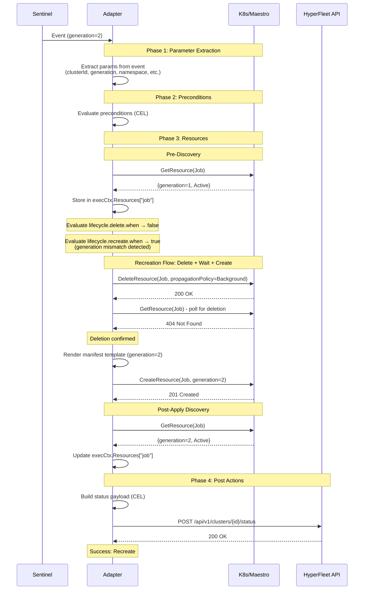
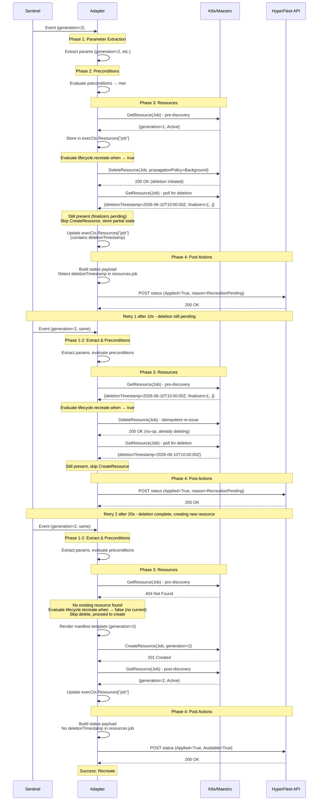

# Adapter Resource Recreation Flow Design

**Jira**: [HYPERFLEET-837](https://issues.redhat.com/browse/HYPERFLEET-837)

## What & Why

**What**: Design the recreation workflow for resources that cannot be updated in-place (e.g., Kubernetes Jobs with immutable fields). When certain conditions change, the adapter deletes the old resource and creates a new one.

**Why**: Some resources have immutable fields that cannot be patched. Without a clear recreation mechanism:
- Config authors have no way to express "recreate this resource when X changes"
- Recreation must be safe across Sentinel's ~10s retry loop (may receive same event multiple times)
- Deletion may span multiple reconciliation loops due to finalizers or async behavior
- Creation must never be attempted while deletion is still pending

**Related Documentation:**
- [Adapter Framework Design](./adapter-frame-design.md) — Core executor architecture
- [Adapter Status Contract](./adapter-status-contract.md) — Status reporting patterns

### Scope

- CEL expression evaluation for recreation triggers (`lifecycle.recreate.when`)
- Stateless, transport-agnostic delete+apply flow
- Handling async deletion (finalizers, eventual consistency)
- Both Kubernetes and Maestro transports
- Safe retry across Sentinel's polling loop

### Out of Scope

- Stuck deletion timeout behavior and alerts (Will be covered by [HYPERFLEET-1205](https://redhat.atlassian.net/browse/HYPERFLEET-1205))

---

## Design

### Flow & Lifecycle

When a resource is configured with `lifecycle.recreate.when`, the executor:

1. **Pre-discovers** the current resource state (if any) so CEL expressions can compare incoming parameters with the current resource to detect changes that require recreation.

2. **Deletion short-circuit**: `lifecycle.delete.when` is evaluated first. If it evaluates to true, `lifecycle.recreate.when` is never evaluated — see [Conflict Resolution: Delete vs. Recreate](#conflict-resolution-delete-vs-recreate) below.

3. **Evaluates** `lifecycle.recreate.when` (a CEL expression). If true, enters the recreation flow; otherwise, uses the normal apply path (update in-place or create).

4. **In the recreation flow**:
   - Trigger deletion of the old resource (asynchronously) using `Background` propagation policy
   - Perform post-discovery to check whether the resource has been deleted
   - If resource is gone (404/NotFound): proceed to create the new resource
   - If resource still exists (has `deletionTimestamp` or other deletion state): return early with `Operation=Recreate, Reason="deletion pending"` — do NOT attempt creation
   - This flow is safe to retry — multiple attempts converge to the same end state
   
   **Handling pending deletions**: When post-discovery still sees the resource (even with `deletionTimestamp`), we rely on Sentinel's existing retry mechanism (~10s interval) to re-trigger the adapter. This avoids introducing nested polling loops within the adapter, which would increase complexity and cost at scale. The recreation will complete on a subsequent reconciliation once the resource is fully deleted.

### Configuration Structure

Configure resource recreation by adding a `lifecycle.recreate.when` expression that detects when the resource should be deleted and recreated:

```yaml
resources:
  - name: "job"
    transport:
      client: "kubernetes"
    manifest:
      apiVersion: batch/v1
      kind: Job
      metadata:
        name: "{{ .clusterId }}-job-{{ .generation }}"
        namespace: "{{ .namespace }}"
        labels:
          hyperfleet.io/cluster-id: "{{ .clusterId }}"
          hyperfleet.io/resource-type: "job"
        annotations:
          hyperfleet.io/generation: "{{ .generation }}"
      spec:
        backoffLimit: 0
        ttlSecondsAfterFinished: 300
        template:
          spec:
            restartPolicy: Never
            containers:
              - name: hello
                image: alpine:3.19
                command: ["/bin/sh", "-c", "echo 'Hello World!' && exit 0"]
    
    # Required: discovery allows the CEL expression to compare current vs. desired state
    discovery:
      namespace: "{{ .namespace }}"
      by_selectors:
        label_selector:
          hyperfleet.io/cluster-id: "{{ .clusterId }}"
          hyperfleet.io/resource-type: "job"
    
    lifecycle:
      # Deletion configuration
      delete:
        propagationPolicy: "Background"
        when:
          expression: "is_deleting"
      # Recreation trigger: when the expression is true, delete old resource and create new
      recreate:
        when:
          expression: |
            resources.?job.hasValue()
            && has(resources.job.metadata)
            && has(resources.job.metadata.annotations)
            && string(generation) != resources.job.metadata.annotations["hyperfleet.io/generation"]
```

**Requirements (validated at adapter startup):**

- **Discovery block required**: If `discovery` is absent, the adapter rejects the config and fails to start — this prevents silent runtime failure where the CEL expression evaluates against an empty resource context
- **Expression required**: `lifecycle.recreate.when.expression` must be present and non-empty
- **Transport-agnostic**: Recreation works identically for K8s and Maestro transports

### Conflict Resolution: Delete vs. Recreate

Both `lifecycle.delete.when` and `lifecycle.recreate.when` can evaluate to true simultaneously. A common case: when `deleted_time` is set, the existing resource still carries the old generation annotation, which triggers a generation mismatch in the recreate expression.

The framework resolves this with explicit evaluation ordering:

| Priority | Expression | If true |
|----------|-----------|---------|
| 1 (higher) | `lifecycle.delete.when` | Execute deletion, stop. `lifecycle.recreate.when` is never evaluated. |
| 2 | `lifecycle.recreate.when` | Enter recreation flow. |

This ordering is framework-enforced and not configurable. Config authors do not need to write `!is_deleting` in recreate expressions.

### Recreation Flow Implementation

The detailed recreation flow is described in step 4 of [Flow & Lifecycle](#flow--lifecycle) above. Key implementation details:

- **Idempotent deletion**: `TransportClient.DeleteResource()` can be called multiple times safely
- **Post-delete verification**: Uses same discovery mechanism to check if resource is gone
- **Convergence**: Multiple retry attempts from Sentinel converge to the same end state
- **No special flags**: Uses standard `ApplyResource()` after deletion confirms completion

### Multi-Resource Recreation Ordering

When multiple resources are configured, they are processed **sequentially in config list order** — there is no parallelism and no automatic dependency resolver.

Before the loop begins, a single **pre-discovery pass** runs for all resources and populates their current state into `execCtx.Resources`. This ensures `lifecycle.recreate.when` CEL expressions can reference sibling resource state regardless of their position in the list.

| Scenario | Behavior |
|----------|----------|
| Resource A recreation is deletion pending | Loop continues — resource B is still processed in the same reconciliation |
| Resource A delete succeeds (fully gone) | Resource B's `recreate.when` can reference `resources.?A.hasValue() == false` in the same reconciliation |
| Resource A delete is still pending | Resource B sees A's mid-deletion state in `resources.A` (object present with `deletionTimestamp`) |

Config authors control ordering via: (1) list position in config, and (2) CEL expressions that reference sibling resource state to create implicit dependencies.

### Status Reporting During Recreation

Post-processing always runs after the resources phase, **including when deletion is still pending**. There is no framework-level guard that skips post-processing during recreation. When the resource hasn't been fully removed yet, `resources.<name>` contains the **still-present, mid-deletion object** — typically with `metadata.deletionTimestamp` set. Config authors encode awareness of this state into their CEL conditions.

Status conditions are built in the `post` section using CEL expressions that access:

- **Discovered resources**: `resources.?resourceName` (contains the current state, including metadata and status)
- **Adapter execution state**: `adapter.executionStatus` (success/failed), `adapter.resourcesSkipped`, `adapter.errorMessage`
- **Parameters from preconditions**: `is_deleting`, `generation`, etc.

**Detecting pending deletion during recreation:**

When recreation is in progress but deletion hasn't completed yet (finalizers pending, async deletion), the discovered resource will still exist in `resources.?resourceName`. Status conditions can detect this state:

```yaml
post:
  payloads:
    - name: "statusPayload"
      build:
        conditions:
          # Applied: Resource exists (may be pending deletion during recreation)
          - type: "Applied"
            status:
              expression: |
                resources.?job.?metadata.?creationTimestamp.hasValue() ? "True" : "False"
            reason:
              expression: |
                resources.?job.?metadata.?deletionTimestamp.hasValue()
                  ? "RecreationPending"
                  : (resources.?job.?metadata.?creationTimestamp.hasValue()
                      ? "ResourceApplied"
                      : "ResourceNotYetCreated")
            message:
              expression: |
                resources.?job.?metadata.?deletionTimestamp.hasValue()
                  ? "Resource deletion in progress, recreation will complete after finalizers"
                  : (resources.?job.?metadata.?creationTimestamp.hasValue()
                      ? "Resource successfully applied"
                      : "Resource not yet created")
          
          # Available: Check if resource is actually available (not during deletion)
          - type: "Available"
            status:
              expression: |
                resources.?job.?metadata.?deletionTimestamp.hasValue()
                  ? "False"
                  : (resources.?job.?status.?succeeded.orValue(0) > 0 ? "True" : "False")
            reason:
              expression: |
                resources.?job.?metadata.?deletionTimestamp.hasValue()
                  ? "DeletionPending"
                  : (resources.?job.?status.?succeeded.orValue(0) > 0
                      ? "JobCompleted"
                      : "JobRunning")
```

**Key detection pattern**: `resources.?resourceName.?metadata.?deletionTimestamp.hasValue()` indicates the resource is pending deletion (finalizers or async deletion in progress).

**After successful recreation** (new resource created, no deletionTimestamp):
- `Applied=True` with `Reason="ResourceApplied"`
- `Available` depends on postconditions (job completion, etc.)
- Standard post-apply discovery populates `resources.?resourceName` with the new resource state

See [Adapter Status Contract](./adapter-status-contract.md) for details on the standard status condition patterns.

### Happy Path Sequence



### Pending Deletion Sequence

This is the critical case: deletion can potentially take multiple adapter reconciliation loops due to finalizers / async behavior / grace periods when deleting k8s resources. Sentinel sends the same event repeatedly (~10s intervals). Recreation must be safe to retry.



**Key property**: Delete is idempotent. Re-issuing DELETE when the resource already has `deletionTimestamp` is safe. Sentinel's retry loop naturally handles pending deletions without special logic.

### CEL Evaluation Context

`lifecycle.recreate.when` expressions have access to:

| Context Variable | Description | Example |
|-----------------|-------------|---------|
| Extracted parameters | From event/preconditions | `generation`, `clusterId`, `namespace` |
| Discovered resources | Current resource state | `resources.?job.metadata.annotations` |
| Adapter metadata | Execution state | `adapter.executionStatus`, `adapter.errorMessage` |

**Safe access patterns:**
- **Optional chaining**: `resources.?job.hasValue()` — prevents crashes on missing resources
- **`has()` macro**: `has(resources.job.metadata)` — checks for nested field existence

**Common expressions:**

```cel
# Recreate when generation annotation mismatches (recommended)
resources.?job.hasValue()
&& has(resources.job.metadata.annotations)
&& string(generation) != resources.job.metadata.annotations["hyperfleet.io/generation"]

# Recreate when spec field changes
resources.?cluster.hasValue()
&& has(resources.cluster.spec)
&& resources.cluster.spec.region != currentRegion

# Always recreate (testing/debugging)
true
```

### Edge Cases & Handling

| Scenario | Behavior |
|----------|----------|
| Resource doesn't exist at pre-discovery | Skip delete step, go directly to apply (create new resource) |
| Post-delete discovery fails (non-API error) | Assume resource still present due to transient error. Return early with "deletion pending". Retry on next Sentinel event. |
| CEL accesses non-existent resource | Use optional chaining (`resources.?job.hasValue() && ...`) to avoid crashes. CEL short-circuits evaluation. |
| Both delete and recreate expressions are true | Framework uses explicit evaluation ordering — see [Conflict Resolution](#conflict-resolution-delete-vs-recreate) |

---

## Responsibilities & Trade-offs

**What the framework provides:** Declarative recreation via CEL expressions. Works identically for K8s and Maestro. Safe to retry (delete is idempotent). Explicit delete-before-recreate evaluation ordering enforced by the framework.

**What config authors own:**
- Test recreation flow in staging environment before production
- Validate that stuck deletions are prevented through proper RBAC, finalizers, and cleanup logic in their domain

**Trade-off:** Deletion is fire-and-forget; actual deletion may span multiple reconciliation loops. The framework cannot recover from stuck deletions — prevention through proper design in the staging environment is the only viable approach.

**Why `lifecycle.recreate.when` replaces `RecreateOnChange`:** The previous transport-layer flag only worked for K8s (ignored by Maestro) and was not safe to retry across Sentinel's polling loop. The new CEL-based approach is transport-agnostic and stateless.
