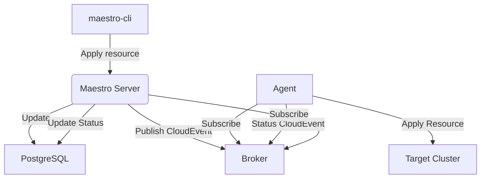

# Maestro CLI Implementation Guide

## Overview

This document provides detailed implementation guidance for the job-based maestro-cli approach for HyperFleet's Maestro integration.

---

## Resource Workflow

### Complete Resource Lifecycle



### Step-by-Step Workflow

1. **Cluster Registration**: Agent registers as "Consumer" via HTTP API
2. **Resource Submission**: maestro-cli submits ManifestWork via gRPC CloudEvent
3. **Resource Storage**: Maestro server stores in database, generates resource-bundle ID
4. **Resource Delivery**: CloudEvent published to broker, agent receives and applies
5. **Status Reporting**: Agent monitors status, publishes updates via CloudEvents
6. **Status Processing**: Server receives status, updates database

---

## maestro-CLI Command Specification

### Core Commands

```bash
# Apply ManifestWork (create or update automatically) - includes cluster ID in name
maestro-cli apply --manifest-file=hyperfleet-cluster-west-1-nodepool.yaml --consumer=cluster-west-1 --watch --timeout=5m --results-path=/shared/results.json

# Multi-cluster deployment examples
maestro-cli apply --manifest-file=hyperfleet-cluster-west-1-nodepool.yaml --consumer=cluster-west-1 --watch
maestro-cli apply --manifest-file=hyperfleet-cluster-east-2-nodepool.yaml --consumer=cluster-east-2 --watch
maestro-cli apply --manifest-file=hyperfleet-cluster-west-1-idp.yaml --consumer=cluster-west-1 --watch

# Get ManifestWork status - specify full name with cluster ID
maestro-cli get --name=hyperfleet-cluster-west-1-nodepool --consumer=cluster-west-1 --results-path=/shared/get-results.json

# List ManifestWorks with filtering by consumer
maestro-cli list --consumer=cluster-west-1 --status=Applied
maestro-cli list --consumer=cluster-east-2 --status=Applied

# Describe specific ManifestWork
maestro-cli describe --name=hyperfleet-cluster-west-1-nodepool --consumer=cluster-west-1

# Delete specific ManifestWork - include cluster ID in name
maestro-cli delete --name=hyperfleet-cluster-west-1-nodepool --consumer=cluster-west-1 --watch --results-path=/shared/delete-results.json

# Delete all ManifestWorks for a specific consumer/cluster
maestro-cli delete --consumer=cluster-west-1 --all --watch
maestro-cli delete --consumer=cluster-east-2 --all --watch

# Validate ManifestWork before submission
maestro-cli validate --manifest-file=hyperfleet-cluster-west-1-nodepool.yaml --consumer=cluster-west-1

# Wait for specific condition - use full ManifestWork name
maestro-cli wait --name=hyperfleet-cluster-west-1-nodepool --consumer=cluster-west-1 --condition=Applied --timeout=10m --results-path=/shared/wait-results.json

# Watch all ManifestWorks for specific consumer/cluster
maestro-cli watch --consumer=cluster-west-1
maestro-cli watch --consumer=cluster-east-2

# Check differences between desired and actual state
maestro-cli diff --name=hyperfleet-cluster-west-1-nodepool --consumer=cluster-west-1 --manifest-file=hyperfleet-cluster-west-1-nodepool.yaml

# Build ManifestWork by merging nodepool details with remote ManifestWork
maestro-cli build --name=hyperfleet-cluster-west-1-nodepool --consumer=cluster-west-1 --source-file=nodepool-config.json --output=complete-manifestwork.yaml

# Build and apply directly
maestro-cli build --name=hyperfleet-cluster-west-1-nodepool --consumer=cluster-west-1 --source-file=nodepool-config.json --apply --watch
```

---

## Implementation Approach: ManifestWork Client (Recommended)

**Chosen Approach**: Use Maestro's ManifestWork client for Kubernetes-native operations

### Why ManifestWork Implementation

- **Kubernetes-Native API**: Works with typed `ManifestWork` objects like kubectl
- **Semantic Naming**: Use meaningful ManifestWork names instead of opaque bundle IDs
- **Built-in Apply Logic**: Handles create-or-update automatically (perfect for CLI `apply` command)
- **No Bundle ID Management**: ManifestWork names provide natural resource identification
- **Type Safety**: Compile-time checking and IDE support
- **Watch Support**: Real-time status updates without polling

### ManifestWork ↔ Resource-Bundle Mapping

```
Each ManifestWork = One Resource-Bundle
├── ManifestWork Name → Resource-Bundle Name (semantic with cluster ID)
├── ManifestWork Namespace → Consumer Name (cluster)
└── ManifestWork Manifests → Resource-Bundle Content
```

### Implementation Pattern

<details>
<summary>applyCommand implementation with ManifestWork</summary>

```go
func applyCommand(flags *MaestroCLIFlags) error {
    // Create ManifestWork client
    workClient, err := createWorkClient(flags.GRPCEndpoint, flags.HTTPEndpoint)
    if err != nil {
        return fmt.Errorf("failed to create work client: %w", err)
    }

    // Load ManifestWork from file
    manifestWork, err := loadManifestWorkFromFile(flags.ManifestFile)
    if err != nil {
        return fmt.Errorf("failed to load manifest: %w", err)
    }

    // Apply (create or update automatically)
    err = applyManifestWork(ctx, workClient, flags.Consumer, manifestWork)
    if err != nil {
        return fmt.Errorf("failed to apply manifest work: %w", err)
    }

    // Write status for status-reporter integration
    status := StatusResult{
        ManifestWorkName: manifestWork.Name,  // e.g. "hyperfleet-cluster-west-1-nodepool"
        Consumer:        flags.Consumer,      // e.g. "cluster-west-1"
        Status:          "Applied",
        Message:         "ManifestWork applied successfully",
        Timestamp:       time.Now(),
    }
    writeStatusResult(status, flags)

    if flags.Watch {
        return waitWithManifestWorkWatch(workClient, flags.Consumer, manifestWork.Name, flags.Condition)
    }
    return nil
}

func applyManifestWork(ctx context.Context, workClient workv1client.WorkV1Interface, consumer string, manifestwork *workv1.ManifestWork) error {
    // Try to get existing work
    existingWork, err := workClient.ManifestWorks(consumer).Get(ctx, manifestwork.Name, metav1.GetOptions{})
    if apierrors.IsNotFound(err) {
        // Work doesn't exist, create it
        _, err := workClient.ManifestWorks(consumer).Create(ctx, manifestwork, metav1.CreateOptions{})
        return err
    }

    if err != nil {
        return fmt.Errorf("failed to get existing work: %w", err)
    }

    // Work exists, update with merge patch
    patchData, err := grpcsource.ToWorkPatch(existingWork, manifestwork)
    if err != nil {
        return fmt.Errorf("failed to create patch: %w", err)
    }

    _, err = workClient.ManifestWorks(consumer).Patch(ctx, manifestwork.Name, types.MergePatchType, patchData, metav1.PatchOptions{})
    return err
}
```
</details>

<details>
<summary>getCommand implementation with ManifestWork</summary>

```go
func getCommand(flags *MaestroCLIFlags) error {
    workClient, err := createWorkClient(flags.GRPCEndpoint, flags.HTTPEndpoint)
    if err != nil {
        return err
    }

    work, err := workClient.ManifestWorks(flags.Consumer).Get(ctx, flags.Name, metav1.GetOptions{})
    if err != nil {
        return fmt.Errorf("failed to get work: %w", err)
    }

    // Output work details
    workJSON, err := json.MarshalIndent(work, "", "  ")
    if err != nil {
        return fmt.Errorf("failed to marshal work: %w", err)
    }

    fmt.Printf("%s\n", string(workJSON))
    return nil
}
```
</details>

<details>
<summary>deleteCommand implementation with ManifestWork</summary>

```go
func deleteCommand(flags *MaestroCLIFlags) error {
    workClient, err := createWorkClient(flags.GRPCEndpoint, flags.HTTPEndpoint)
    if err != nil {
        return err
    }

    if flags.All {
        // Delete all works for this consumer
        workList, err := workClient.ManifestWorks(flags.Consumer).List(ctx, metav1.ListOptions{})
        if err != nil {
            return fmt.Errorf("failed to list works: %w", err)
        }

        for _, work := range workList.Items {
            err = workClient.ManifestWorks(flags.Consumer).Delete(ctx, work.Name, metav1.DeleteOptions{})
            if err != nil {
                return fmt.Errorf("failed to delete work %s: %w", work.Name, err)
            }
        }
    } else {
        // Delete specific work
        err = workClient.ManifestWorks(flags.Consumer).Delete(ctx, flags.Name, metav1.DeleteOptions{})
        if err != nil {
            return fmt.Errorf("failed to delete work: %w", err)
        }
    }

    return nil
}
```
</details>

<details>
<summary>waitCommand implementation with ManifestWork Watch</summary>

```go
func waitWithManifestWorkWatch(workClient workv1client.WorkV1Interface, consumer, workName, condition string) error {
    watcher, err := workClient.ManifestWorks(consumer).Watch(ctx, metav1.ListOptions{
        FieldSelector: fmt.Sprintf("metadata.name=%s", workName),
    })
    if err != nil {
        return fmt.Errorf("failed to create watcher: %w", err)
    }
    defer watcher.Stop()

    ch := watcher.ResultChan()
    for {
        select {
        case <-ctx.Done():
            return nil
        case event, ok := <-ch:
            if !ok {
                return fmt.Errorf("watch channel closed")
            }

            work, ok := event.Object.(*workv1.ManifestWork)
            if !ok {
                continue
            }

            if checkManifestWorkCondition(work, condition) {
                // Write final status
                status := StatusResult{
                    ManifestWorkName: work.Name,
                    Consumer:        consumer,
                    Status:          condition,
                    Message:         fmt.Sprintf("Condition '%s' met", condition),
                    Timestamp:       time.Now(),
                }
                writeStatusResult(status, nil)
                return nil
            }
        }
    }
}

func checkManifestWorkCondition(work *workv1.ManifestWork, condition string) bool {
    switch condition {
    case "Applied":
        return work.Status.Phase == workv1.ManifestWorkPhaseApplied
    case "Available":
        return work.Status.Phase == workv1.ManifestWorkPhaseAvailable
    case "Progressing":
        return work.Status.Phase == workv1.ManifestWorkPhaseProgressing
    case "Degraded":
        return work.Status.Phase == workv1.ManifestWorkPhaseDegraded
    default:
        return false
    }
}
```
</details>

### Alternative Approach: CloudEvents Implementation (Not Recommended)

**CloudEvents approach** uses low-level gRPC CloudEvents protocol directly:

<details>
<summary>Alternative CloudEvents implementation</summary>

```go
// Alternative: Direct CloudEvents approach (more complex)
func applyCommandWithCloudEvents(flags *MaestroCLIFlags) error {
    // Create gRPC CloudEvents client
    conn, err := grpc.Dial(flags.GRPCEndpoint, grpc.WithTransportCredentials(insecure.NewCredentials()))
    if err != nil {
        return err
    }
    defer conn.Close()

    client := pbv1.NewCloudEventServiceClient(conn)

    // Manually construct CloudEvent
    evt := cloudevents.NewEvent()
    evt.SetType("io.open-cluster-management.works.v1alpha1.manifestbundles.spec.create_request")
    evt.SetExtension("resourceid", uuid.NewString())

    evt.SetSource("maestro-cli")
    evt.SetExtension("clustername", flags.Consumer)
    evt.SetData(cloudevents.ApplicationJSON, loadCloudEventData(flags.ManifestFile))

    // Convert to protobuf and publish
    pbEvt := &pbv1.CloudEvent{}
    if err = grpcprotocol.WritePBMessage(ctx, binding.ToMessage(&evt), pbEvt); err != nil {
        return err
    }

    _, err = client.Publish(ctx, &pbv1.PublishRequest{Event: pbEvt})
    if err != nil {
        return fmt.Errorf("failed to publish CloudEvent: %w", err)
    }

    // Manual status tracking required
    if flags.Watch {
        return subscribeToStatusUpdates(client, flags)
    }
    return nil
}

func loadCloudEventData(manifestFile string) interface{} {
    // Must manually convert ManifestWork to CloudEvent data format
    manifestWork := loadManifestWorkFromFile(manifestFile)

    return map[string]interface{}{
        "manifests": manifestWork.Spec.Workload.Manifests,
        "deleteOption": manifestWork.Spec.DeleteOption,
        "manifestConfigs": manifestWork.Spec.ManifestConfigs,
    }
}
```
</details>

### Why NOT CloudEvents Implementation

| **Aspect** | **ManifestWork Client** | **CloudEvents Client** |
|------------|------------------------|------------------------|
| **Bundle ID Management** | ❌ **Not needed** - use ManifestWork names | ✅ **Required** - must track opaque resource-bundle IDs |
| **Apply Logic** | ✅ **Built-in** - handles create/update automatically | ❌ **Manual** - must implement create vs update logic |
| **Type Safety** | ✅ **Strong typing** - `workv1.ManifestWork` objects | ❌ **Interface{}** - manual JSON/CloudEvent manipulation |
| **API Complexity** | ✅ **Simple** - familiar kubectl-like operations | ❌ **Complex** - CloudEvent construction and extensions |
| **Status Monitoring** | ✅ **Watch API** - real-time typed events | ❌ **Manual subscription** - parse CloudEvent responses |
| **Error Handling** | ✅ **Kubernetes errors** - standard apimachinery errors | ❌ **CloudEvent errors** - custom error parsing |
| **Resource Identification** | ✅ **Semantic names** - "hyperfleet-nodepool" | ❌ **Opaque IDs** - "rb-abc123-def456" |
| **Learning Curve** | ✅ **Kubernetes-native** - familiar to developers | ❌ **CloudEvents protocol** - requires new concepts |

**Key Problems with CloudEvents Approach:**
1. **Resource ID Complexity**: Must track and manage opaque resource-bundle IDs
2. **Manual Apply Logic**: No built-in create-or-update handling
3. **Protocol Complexity**: Must understand CloudEvent extensions and types
4. **Status Parsing**: Manual CloudEvent subscription and response parsing
5. **Type Safety**: Loses compile-time checking and IDE support

**Why ManifestWork is Better:**
- **Semantic Naming**: Work directly with meaningful ManifestWork names
- **Kubernetes-Native**: Familiar API patterns for developers
- **Built-in Operations**: Apply, watch, and status checking included
- **Type Safety**: Full compile-time validation and IDE autocomplete
- **Simpler Implementation**: Less code, fewer concepts to learn
---

## Command Flags

### Required Flags by Command

| **Command** | **Required Flags** | **Optional Flags** |
|-------------|-------------------|--------------------|
| **apply** | `--name`, `--manifest-file`, `--consumer` | `--manifest-name`, `--watch`, `--timeout`, `--results-path` |
| **get** | `--name`, `--consumer` | `--manifest-name`, `--output`, `--results-path` |
| **list** | `--consumer` | `--status`, `--output` |
| **delete** | `--name`, `--consumer` | `--manifest-name`, `--watch`, `--results-path` |
| **describe** | `--name`, `--consumer` | `--output` |
| **validate** | `--manifest-file`, `--consumer` | None |
| **wait** | `--name`, `--consumer`, `--condition` | `--manifest-name`, `--timeout`, `--results-path` |
| **watch** | `--consumer` | `--timeout` |
| **diff** | `--name`, `--consumer`, `--manifest-file` | `--show-diff` |
| **build** | `--name`, `--consumer`, `--source-file` | `--output`, `--apply`, `--watch`, `--strategy`, `--force` |

### Flag Validation

Each command validates its required flags before execution:
- **apply**: Requires `--name`, `--manifest-file`, and `--consumer`; optionally `--manifest-name` to merge with existing ManifestWork (fetches current, merges provided manifest)
- **get**: Requires `--name` and `--consumer`; optionally `--manifest-name` to get specific manifest status within ManifestWork
- **delete**: Requires `--name` and `--consumer`; optionally `--manifest-name` to delete specific manifest within ManifestWork
- **wait**: Requires `--name`, `--consumer`, and `--condition`; optionally `--manifest-name` to wait for a specific manifest condition within ManifestWork
- **build**: Requires `--name`, `--consumer`, and `--source-file`

---

### Command Implementation Reference

For detailed command implementation patterns, refer to the official Maestro ManifestWork client example:

**Reference**: [maestro/examples/manifestwork/client.go](https://github.com/openshift-online/maestro/blob/main/examples/manifestwork/client.go)

This example demonstrates:
- **WorkClient creation** using `grpcsource.NewMaestroGRPCSourceWorkClient`
- **get** - `workClient.ManifestWorks(consumerName).Get(ctx, workName, metav1.GetOptions{})`
- **list** - `workClient.ManifestWorks(consumerName).List(ctx, metav1.ListOptions{})`
- **apply** - Create with `workClient.ManifestWorks(consumerName).Create()` or update with `workClient.ManifestWorks(consumerName).Patch()`
- **delete** - `workClient.ManifestWorks(consumerName).Delete(ctx, workName, metav1.DeleteOptions{})`
- **watch** - `workClient.ManifestWorks(consumerName).Watch(ctx, metav1.ListOptions{})`

**Key packages used:**
```go
import (
    "github.com/openshift-online/maestro/pkg/api/openapi"
    "github.com/openshift-online/maestro/pkg/client/cloudevents/grpcsource"
    workv1client "open-cluster-management.io/api/client/work/clientset/versioned/typed/work/v1"
    workv1 "open-cluster-management.io/api/work/v1"
)
```

---

## Status Monitoring Implementation

### Why HTTP Polling for Status Monitoring (--watch flag)

**Decision:** Use HTTP polling instead of gRPC subscription for the `--watch` flag and status monitoring commands.

**HTTP Polling Benefits:**
- **No event consumption conflicts** - Uses read-only HTTP API, no broker interaction
- **No gRPC connection management** - Avoids stream resource usage and complexity
- **Simple implementation** - Standard HTTP client patterns
- **No broker dependency** - Works even if gRPC broker has issues
- **Configurable intervals** - Balance between latency and server load
- **No broker-specific setup** - Subscribe requires additional preparation for non-gRPC brokers (e.g., GCP Pub/Sub requires creating a separate subscription, AWS IoT requires topic configuration)
- **No state persistence needed** - Subscribe-based approach requires a "database" to record status from CloudEvents, otherwise duplicating what Maestro Server already does; HTTP polling leverages Maestro's existing status storage. We can use RESULT_PATH file to record the status with gRPC, but not enough benefits from the complexity.

**Trade-offs Accepted:**
- **Higher latency** - Polling interval (5-10s) vs real-time events
- **More HTTP requests** - Regular polling vs event-driven push
- **Less efficient** - Repeated queries vs push notifications

**Why This Works for maestro-cli:**
- Status polling latency (5-10s) is acceptable for job-based operations
- Job startup time (~2-5s) already dominates, so polling adds minimal overhead
- Simplicity and reliability outweigh real-time requirements for adapter job use cases

### HTTP Polling Implementation

<details>
<summary>StatusPoller implementation</summary>

```go
type StatusPoller struct {
    httpClient   *http.Client
    maestroAddr  string
    pollInterval time.Duration
}

func (p *StatusPoller) WaitForCondition(bundleID, condition string, timeout time.Duration) error {
    ctx, cancel := context.WithTimeout(context.Background(), timeout)
    defer cancel()

    ticker := time.NewTicker(p.pollInterval)
    defer ticker.Stop()

    for {
        select {
        case <-ctx.Done():
            return fmt.Errorf("timeout waiting for condition %s", condition)
        case <-ticker.C:
            status, err := p.getResourceStatus(bundleID)
            if err != nil {
                continue // Retry on error
            }

            if p.checkCondition(status, condition) {
                return nil
            }
        }
    }
}

func (p *StatusPoller) getResourceStatus(bundleID string) (*ResourceStatus, error) {
    url := fmt.Sprintf("%s/api/maestro/v1/resource-bundles/%s", p.maestroAddr, bundleID)

    resp, err := p.httpClient.Get(url)
    if err != nil {
        return nil, err
    }
    defer resp.Body.Close()

    var status ResourceStatus
    err = json.NewDecoder(resp.Body).Decode(&status)
    return &status, err
}

func (p *StatusPoller) checkCondition(status *ResourceStatus, condition string) bool {
    switch condition {
    case "Applied":
        return status.Status == "Applied"
    case "Failed":
        return status.Status == "Failed"
    case "AllApplied":
        return status.AllResourcesApplied()
    default:
        return strings.Contains(status.Status, condition)
    }
}
```
</details>

### Resource-Specific Status Monitoring

<details>
<summary>WaitForResourceCondition implementation</summary>

```go
func (p *StatusPoller) WaitForResourceCondition(bundleID, resourceName, condition string) error {
    for {
        bundle, err := p.getResourceBundle(bundleID)
        if err != nil {
            continue
        }

        // Find specific resource status within bundle
        for _, resourceStatus := range bundle.ResourceStatuses {
            if resourceStatus.Name == resourceName {
                if resourceStatus.Phase == condition {
                    return nil
                }
                break
            }
        }

        time.Sleep(p.pollInterval)
    }
}
```
</details>

---

## Error Handling & Resilience

### Retry Logic

<details>
<summary>executeWithRetry implementation</summary>

```go
func executeWithRetry(operation func() error, maxRetries int, backoff time.Duration) error {
    var lastError error

    for attempt := 0; attempt <= maxRetries; attempt++ {
        if attempt > 0 {
            time.Sleep(backoff * time.Duration(attempt))
        }

        if err := operation(); err != nil {
            lastError = err
            log.Printf("Attempt %d failed: %v", attempt+1, err)
            continue
        }

        return nil // Success
    }

    return fmt.Errorf("operation failed after %d attempts: %w", maxRetries+1, lastError)
}
```
</details>

### Connection Management

<details>
<summary>MaestroClient connection management</summary>

```go
type MaestroClient struct {
    grpcConn   *grpc.ClientConn
    httpClient *http.Client
    config     ClientConfig
}

func (c *MaestroClient) ensureGRPCConnection() error {
    if c.grpcConn == nil {
        conn, err := grpc.Dial(c.config.GRPCEndpoint,
            grpc.WithTransportCredentials(c.config.TLSCredentials),
            grpc.WithDefaultCallOptions(grpc.MaxCallRecvMsgSize(16*1024*1024)),
        )
        if err != nil {
            return fmt.Errorf("failed to create gRPC connection: %w", err)
        }
        c.grpcConn = conn
    }
    return nil
}

func (c *MaestroClient) Close() error {
    if c.grpcConn != nil {
        return c.grpcConn.Close()
    }
    return nil
}
```
</details>

### Graceful Degradation

- **Primary execution attempt** - Execute command with configured endpoints
- **Fallback on failure** - If primary fails and fallback is available, attempt fallback approach
- **Local storage fallback** - Store manifest locally for retry when Maestro is unavailable
- **Error propagation** - Return error if no fallback available or fallback also fails

---

## Status Output Integration
`--watch` flag can provide status syncing functionality. To well record the status and result, we will provide some configurations to support the result recording.

### RESULTS_PATH Configuration

**Configuration Priority:**
```bash
1. --results-path flag (highest priority)
2. RESULTS_PATH environment variable
3. Default: None. The result won't be recorded if no result-path set.
```

### Status Output Format

<details>
<summary>StatusResult implementation</summary>

```go
type StatusResult struct {
    ManifestWorkName string            `json:"manifestWorkName"` // Semantic ManifestWork name
    Consumer        string            `json:"consumer"`         // Target cluster name
    Status          string            `json:"status"`           // Applied, Failed, InProgress, Available, Progressing, Degraded
    Message         string            `json:"message"`
    Timestamp       time.Time         `json:"timestamp"`
    Resources       []ResourceStatus  `json:"resources,omitempty"`
}

func writeStatusResult(status StatusResult, flags *MaestroCLIFlags) error {
    resultsPath := getResultsPath(flags)
    if resultsPath == "" {
        return nil // No results output requested
    }

    data, _ := json.Marshal(status)
    return os.WriteFile(resultsPath, data, 0644)
}

func getResultsPath(flags *MaestroCLIFlags) string {
    // Priority: flag > env var > no default
    if flags.ResultsPath != "" {
        return flags.ResultsPath
    }

    if envPath := os.Getenv("RESULTS_PATH"); envPath != "" {
        return envPath
    }

    return "" // No default - results won't be recorded if not set
}
```
</details>

### Status Flow Integration

**Status-reporter integration:**
```
maestro-cli (writes RESULTS_PATH) → status-reporter (reads RESULTS_PATH) → HyperFleet status updates
```

---

## Resource Update Strategy

### Complete Manifest Updates

**Important: maestro-cli always works with complete ManifestWork resources.**

**For all operations with --manifest-name flag set(apply, delete):**
- CLI always fetches the full ManifestWork from Maestro
- User provides complete desired state in manifest file
- CLI replaces entire ManifestWork contents with provided manifest

> **Note:** See [Implementation Pattern](#implementation-pattern) section for the `applyManifestWork` function details.

### Why Complete Bundle Operations

- **ManifestWork spec represents complete desired state** - Partial updates not supported
- **Missing manifests will be deleted by the agent** - Maestro agents expect full ManifestWork state
- **Atomic operations ensure consistency** - All resources in ManifestWork updated together
- **Agent handles diff and applies only changes** - Maestro optimizes at the agent level
- **CLI fetches current ManifestWork** - Always works with complete ManifestWork for safety

### Apply Command Usage

```bash
# Always provide complete manifest file - CLI uses ManifestWork name for identification
maestro-cli apply --manifest-file=complete-manifestwork.yaml --consumer=cluster-west-1 --watch

# CLI behavior:
# 1. Extracts ManifestWork name from the manifest file
# 2. Fetches current ManifestWork from Maestro (if exists)
# 3. Applies complete new state to Maestro

# NOT supported: partial manifest files
# maestro-cli apply --manifest-file=just-configmap.yaml --consumer=cluster-west-1  # ❌ Wrong - will delete other resources
```

---

## Build Command Implementation

### Overview

The `build` command enables merging nodepool configurations with existing ManifestWork resources, automating the fetch-merge-apply workflow for complex multi-resource deployments.

### Use Cases

**Primary Use Case**: Nodepool adapter needs to update nodepool configuration while preserving other resources (namespace, configmaps, services) in the same ManifestWork.

**Problem Solved**:
- Manual fetching and merging of existing ManifestWork
- Complex resource combination logic
- Error-prone manifest reconstruction

### Command Syntax

```bash
# Build ManifestWork by merging nodepool details with remote ManifestWork
maestro-cli build --name=hyperfleet-cluster-west-1-nodepool --consumer=cluster-west-1 \
  --source-file=nodepool-config.json --output=complete-manifestwork.yaml

# Build and apply directly (recommended for automation)
maestro-cli build --name=hyperfleet-cluster-west-1-nodepool --consumer=cluster-west-1 \
  --source-file=nodepool-config.json --apply --watch

# Dry-run validation before building
maestro-cli build --name=hyperfleet-cluster-west-1-nodepool --consumer=cluster-west-1 \
  --source-file=nodepool-config.json --dry-run

# Force overwrite with replace strategy
maestro-cli build --name=hyperfleet-cluster-west-1-nodepool --consumer=cluster-west-1 \
  --source-file=nodepool-config.json --strategy=replace --force --apply
```

### Build Flags

```go
type BuildFlags struct {
    // ManifestWork identification
    Name         string `flag:"name"`          // ManifestWork name (required)
    Consumer     string `flag:"consumer"`      // Target cluster (required)

    // Input sources
    NodepoolFile string `flag:"nodepool-file"` // JSON file with nodepool details
    ResourceFile string `flag:"resource-file"` // Generic resource file (alternative)

    // Output options
    Output       string `flag:"output"`        // Output file path (default: stdout)
    Format       string `flag:"format"`        // yaml|json (default: yaml)

    // Direct application
    Apply        bool   `flag:"apply"`         // Apply after building
    Watch        bool   `flag:"watch"`         // Watch if applying
    DryRun       bool   `flag:"dry-run"`       // Validate without applying

    // Merge strategy
    Strategy     string `flag:"strategy"`      // merge|replace (default: merge)
    Force        bool   `flag:"force"`         // Force overwrite existing resources
}
```

### Merge Strategies

**1. Merge Strategy (default)**: Combines resources intelligently
- **Behavior**: Replaces existing resources with same kind/name/namespace, adds new resources
- **Use Case**: Standard nodepool updates that preserve other resources

**2. Replace Strategy**: Overwrites all nodepool-related resources
- **Behavior**: Removes old nodepool resources, adds new ones
- **Use Case**: Complete nodepool reconfiguration

### Nodepool Configuration Format

<details>
<summary>Example nodepool-config.json</summary>

```json
{
  "nodepools": [
    {
      "name": "workers",
      "instanceType": "m5.large",
      "replicas": 3,
      "zones": ["us-west-2a", "us-west-2b"],
      "labels": {
        "node-role.kubernetes.io/worker": "",
        "hyperfleet.io/nodepool": "workers"
      }
    },
    {
      "name": "gpu-workers",
      "instanceType": "p3.2xlarge",
      "replicas": 1,
      "zones": ["us-west-2a"],
      "taints": [
        {
          "key": "nvidia.com/gpu",
          "value": "true",
          "effect": "NoSchedule"
        }
      ]
    }
  ],
  "metadata": {
    "cluster": "cluster-west-1",
    "region": "us-west-2",
    "version": "1.29"
  }
}
```
</details>

### Implementation

<details>
<summary>buildCommand implementation</summary>

```go
func buildCommand(flags *BuildFlags) error {
    // 1. Fetch existing ManifestWork from remote
    workClient, err := createWorkClient(flags.GRPCEndpoint, flags.HTTPEndpoint)
    if err != nil {
        return fmt.Errorf("failed to create work client: %w", err)
    }

    existingWork, err := workClient.ManifestWorks(flags.Consumer).Get(ctx, flags.Name, metav1.GetOptions{})
    if err != nil && !apierrors.IsNotFound(err) {
        return fmt.Errorf("failed to fetch existing work: %w", err)
    }

    // 2. Load configuration
    var newManifests []workv1.Manifest
    if flags.NodepoolFile != "" {
        nodepoolConfig, err := loadNodepoolConfig(flags.NodepoolFile)
        if err != nil {
            return fmt.Errorf("failed to load nodepool config: %w", err)
        }
        newManifests, err = nodepoolToManifests(nodepoolConfig)
        if err != nil {
            return fmt.Errorf("failed to convert nodepool to manifests: %w", err)
        }
    } else if flags.ResourceFile != "" {
        newManifests, err = loadResourceFile(flags.ResourceFile)
        if err != nil {
            return fmt.Errorf("failed to load resource file: %w", err)
        }
    }

    // 3. Merge configurations
    mergedWork, err := mergeManifestWork(existingWork, newManifests, flags.Strategy)
    if err != nil {
        return fmt.Errorf("failed to merge configurations: %w", err)
    }

    // 4. Output or apply
    if flags.Apply {
        return applyManifestWork(ctx, workClient, flags.Consumer, mergedWork)
    } else {
        return outputManifestWork(mergedWork, flags.Output, flags.Format)
    }
}

func mergeManifestWork(existingWork *workv1.ManifestWork, newManifests []workv1.Manifest, strategy string) (*workv1.ManifestWork, error) {
    if existingWork == nil {
        // Create new ManifestWork if none exists
        return &workv1.ManifestWork{
            ObjectMeta: metav1.ObjectMeta{
                Name:      flags.Name,
                Namespace: flags.Consumer,
            },
            Spec: workv1.ManifestWorkSpec{
                Workload: workv1.ManifestsTemplate{
                    Manifests: newManifests,
                },
            },
        }, nil
    }

    // Create working copy
    mergedWork := existingWork.DeepCopy()

    switch strategy {
    case "merge":
        return mergeStrategy(mergedWork, newManifests)
    case "replace":
        return replaceStrategy(mergedWork, newManifests)
    default:
        return nil, fmt.Errorf("unknown strategy: %s", strategy)
    }
}

func mergeStrategy(work *workv1.ManifestWork, newManifests []workv1.Manifest) (*workv1.ManifestWork, error) {
    existingManifests := work.Spec.Workload.Manifests

    // Build index of existing resources by kind/name/namespace
    existingIndex := make(map[string]int)
    for i, manifest := range existingManifests {
        key := manifestKey(manifest)
        existingIndex[key] = i
    }

    // Merge new manifests
    for _, newManifest := range newManifests {
        key := manifestKey(newManifest)
        if existingIdx, exists := existingIndex[key]; exists {
            // Replace existing resource
            existingManifests[existingIdx] = newManifest
        } else {
            // Add new resource
            existingManifests = append(existingManifests, newManifest)
        }
    }

    work.Spec.Workload.Manifests = existingManifests
    return work, nil
}

func manifestKey(manifest workv1.Manifest) string {
    // Extract kind, name, namespace from manifest for indexing
    obj := &unstructured.Unstructured{}
    if err := obj.UnmarshalJSON(manifest.RawExtension.Raw); err != nil {
        return ""
    }

    return fmt.Sprintf("%s/%s/%s",
        obj.GetKind(),
        obj.GetNamespace(),
        obj.GetName())
}
```
</details>

### Build Command Workflow

1. **Fetch Remote**: Retrieve existing ManifestWork from Maestro via ManifestWork client
2. **Load Configuration**: Parse nodepool or resource configuration file
3. **Convert Resources**: Transform configuration into Kubernetes manifests
4. **Merge Strategy**: Combine existing and new manifests based on strategy
5. **Output/Apply**: Either output merged ManifestWork or apply directly

### Benefits

| **Advantage** | **Description** |
|---------------|-----------------|
| **Automation** | Eliminates manual fetch-merge-apply workflow |
| **Safety** | Preserves existing resources during nodepool updates |
| **Flexibility** | Supports both nodepool-specific and generic resource merging |
| **Integration** | Works seamlessly with existing apply command |
| **Validation** | Dry-run mode prevents errors before application |

---

## Performance Considerations

### Note on Performance Trade-offs

**For maestro-cli:** Performance optimization is not a primary concern since this is a short-lived binary that runs in Kubernetes Jobs. Job startup overhead (pod scheduling, image pulling, container initialization) typically dominates execution time, making CLI-level optimizations less impactful. The CLI prioritizes simplicity, reliability, and maintainability over performance.

**For future adapter framework integration:** These considerations become important when scaling to high-frequency operations across many clusters, where the overhead of job creation becomes significant compared to persistent processes.

### Resource Usage Patterns

- **Connection pooling** for HTTP clients - *Future adapter framework consideration*
- **Connection reuse** for gRPC clients - *Future adapter framework consideration*
- **Manifest caching** to avoid repeated parsing - *Job-based CLI doesn't benefit from caching*
- **Compressed payloads** for large manifests - *Network optimization for high-volume scenarios*
- **Batch operations** where possible - *Not applicable to single-job CLI operations*

### Scaling Considerations

| **Aspect** | **maestro-cli (Current)** | **Adapter Framework (Future)** |
|------------|---------------------------|--------------------------------|
| **Connection Lifecycle** | Create → Use → Close | Persistent connection pools |
| **Memory Usage** | Minimal (job-based) | Optimized for long-running processes |
| **Network Efficiency** | Simple HTTP/gRPC calls | Connection reuse, batching |
| **Caching Strategy** | No caching needed | Manifest and status caching |
| **Concurrency** | Single operation per job | High-concurrency operation handling |

### Trade-off Decisions

- **Simplicity over Performance:** maestro-cli chooses straightforward implementations since job startup time dominates
- **Job Isolation over Efficiency:** Each operation runs in its own job (startup cost ~2-5 seconds vs CLI execution ~100ms)
- **Reliability over Speed:** HTTP polling over complex gRPC subscription management
- **Maintainability over Optimization:** Clear, debuggable code over micro-optimizations that won't impact overall latency

---

This implementation guide provides the detailed technical foundation for building the maestro-cli tool focused on core functionality, command specifications, and status monitoring capabilities.
