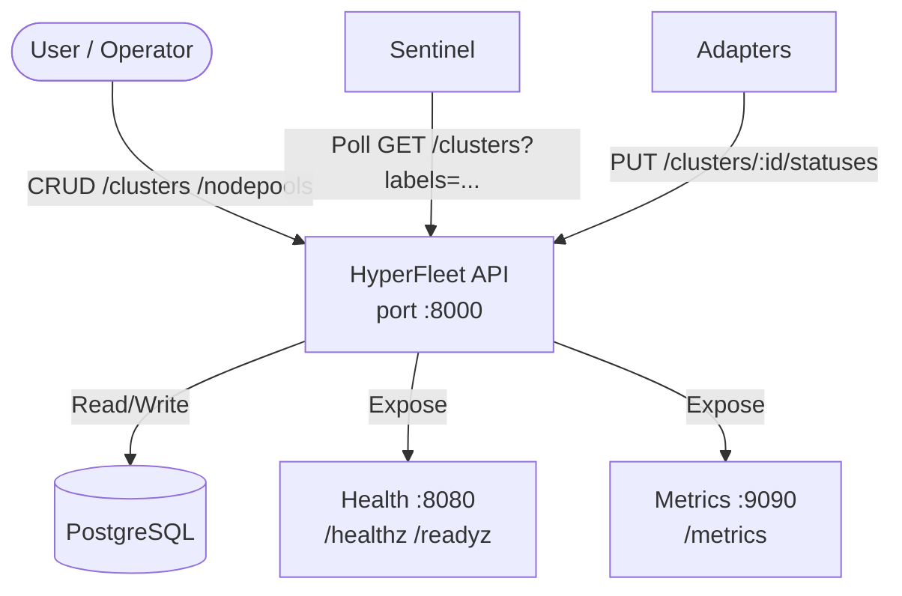

# HyperFleet API Service

The HyperFleet API is the data layer for the HyperFleet platform — a stateless REST service providing CRUD operations for HyperFleet API resources (clusters and node pools, adapter-based status reporting with Kubernetes-style conditions), and generation tracking. 

It contains no business logic other than the aggregation logic from adapter statuses to determine the reconciliation state of the resource.

---

## What & Why

**What**: A stateless REST API service providing CRUD operations for HyperFleet resources (clusters, node pools) and their statuses. Written in Go, backed by PostgreSQL, and defined via OpenAPI 3.0.

**Why**: HyperFleet's event-driven architecture requires a reliable, neutral data layer. Without a dedicated API:

- Sentinel has no authoritative source to poll for resource desired state
- Adapters have no place to report their reconciliation status
- The aggregated `Ready` condition (which drives Sentinel's decision logic) has no home

The API is intentionally simple by design — it stores state and aggregates adapter conditions. All orchestration logic lives in Sentinel and Adapters, keeping the API stable, independently deployable, and easy to scale horizontally.

---

## How

### Architecture




### Resources

#### Clusters

The primary HyperFleet resource. A cluster tracks desired state (`spec`) and current state (aggregated `status.conditions`).

| Endpoint | Method | Description |
|----------|--------|-------------|
| `/api/hyperfleet/v1/clusters` | GET | List clusters (paginated, label-filter) |
| `/api/hyperfleet/v1/clusters` | POST | Create cluster |
| `/api/hyperfleet/v1/clusters/{id}` | GET | Get cluster by ID |
| `/api/hyperfleet/v1/clusters/{id}` | PATCH | Update cluster spec |
| `/api/hyperfleet/v1/clusters/{id}/statuses` | GET | List adapter status reports |
| `/api/hyperfleet/v1/clusters/{id}/statuses` | PUT | Report adapter status |

#### Node Pools

Groups of compute nodes nested under a cluster.

| Endpoint | Method | Description |
|----------|--------|-------------|
| `/api/hyperfleet/v1/nodepools` | GET | List all node pools (cross-cluster) |
| `/api/hyperfleet/v1/clusters/{id}/nodepools` | GET | List node pools for a cluster |
| `/api/hyperfleet/v1/clusters/{id}/nodepools` | POST | Create node pool |
| `/api/hyperfleet/v1/clusters/{id}/nodepools/{np_id}` | GET | Get node pool |
| `/api/hyperfleet/v1/clusters/{id}/nodepools/{np_id}/statuses` | PUT | Report adapter status |

Both resources support:
- **Pagination**: `page` and `size` query parameters
- **Label filtering**: `?search=labels.region=us-east` for Sentinel resource selectors

### Resource Schema

```json
{
  "kind": "Cluster",
  "id": "cls-abc123",
  "href": "/api/hyperfleet/v1/clusters/cls-abc123",
  "name": "my-cluster",
  "generation": 2,
  "spec": {},
  "labels": { "region": "us-east", "environment": "production" },
  "created_time": "2025-10-01T00:00:00Z",
  "updated_time": "2025-10-15T00:00:00Z",
  "status": {
    "conditions": [
      {
        "type": "Ready",
        "status": "False",
        "reason": "AdaptersReconciling",
        "message": "dns adapter has not reconciled generation 2",
        "observed_generation": 1,
        "last_updated_time": "2025-10-15T12:00:00Z",
        "last_transition_time": "2025-10-15T11:00:00Z"
      }
    ]
  }
}
```

### Status Aggregation

The API aggregates adapter status reports into the resource's `status.conditions` array. 

The `Ready` condition determines if the "state of the world" have been reconciled to match the desired state of the HyperFleet API resource.

It is computed out of the different status reports coming from adapters that have to provide information about the their validity at current API resource `generation`

This aggregated `Ready` condition is the primary signal consumed by Sentinel's CEL decision logic. The API performs this aggregation on every `PUT /statuses` call so Sentinel always reads current state.

### Generation Tracking

`generation` increments on every change to the API resource that conveys some customer intention. 
This is, changes to the fields:
- `spec`
- `labels`

Adapters include `observed_generation` in status reports. The API uses this to detect stale reports: if `adapter.observed_generation < resource.generation`, that adapter has not yet reconciled the latest desired state, and `Ready` is set to `False`.


### Technology Stack

| Component | Choice |
|-----------|--------|
| Language | Go 1.24+ |
| API definition | OpenAPI 3.0 (`openapi/` directory) |
| Code generation | `oapi-codegen` — models and handlers generated from spec |
| Database | PostgreSQL 13+ |
| ORM | GORM with JSONB fields for `spec`, `conditions`, `labels` |
| Authentication | OCM JWT (production) / disabled (development) |
| Deployment | Kubernetes (Helm chart in `charts/`) |


### Ports

| Port | Purpose |
|------|---------|
| `:8000` | REST API + OpenAPI UI (`/api/hyperfleet/v1/`) |
| `:8080` | Health probes (`/healthz`, `/readyz`) |
| `:9090` | Prometheus metrics (`/metrics`) |

---

## Trade-offs

### What We Gain

- ✅ **Simple, stable contract**: The API is a pure data layer — no hidden side effects, no event creation, no orchestration. Every call has a predictable outcome.
- ✅ **Horizontal scalability**: Stateless design means any number of replicas can run behind a load balancer without coordination.
- ✅ **Clear separation of concerns**: Business logic lives in Adapters, reconciliation decisions live in Sentinel. The API does not need to change when provisioning logic changes.
- ✅ **OpenAPI-first**: The OpenAPI spec is the single source of truth. Go models, handlers, and SDK clients are generated from it — no drift between spec and implementation.
- ✅ **Multi-provider flexibility**: JSONB `spec` field allows GCP, AWS, and future providers to store provider-specific configuration without schema migrations.

### What We Lose / What Gets Harder

- ❌ **No transactional event creation**: When a user creates or updates a cluster, no event is published atomically with the DB write. Sentinel must poll to detect the change, introducing up to one poll-interval of latency (default 5s).
- ❌ **Resource intensive**: Polling to detect changes is more resource intensive than publishing messages when these occur.
- ❌ **Adapter status is eventually consistent**: The `Ready` condition reflects the last adapter reports, not real-time cluster state. A cluster may be `Ready: True` briefly after adapters report success while a cloud-side failure is occurring.
- ⚠️ **All query load hits the database**: Sentinel polls all matching clusters every cycle. At large cluster counts, this creates significant read load on PostgreSQL.
- ⚠️ **No watch/streaming API**: Sentinel must poll rather than receive push notifications. Long-term, this limits reaction time and increases idle load.

### Technical Debt Incurred

- **JSONB in DB schema**: The current DB schema contains some JSONB fields 
  - **Impact**: Code is marshalling/unmarshalling from these fields instead of leveraging the ORM directly. Harder to use indexes
  - **Remediation**: Post-MVP, convert status conditions to a table instead of JSONB
- **`spec` field in clusters/nodepools table**: this is a JSONB that can grow big in size
  - Impact: increased network traffic, as the full API resource payload travels for every API request
  - Remediation: split the `spec` into its own table, or provide a way for Sentinel to fetch API resources without payload, as it is unused in Sentinel


### Acceptable Because

- MVP targets a small cluster count where polling overhead and eventual consistency are not operational concerns.
- Decoupling the data layer from orchestration is the correct long-term architecture, even if short-term it means polling.
- OpenAPI-first development reduces the risk of spec/implementation drift, which is more valuable at this stage than a push-based API.

---

## Alternatives Considered

### Publishing changes from the API

What: Instead of polling the API, for every change in the API resource, publish the change to a queue

Why Rejected: the API gets an additional concern (publishing) and needs to guarantee delivery, so some type of transactional outbox pattern has to be implemented. For simplicity we accept polling at the scale the solution will be operating.


### Embed Business Logic in the API (Monolith)

**What**: Implement reconciliation logic, event publishing, and adapter orchestration directly in the API service rather than delegating to Sentinel and Adapters.

**Why Rejected**: Creates a tightly coupled monolith where the API must know about every cloud provider and provisioning step. Any change to provisioning logic requires an API change and redeployment. The event-driven adapter pattern allows independent deployment and scaling of provisioning components.

### Use a Different Database (e.g., etcd, CockroachDB)

**What**: Use etcd (Kubernetes-native key-value store) or CockroachDB (distributed SQL) instead of PostgreSQL.

**Why Rejected**: PostgreSQL is a well-understood, operationally mature choice for structured relational data with JSONB flexibility. etcd is optimized for Kubernetes resource metadata, not arbitrary resource storage at scale. CockroachDB adds operational complexity without clear benefit at MVP scale. PostgreSQL provides the JSONB query capabilities needed for label-based filtering.

### gRPC API Instead of REST

**What**: Expose a gRPC API instead of (or in addition to) REST, using Protocol Buffers for resource definitions.

**Why Rejected**: REST + OpenAPI is the standard for OCM-integrated services. HyperFleet must integrate with OCM tooling (CLI, token auth, API conventions) which expect REST. gRPC would require a separate gateway or break OCM integration.

### Event Sourcing

**What**: Store the full history of resource state changes (event log) rather than current state, deriving current state from events.

**Why Rejected**: Event sourcing adds significant implementation complexity (event replay, snapshot strategies, CQRS patterns) without clear benefit for cluster lifecycle management. Current state storage with soft delete and `generation` tracking satisfies HyperFleet's auditability requirements at much lower complexity.

---

## Dependencies

| Dependency | Purpose |
|-----------|---------|
| PostgreSQL 13+ | Primary data store for all resources and statuses |
| Red Hat SSO / OCM | JWT token issuance and validation (production auth) |
| Sentinel | Polls this API for resources; drives reconciliation |
| Adapters | PUT status updates to this API |

---

## Interfaces

### REST API Base Path

```
/api/hyperfleet/v1/
```

Full spec: available at `/api/hyperfleet/v1/openapi` when the service is running, or in the [`hyperfleet-api-spec` repository](https://github.com/openshift-hyperfleet/hyperfleet-api-spec) (the authoritative TypeSpec source). The `openapi/openapi.yaml` in `hyperfleet-api` is extracted from the spec module at build time and is not committed to git.

### Configuration

Key environment variables (see `docs/config.md` in the repository for the full list):

| Variable | Default | Description |
|----------|---------|-------------|
| `DATABASE_URL` | — | PostgreSQL connection string |
| `AUTH_ENABLED` | `true` | Disable for local dev (`false`) |
| `JWT_ISSUER` | — | Expected JWT issuer URL |
| `JWT_AUDIENCE` | — | Expected JWT audience |
| `API_PORT` | `8000` | REST API listen port |
| `HEALTH_PORT` | `8080` | Health probe listen port |
| `METRICS_PORT` | `9090` | Prometheus metrics port |

---

## Related Documents

- [Architecture Summary](../../README.md) — system-level view of the API's role
- [Sentinel Design](../sentinel/sentinel.md) — how Sentinel polls the API
- [Adapter Framework Design](../adapter/framework/adapter-frame-design.md) — how Adapters report status
- [Status Guide](../../docs/status-guide.md) — complete condition contract
- [API Versioning Strategy](api-versioning.md) — versioning and compatibility policy
- [Glossary](../../docs/glossary.md) — HyperFleet term definitions
