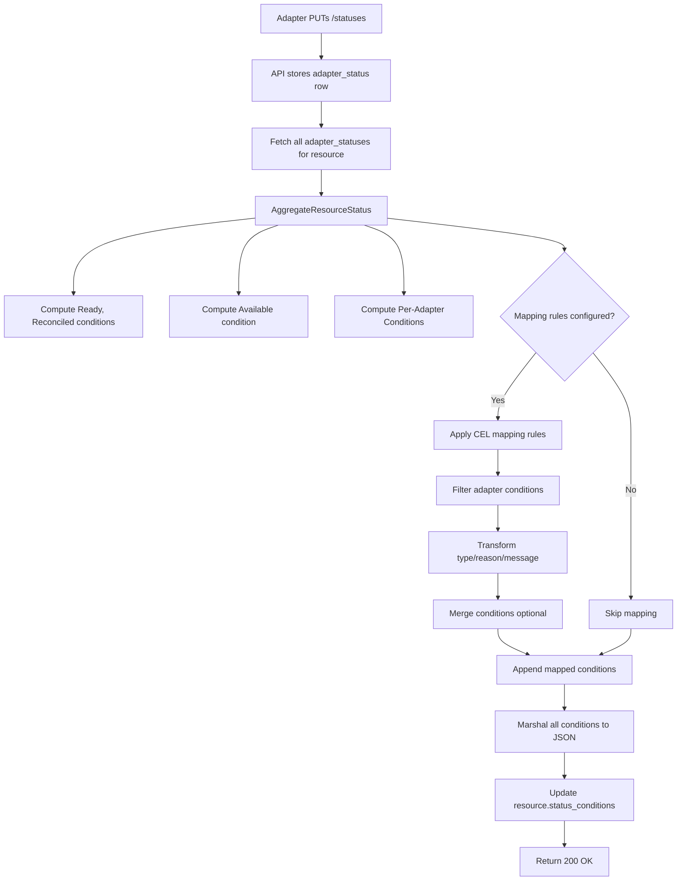
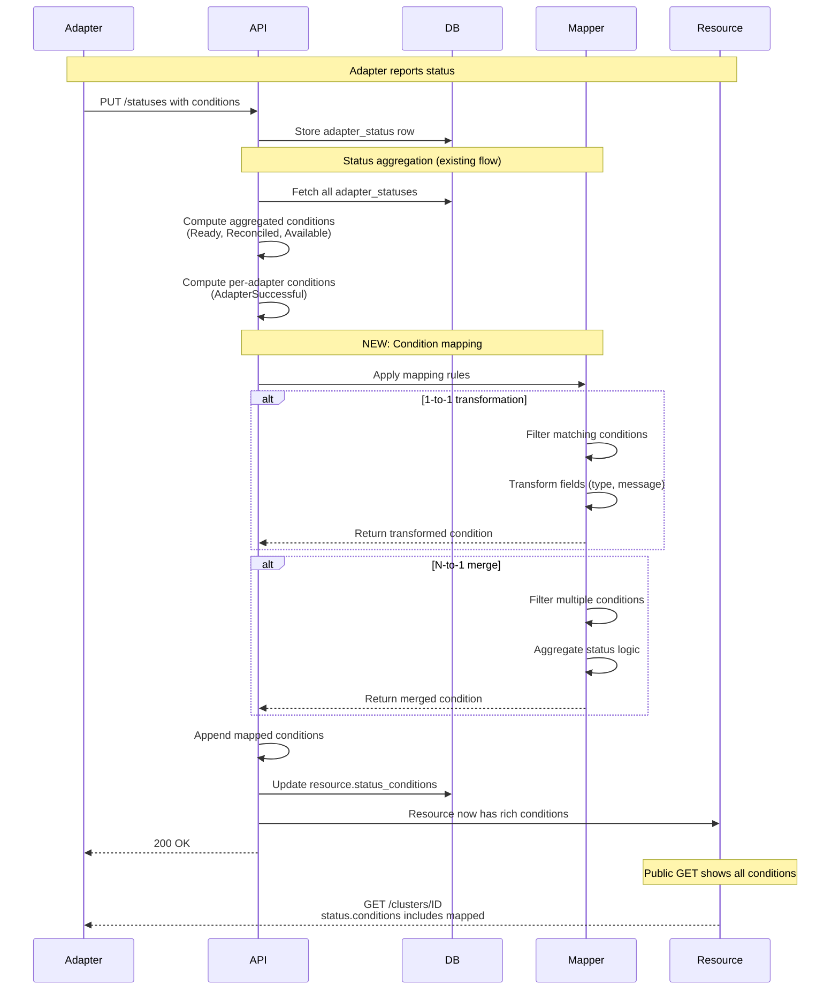

# Condition Mapping Design

**Jira**: [HYPERFLEET-907](https://redhat.atlassian.net/browse/HYPERFLEET-907)

## Terminology

| Term | Definition |
|------|-----------|
| **Resource Condition** | Kubernetes-style condition in `status.conditions` array on Cluster/NodePool resources. Status is `True` or `False` only. |
| **Adapter Condition** | Condition reported by adapters via `PUT /statuses`. Status can be `True`, `False`, or `Unknown`. Stored in `adapter_statuses` table. **Note**: Adapter conditions with `status="Unknown"` are automatically filtered out during mapping and never converted to resource conditions, preventing violations of the True/False-only contract. |
| **Standard Condition Fields** | All conditions (both Resource and Adapter) contain six fields: `type` (string, condition category), `status` (`True`/`False` for resource conditions; `True`/`False`/`Unknown` for adapter conditions), `reason` (CamelCase string, machine-readable cause), `message` (human-readable description), `observed_generation` (resource generation when condition was set), `last_transition_time` (RFC 3339 timestamp of last status change). |
| **Condition Mapping** | Declarative CEL-based rules that copy/transform selected adapter conditions into resource conditions. |
| **Aggregated Conditions** | Fixed resource conditions (`Ready`, `Reconciled`, `Available`) computed by the API from adapter statuses. |
| **Per-Adapter Conditions** | Resource conditions automatically created for each required adapter (e.g., `ROSAAdapterSuccessful`). |
| **Mapped Conditions** | Resource conditions dynamically created from adapter conditions via mapping rules. |

## What & Why

**What**: Add a CEL-based condition mapping engine to the HyperFleet API that copies/transforms selected adapter conditions from `/statuses` endpoint into the public `status.conditions` array on Cluster and NodePool resources.

**Why**: The current `status.conditions` exposes only aggregated conditions (`Ready` [deprecated], `Reconciled`, `Available`) plus one per-adapter condition (`<AdapterName>Successful`). Rich adapter-specific conditions (e.g., Maestro resource feedback, ROSA control plane status, GCP provider health) are only accessible via the internal `/statuses` endpoint. This creates four problems:

1. **Sentinel CEL expressions** must fetch `/statuses` to evaluate adapter conditions, adding latency and complexity
2. **Adapters checking preconditions** need internal API access instead of reading public resource state
3. **External consumers** (CLI, UI, integrations) cannot access provider-specific status without hitting internal endpoints
4. **Inconsistent API design** — status information split between public and internal endpoints

Adapter teams require both 1-to-1 condition transformations (e.g., `ControlPlaneReady` → `ROSAControlPlaneReady`) and N-to-1 merges (e.g., multiple GCP health signals → single `GCPProviderHealthy` condition). See [HYPERFLEET-907](https://redhat.atlassian.net/browse/HYPERFLEET-907) for detailed requirements from GCP and ROSA adapter teams.

**Related Documentation:**
- **Current Status Aggregation**: [ADR-0008 — Dynamic Status Aggregation](../../adrs/0008-dynamic-status-aggregation.md) — aggregation computed on write path; [ADR-0007 — Conditions-Based Status Model](../../adrs/0007-conditions-based-status-model.md) — ResourceCondition and AdapterCondition contracts; [Status Guide](../../docs/status-guide.md) — condition reporting and validation rules
- [API Service Design](./api-service.md) — API architecture and service layer patterns
- [Sentinel Message Decision Config](../sentinel/sentinel.md) — Existing CEL usage in Sentinel
- [Adapter Framework Design](../adapter/framework/adapter-frame-design.md) — Existing CEL usage in adapters (Config Loader and Criteria Evaluator sections)

### Scope

- CEL-based condition mapping engine in API status aggregation flow
- Configuration schema for mapping rules (per-adapter filters, transformations, merge logic)
- Integration into existing `AggregateResourceStatus()` function
- Backward compatibility with existing conditions

### Out of Scope

- **Replacing existing conditions** — `Ready`, `Reconciled`, `Available`, `<Adapter>Successful` remain unchanged
- **New API endpoints** — mapping runs during existing `PUT /statuses` flow
- **Adapter config changes** — adapters continue reporting conditions as-is
- **Condition validation** — adapters already validate mandatory conditions (`Available`, `Applied`, `Health`)

---

## How

### Overview

The API runs condition mapping **within the existing status aggregation flow** (triggered by `PUT /statuses`). No new endpoints or components are introduced. The mapper filters and transforms adapter conditions using CEL expressions, then appends mapped conditions to the resource's `status.conditions` array.




### Mapping Execution Flow

Condition mapping runs **during the existing PUT /statuses flow** — no new endpoints or components.



**Key Points**:
- Mapping happens **on every PUT /statuses** (during existing aggregation flow)
- Unknown conditions automatically filtered out (only True/False mapped)
- Execution time: ~2-3ms for 15 rules across 3 adapters
- Atomic transaction: adapter status + mapped conditions committed together

### Configuration Schema

Mapping rules are configured per-adapter in the API's adapter requirements config. Two patterns are supported: **1-to-1 transformation** and **N-to-1 merge**.

```yaml
# config/hyperfleet-api.yaml

adapters:
  required:
    cluster:
      - rosa-adapter
      - gcp-adapter
  
  condition_mapping:
    rules:
      # Rule 1: Simple transformation (1-to-1)
      - name: "rosa-control-plane"
        adapter: "rosa-adapter"
        source_condition_filter:
          expression: |
            adapterCondition.type in ["ControlPlaneReady", "WorkerNodesReady"]
        transformations:
          - target_field: "type"
            expression: |
              "ROSA" + adapterCondition.type
          - target_field: "message"
            expression: |
              "ROSA: " + adapterCondition.message

      # Rule 2: Merge multiple conditions (N-to-1)
      - name: "gcp-provider-health"
        adapter: "gcp-adapter"
        merge:
          target_type: "GCPProviderHealthy"
          source_condition_filter:
            expression: |
              adapterCondition.type.startsWith("GCP")              
          aggregation_logic:
            status_expression: |
              sourceConditions.all(c, c.status == "True") ? "True" : "False"
            reason_expression: |
              sourceConditions.all(c, c.status == "True") ? "AllHealthy" : "PartiallyHealthy"
            message_expression: |
              sourceConditions.filter(c, c.status != "True").size() == 0
                ? "All GCP health checks passed"
                : "Failed: " + sourceConditions.filter(c, c.status != "True").map(c, c.type).join(", ")
```

### Rule Execution and Conflict Resolution

**Evaluation Order**: Rules are evaluated **in declaration order** (top-to-bottom). Rules targeting the same adapter are processed sequentially.

**Conflict Resolution**: When multiple rules produce resource conditions with the **same `type`**, the **last-wins** strategy applies — the condition from the last evaluated rule overwrites earlier conditions. In a deployment with 3 adapters and 5 rules per adapter (15 total), processing order adds ~2-3ms latency per resource due to sequential evaluation.

**Unknown Filtering**: Adapter conditions with `status="Unknown"` are **automatically filtered out** before CEL evaluation. Only conditions with `status="True"` or `status="False"` are passed to the mapping engine, ensuring resource conditions never violate the True/False-only contract.

### CEL Evaluation Context

**For 1-to-1 mapping** (`source_condition_filter`), the CEL context includes:
- `adapterCondition.type`, `adapterCondition.status`, `adapterCondition.reason`, `adapterCondition.message`, `adapterCondition.observed_generation`, `adapterCondition.last_transition_time`
- `adapterName` (e.g., `"rosa-adapter"`)
- `resourceGeneration` (current resource generation number)

**For N-to-1 merge** (`aggregation_logic`), the CEL context includes:
- `sourceConditions` (array of conditions matching the filter, each with the six standard fields)
- `adapterName`, `resourceGeneration`

**Field Allowlist**: Only the six standard condition fields are exposed to CEL. The `data` field (adapter-specific JSONB) is **NOT exposed** to prevent leaking sensitive information. Adapters must use dedicated condition types instead of `data` for exposing structured information.

### Integration Point

The mapper integrates into the existing `AggregateResourceStatus()` service layer function (see `hyperfleet-api/pkg/services/aggregation.go`). The integration point is after per-adapter conditions are computed and before marshaling to JSON:

1. Fetch adapter_statuses from DB
2. Compute Reconciled condition (Ready mirrors Reconciled for backward compatibility)
3. Compute Available condition
4. Compute per-adapter conditions (1 per required adapter)
5. **NEW**: Apply condition mapping (if configured)
6. Marshal all conditions to JSON
7. Update resource.status_conditions

Mapped conditions are included in the same database transaction as the adapter status update via the existing transaction-per-request middleware (see `hyperfleet-api/pkg/db/CLAUDE.md`).

### Error Handling and Validation

**Field Validation**: Before CEL evaluation, the mapper validates adapter condition fields to prevent injection and resource exhaustion:

| Field | Max Length | Enforcement | Behavior on Violation |
|-------|------------|-------------|----------------------|
| `type` | 128 chars | Compile-time (adapter PUT) | Condition rejected during `PUT /statuses` |
| `reason` | 256 chars | Runtime (pre-CEL) | Condition skipped, warning logged |
| `message` | 2048 chars | Runtime (pre-CEL) | Message truncated, warning logged |
| `status` | Must be True/False/Unknown | Compile-time (adapter PUT) | Condition rejected during `PUT /statuses` |

**Validation Behavior Rationale**: The `reason` field is **machine-readable** and used in CEL expressions and Sentinel decision logic — invalid or oversized reasons could break filtering logic, so the entire condition is skipped. The `message` field is **human-readable** and informational only — truncation preserves the first 2048 characters without breaking semantics, allowing the condition to remain usable for automation.

**CEL String Operation Limits**: Even if a CEL transformation expression attempts to generate a message exceeding 2048 characters, the CEL runtime's **100KB string limit and 10MB memory limit** (documented in Security Considerations § 1) prevent memory exhaustion during evaluation. Expressions exceeding these bounds abort evaluation, the condition is skipped, and an error is logged.

**JSON Unmarshaling**: If stored adapter conditions are malformed (corrupted JSONB, schema mismatch), the mapper logs a warning and skips mapping for that adapter. Processing continues for other adapters.

**CEL Evaluation Errors**: If a CEL expression fails (type mismatch, undefined variable, evaluation timeout), the specific condition/rule is skipped and a warning is logged. The API does not fail the entire request — partial mapping results are committed.

---

## Security Considerations

Condition mapping processes operator-controlled configuration and exposes adapter-reported data to external consumers. Five security domains require explicit safeguards:

### 1. CEL Expression Validation and Sandboxing

**Compile-Time Checks**: All CEL expressions are **compiled at API server startup** (fail-fast). Invalid syntax, undefined variables, or type mismatches prevent the server from starting.

**Complexity Limits** (CEL library defaults):
- **AST Node Limit**: Maximum **1000 AST nodes** — prevents excessively large expressions
- **Expression Depth**: Maximum **32 levels of nesting** — prevents stack exhaustion
- **String Length**: Maximum **100KB per string literal** — prevents memory exhaustion

**Evaluation Timeouts**: Each CEL expression evaluation is **time-boxed to 100ms** using `context.WithTimeout`. Expressions exceeding this timeout are aborted, the condition is skipped, and an error is logged. Total mapping execution (all rules combined) is bounded by a **1-second aggregate timeout** to prevent CPU starvation.

**Timeout Behavior**: When the aggregate timeout is exceeded, the API **returns partial mapping results** — conditions successfully mapped before the timeout are included in `status.conditions`, and remaining rules are skipped. The adapter receives a **200 OK** response with a **`Warning: 199 - "Partial condition mapping due to timeout"`** header to signal incomplete processing while maintaining backward compatibility. The existing transaction middleware ensures atomicity — either the full transaction commits (adapter status + mapped conditions) or it rolls back.

**Runtime Safeguards**:
- **Memory Limit**: Maximum **10MB allocation per expression** (CEL library enforced)
- **Recursion Limit**: CEL disallows recursive function calls — prevents stack overflow
- **Sandboxing**: CEL runtime cannot execute arbitrary code, access filesystem/network, or modify global state

### 2. Adapter Condition Data Exposure Risks

**Sensitive Field Filtering**: Adapter conditions may contain **sensitive data in custom fields** (e.g., API tokens in `data` field, internal IPs in `message`). Mapping rules MUST NOT expose these fields to external consumers.

**Allowlist Approach**: Only the five standard condition fields are exposed to CEL context: `type`, `status`, `reason`, `message`, `last_transition_time`. The `data` field (adapter-specific JSONB) is **NOT exposed**.

**Adapter Responsibility**: Adapters MUST follow the [Error Model Standard](../../standards/error-model.md) when populating `type`, `reason`, and `message` fields. These fields are exposed to external consumers via mapped conditions and MUST NOT contain:
- Internal service URLs or IP addresses
- Stack traces or debug information
- Sensitive configuration values (tokens, credentials, internal resource IDs)
- Implementation details that leak internal architecture

### 3. Access Control

**Configuration Changes**: Condition mapping rules are defined in the API's YAML configuration file, which requires **cluster-admin RBAC permissions** to modify (Kubernetes ConfigMap or file on disk). Rule changes require API server restart.

**CI Validation**: Configuration changes MUST pass CI validation (CEL compilation, field validation, lint checks) before merging.

### 4. DoS Prevention

**Cardinality Limits**: Maximum **50 mapped conditions per resource** to prevent unbounded `status.conditions` array growth. This limit is enforced at runtime — excess conditions are dropped, and an error is logged.

**Aggregate Timeout**: Total mapping execution **aborted after 1 second** (all rules combined) to prevent CPU starvation of other API requests.

### 5. Error Sanitization

**RFC 9457 Compliance**: Mapping errors returned to adapters (via `PUT /statuses` response) follow RFC 9457 Problem Details format (see [Error Model Standard](../../standards/error-model.md)). Error messages MUST NOT leak internal details (stack traces, database connection strings, internal service names).

**Audit Logging**: Mapping execution errors (CEL timeouts, field validation failures, cardinality violations) are logged with adapter name, rule name, and error reason. Logs are retained for **90 days** per the [Logging Standard](../../standards/logging-specification.md).

---

## Examples

### Example 1: 1-to-1 Transformation (ROSA Control Plane)

**Config:**
```yaml
- name: "rosa-control-plane"
  adapter: "rosa-adapter"
  source_condition_filter:
    expression: |
      adapterCondition.type == "ControlPlaneReady"
  transformations:
    - target_field: "type"
      expression: |
        "ROSA" + adapterCondition.type
```

**Input** (adapter condition):
```json
{"type": "ControlPlaneReady", "status": "True", "reason": "Operational", "message": "Control plane is operational", "observed_generation": 5, "last_transition_time": "2026-05-19T10:30:00Z"}
```

**Output** (resource condition):
```json
{"type": "ROSAControlPlaneReady", "status": "True", "reason": "Operational", "message": "Control plane is operational", "observed_generation": 5, "last_transition_time": "2026-05-19T10:30:00Z"}
```

### Example 2: N-to-1 Merge (GCP Provider Health)

**Config:**
```yaml
- name: "gcp-provider-health"
  adapter: "gcp-adapter"
  merge:
    target_type: "GCPProviderHealthy"
    source_condition_filter:
      expression: |
        adapterCondition.type.startsWith("GCP")
    aggregation_logic:
      status_expression: |
        sourceConditions.all(c, c.status == "True") ? "True" : "False"
      reason_expression: |
        sourceConditions.all(c, c.status == "True") ? "AllHealthy" : "PartiallyHealthy"
      message_expression: |
        sourceConditions.filter(c, c.status != "True").size() == 0
          ? "All GCP health checks passed"
          : "Failed: " + sourceConditions.filter(c, c.status != "True").map(c, c.type).join(", ")
```

**Input** (3 adapter conditions from GCP adapter):
```json
[
  {"type": "GCPAPIAccess", "status": "True", "reason": "Authenticated", "message": "GCP API access authenticated", "observed_generation": 5, "last_transition_time": "2026-05-19T10:25:00Z"},
  {"type": "GCPQuotaAvailable", "status": "False", "reason": "QuotaExceeded", "message": "GCP quota exceeded for CPUs", "observed_generation": 5, "last_transition_time": "2026-05-19T10:30:00Z"},
  {"type": "GCPNetworkReady", "status": "True", "reason": "NetworkConfigured", "message": "GCP network configured", "observed_generation": 5, "last_transition_time": "2026-05-19T10:20:00Z"}
]
```

**Output** (1 merged resource condition):
```json
{"type": "GCPProviderHealthy", "status": "False", "reason": "PartiallyHealthy", "message": "Failed: GCPQuotaAvailable", "observed_generation": 5, "last_transition_time": "2026-05-19T10:32:00Z"}
```

---

## Trade-offs

### What We Gain

- **Declarative exposure** — adapters add new conditions without code changes
- **Consistent API design** — all status in `status.conditions`, no internal `/statuses` dependency
- **CEL consistency** — reuses existing pattern from Sentinel and adapters
- **Sentinel simplification** — decision expressions read resource conditions directly (no `/statuses` fetch)
- **External consumer access** — CLI, UI, integrations see provider-specific conditions
- **Cardinality control** — operators configure exactly which conditions to expose (prevents bloat)

### What We Lose / What Gets Harder

- **API latency** — CEL evaluation adds 2-3ms per resource (15 rules, 3 adapters)
- **Configuration complexity** — operators must write CEL expressions (mitigated by examples and validation)
- **Debugging** — mapping failures require checking API logs, not visible in adapter response
- **Tight coupling** — API config must know adapter condition naming (adapters can't change condition types without coordinating config updates)

### Technical Debt Incurred

- **No declarative timeouts** — 100ms per-expression and 1s aggregate timeouts are hardcoded, not configurable (acceptable for MVP; config knobs deferred)
- **No priority field** — rule order is declaration order only (explicit `priority` field deferred)
- **No adapter re-reporting optimization** — for large clusters, repeated status updates generate mapping overhead proportional to Sentinel polling frequency (deferred)

### Acceptable Because

- 2-3ms latency is negligible compared to 200ms baseline API response time
- CEL is already required for Sentinel and adapters — no new dependency
- Debugging mapping failures is rare (fail-fast at startup catches most issues)
- Adapter condition naming stability is expected (breaking changes require coordination anyway)
- MVP focuses on unblocking Sentinel and external consumers; optimization follows

---

## Alternatives Considered

### 1. Go Templates

**What**: Use Go's `text/template` for transformation logic instead of CEL.

**Why Rejected**: Go templates lack sandboxing (can execute arbitrary functions), type safety, and expression libraries (filters, map/reduce). CEL is already a project dependency and provides compile-time validation.

### 2. Static YAML Mapping

**What**: Hardcode 1-to-1 condition name mappings in YAML without expressions:
```yaml
mappings:
  rosa-adapter:
    ControlPlaneReady: ROSAControlPlaneReady
```

**Why Rejected**: Cannot support N-to-1 merges (e.g., `GCPProviderHealthy`), message transformations, or conditional logic. Too inflexible for adapter requirements.

### 3. Adapter-Side Mapping

**What**: Adapters report both internal conditions (`data` field) and public conditions (`status.conditions`-ready format) in the same `PUT /statuses` call.

**Why Rejected**: Duplicates mapping logic across all adapters. Adapters must know HyperFleet condition naming conventions. Makes adapters less reusable across platforms.

---

## References

- [HYPERFLEET-907](https://redhat.atlassian.net/browse/HYPERFLEET-907) — SPIKE: Design declarative condition mapping mechanism
- [HYPERFLEET-905](https://redhat.atlassian.net/browse/HYPERFLEET-905) — Parent epic: Expose API resource statuses through status.conditions
- [ADR-0008 — Dynamic Status Aggregation](../../adrs/0008-dynamic-status-aggregation.md)
- [ADR-0007 — Conditions-Based Status Model](../../adrs/0007-conditions-based-status-model.md)
- [Status Guide](../../docs/status-guide.md)
- [Error Model Standard](../../standards/error-model.md)
- [Logging Standard](../../standards/logging-specification.md)
- [Sentinel Message Decision Config](../sentinel/sentinel.md)
- [Adapter Framework Design](../adapter/framework/adapter-frame-design.md)
