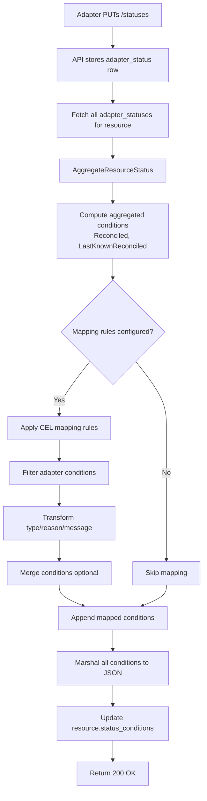
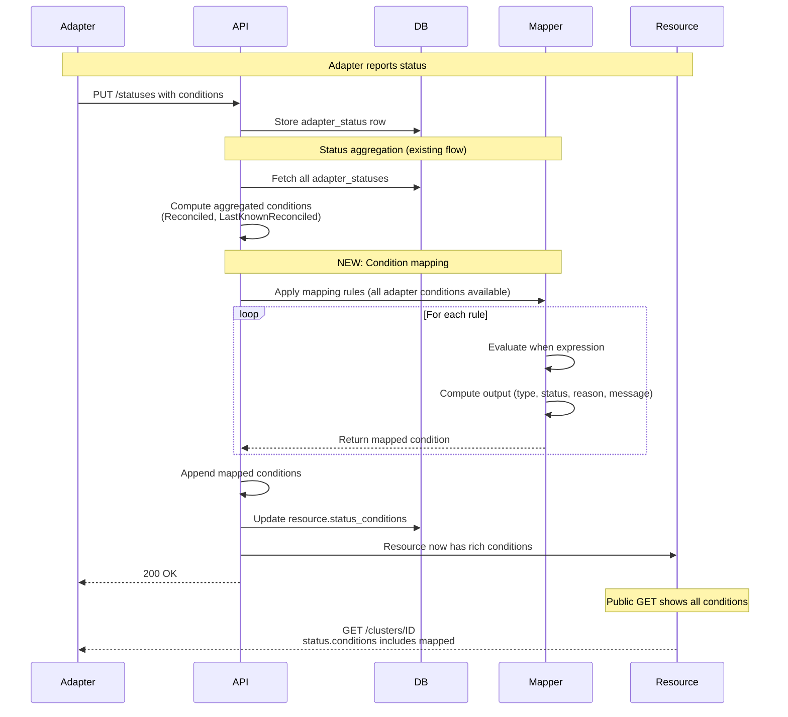

# Condition Mapping Design

**Jira**: [HYPERFLEET-907](https://redhat.atlassian.net/browse/HYPERFLEET-907)

## Terminology

| Term | Definition |
|------|-----------|
| **Resource Condition** | Kubernetes-style condition in `status.conditions` array on Cluster/NodePool resources. Status is `True` or `False` in steady state. `Unknown` may appear transiently during resource initialization. Mapped conditions enforce the True/False-only contract — see **Unknown Filtering** under Rule Execution. |
| **Adapter Condition** | Condition reported by adapters via `PUT /statuses`. Status can be `True`, `False`, or `Unknown`. Stored in `adapter_statuses` table. **Note**: Adapter conditions with `status="Unknown"` are automatically filtered out during mapping and never converted to resource conditions, preventing violations of the True/False-only contract. |
| **Standard Condition Fields** | All conditions (both Resource and Adapter) contain six fields: <br>• `type` — condition category (string)<br>• `status` — `True`/`False` for resource conditions; `True`/`False`/`Unknown` for adapter conditions<br>• `reason` — machine-readable cause (CamelCase string)<br>• `message` — human-readable description<br>• `observed_generation` — resource generation when condition was set<br>• `last_transition_time` — RFC 3339 timestamp of last status change |
| **Condition Mapping** | Declarative CEL-based rules that copy/transform selected adapter conditions into resource conditions. |
| **Aggregated Conditions** | System-computed resource conditions (`Reconciled`, `LastKnownReconciled`) synthesized from adapter statuses. Only applies to reconcilable resources (Cluster, NodePool). Non-reconcilable resources (Channel, Version) have no aggregated conditions. Future: express these via custom mappings to eliminate exceptions. |
| **Mapped Conditions** | Resource conditions dynamically created from adapter conditions via user-configured mapping rules. |

## What & Why

**What**: Add a CEL-based condition mapping engine to the HyperFleet API that copies/transforms selected adapter conditions from `/statuses` endpoint into the public `status.conditions` array on Cluster and NodePool resources.

**Why**: The current `status.conditions` exposes only aggregated conditions (`Reconciled`, `LastKnownReconciled`) plus per-adapter conditions (`<AdapterName>Successful`). Rich provider-specific conditions (e.g., ROSA control plane status, GCP provider health) are only accessible via the internal `/statuses` endpoint, which is not exposed to customers.

**The Problem**: External consumers (CLI, UI, customer integrations) cannot access provider-specific cluster status because rich provider health signals (e.g., ROSA control plane readiness, GCP quota availability) exist in adapter conditions but are not surfaced in the public API resource. Condition mapping solves this by exposing **customer-visible status only** — the guiding question is: **"Does the customer care about this information in the resource?"** If no, it should not be mapped. Adapters are a black box to customers; mapped conditions expose provider status outcomes, not adapter implementation details.

**Requirements**: Partners need to expose provider-specific conditions (e.g., ROSA control plane readiness, GCP quota status) and cross-adapter aggregations (e.g., cluster health from multiple adapters) in the public API. All adapter conditions are available as input; CEL expressions filter and transform to create resource conditions. See [HYPERFLEET-907](https://redhat.atlassian.net/browse/HYPERFLEET-907) for detailed requirements from GCP and ROSA adapter teams.

**Related Documentation:**
- **Current Status Aggregation**: [ADR-0008 — Dynamic Status Aggregation](../../adrs/0008-dynamic-status-aggregation.md) — aggregation computed on write path; [ADR-0007 — Conditions-Based Status Model](../../adrs/0007-conditions-based-status-model.md) — ResourceCondition and AdapterCondition contracts; [Status Guide](../../docs/status-guide.md) — condition reporting and validation rules
- [API Service Design](./api-service.md) — API architecture and service layer patterns
- [Sentinel Message Decision Config](../sentinel/sentinel.md) — Existing CEL usage in Sentinel
- [Adapter Framework Design](../adapter/framework/adapter-frame-design.md) — Existing CEL usage in adapters (Config Loader and Criteria Evaluator sections)

### Scope

- CEL-based condition mapping engine in API status aggregation flow
- Configuration schema for mapping rules (all adapter conditions available as input)
- Integration into existing `AggregateResourceStatus()` function

### Out of Scope

- **Changing aggregated conditions** — `Reconciled` and `LastKnownReconciled` remain computed by existing aggregation logic
- **Expressing aggregated conditions via mappings** — future evolution to eliminate exceptions and support non-reconcilable resources (Channel, Version)
- **New API endpoints** — mapping runs during existing `PUT /statuses` flow
- **Adapter config changes** — adapters continue reporting conditions as-is
- **Condition validation** — adapters already validate mandatory conditions (`Available`, `Applied`, `Health`)

---

## How

### Overview

The API runs condition mapping **within the existing status aggregation flow** (triggered by `PUT /statuses`). No new endpoints or components are introduced. The mapper filters and transforms adapter conditions using CEL expressions, then appends mapped conditions to the resource's `status.conditions` array.




### Mapping Execution Flow

Condition mapping runs **during the existing PUT /statuses flow** — no new endpoints or components.



**Key Points**:
- Mapping happens **on every PUT /statuses** (during existing aggregation flow)
- Unknown conditions automatically filtered out (only True/False mapped)
- Atomic transaction: adapter status + mapped conditions committed together

### Configuration Schema

Mapping rules are configured in the API's adapter requirements config. **All adapter conditions from all adapters are available as input** to every rule. Rules use CEL expressions to filter, transform, and aggregate conditions into resource conditions.

```yaml
# config/hyperfleet-api.yaml

adapters:
  required:
    cluster:
      - rosa-adapter
      - gcp-adapter
  
  condition_mapping:
    # Data field allowlist - operators MUST explicitly declare which data fields are safe to expose
    # Format: map of adapter name to list of allowed field paths (dot-notation for nested fields)
    data_field_allowlist:
      gcp-adapter:
        - quotaRemaining        # Top-level field: c.data.quotaRemaining
        - quota.cpuLimit        # Nested field: c.data.quota.cpuLimit
        - regionHealth.status   # Nested field: c.data.regionHealth.status
      rosa-adapter:
        - controlPlaneNodes     # Top-level field: c.data.controlPlaneNodes
        - upgradeAvailable      # Top-level field: c.data.upgradeAvailable
    
    rules:
      # Example 1: Copy single adapter condition with transformation
      # Map key is the output_type (target condition type)
      ROSAControlPlaneReady:
        when: |
          conditions.exists(c, c.adapter == "rosa-adapter" && c.type == "ControlPlaneReady")
        output_status: |
          conditions.filter(c, c.adapter == "rosa-adapter" && c.type == "ControlPlaneReady")[0].status
        output_reason: |
          conditions.filter(c, c.adapter == "rosa-adapter" && c.type == "ControlPlaneReady")[0].reason
        output_message: |
          "ROSA: " + conditions.filter(c, c.adapter == "rosa-adapter" && c.type == "ControlPlaneReady")[0].message

      # Example 2: Cross-adapter aggregation (cluster health from multiple adapters)
      # Map key is the output_type (target condition type)
      ClusterHealthy:
        when: |
          conditions.exists(c, c.adapter == "rosa-adapter" && c.type == "ControlPlaneReady") &&
          conditions.exists(c, c.adapter == "gcp-adapter" && c.type == "QuotaAvailable")
        output_status: |
          conditions.filter(c, (c.adapter == "rosa-adapter" && c.type == "ControlPlaneReady") || (c.adapter == "gcp-adapter" && c.type == "QuotaAvailable")).all(c, c.status == "True") ? "True" : "False"
        output_reason: |
          conditions.filter(c, (c.adapter == "rosa-adapter" && c.type == "ControlPlaneReady") || (c.adapter == "gcp-adapter" && c.type == "QuotaAvailable")).all(c, c.status == "True") ? "Healthy" : "Degraded"
        output_message: |
          "Cluster health based on ROSA control plane and GCP quota"
      
      # Example 3: Using allowlisted data fields (compile-time validated)
      # Map key is the output_type (target condition type)
      GCPQuotaStatus:
        when: |
          conditions.exists(c, c.adapter == "gcp-adapter" && c.type == "QuotaAvailable" && has(c.data.quotaRemaining))
        output_status: |
          conditions.filter(c, c.adapter == "gcp-adapter" && c.type == "QuotaAvailable")[0].data.quotaRemaining > 10 ? "True" : "False"
        output_reason: |
          conditions.filter(c, c.adapter == "gcp-adapter" && c.type == "QuotaAvailable")[0].data.quotaRemaining > 10 ? "SufficientQuota" : "LowQuota"
        output_message: |
          "GCP quota remaining: " + string(conditions.filter(c, c.adapter == "gcp-adapter" && c.type == "QuotaAvailable")[0].data.quotaRemaining)
```

**Data Field Allowlist Enforcement:**

CEL expressions are **validated at compile-time** (API server startup) to ensure they only access `data` fields explicitly declared in the allowlist. Expressions accessing non-allowlisted fields are **rejected** with a descriptive error, preventing the API server from starting. This provides defense-in-depth: even if an operator misconfigures a rule, sensitive fields cannot be accidentally exposed.

**Allowlist Format:**
- Top-level key: adapter name (must match `conditions[].adapter` value)
- Value: list of field paths in dot-notation (e.g., `quotaRemaining`, `quota.cpuLimit`)
- Nested fields use dot-notation: `c.data.quota.cpuLimit` requires allowlist entry `quota.cpuLimit`
- Allowlist is per-adapter: `gcp-adapter` allowlist does not grant access to `rosa-adapter` data fields

### Rule Execution Model

Each rule executes **once per PUT /statuses request**, producing **at most one resource condition**. The execution model:

1. **Conditional evaluation**: The `when` expression is evaluated once. If it returns `false`, the rule is skipped entirely.
2. **Output generation**: If the `when` expression returns `true`, the `output_*` expressions execute to produce one resource condition.
3. **Cardinality control**: Rules use CEL expressions to decide how to handle multiple matching conditions:
   - **Single condition**: Use `conditions.filter(...)[0]` to take the first match
   - **Aggregate multiple**: Use `conditions.filter(...).all()`, `.exists()`, or `.map()` to merge signals

**Example**: A rule with `when: conditions.exists(c, c.type.startsWith("GCP"))` will fire if **any** GCP condition exists, but produces only **one** output condition. The `output_status` expression decides how to aggregate (e.g., `all(c, c.status == "True")`).

**DSL Consistency**: The `when` keyword aligns with the adapter status task DSL (see [Adapter Framework Design](../adapter/framework/adapter-frame-design.md)), ensuring consistent conditional expression syntax across all HyperFleet components.

**Output Type**: The `type` field of the generated resource condition is derived from the **map key**. For example, a rule with key `ROSAControlPlaneReady` produces a condition with `type: "ROSAControlPlaneReady"`.

**Generated Fields**: Rules specify three output fields (`output_status`, `output_reason`, `output_message`). Three additional fields are **automatically generated** by the API:
- `type` — set to the map key (e.g., `ROSAControlPlaneReady`)
- `observed_generation` — set to `resourceGeneration` (current resource generation)
- `last_transition_time` — set to current server timestamp when the condition is first created. On subsequent updates, only updated if `status` changes (matches Kubernetes condition semantics)

### Rule Execution and Conflict Resolution

**Evaluation Order**: Rules are stored in a map where the **key is the output condition type**. Map iteration order is **undefined** — rules may execute in any order. Since each map key is unique, there is no possibility of overlap or conflict between rules.

**No Conflict Resolution Needed**: Because the map key **is** the output condition type, each rule produces exactly one unique condition. There is no need for a "last-wins" strategy or priority ordering.

**Unknown Filtering**: Adapter conditions with `status="Unknown"` are **automatically filtered out** before CEL evaluation. Only conditions with `status="True"` or `status="False"` are available in the `conditions` variable, ensuring resource conditions never violate the True/False-only contract.

### CEL Evaluation Context

All rule CEL expressions have access to the same context:

**Variables Available**:
- `conditions` — array of all adapter conditions from all adapters (only True/False, Unknown already filtered). Each condition includes:
  - `adapter` (string, e.g., `"rosa-adapter"`)
  - `type` (string)
  - `status` (`"True"` or `"False"`)
  - `reason` (string)
  - `message` (string)
  - `observed_generation` (int64)
  - `last_transition_time` (timestamp)
  - `data` (map, adapter-specific JSONB) — **Allowlist-enforced**: Access to `data` fields is restricted via compile-time validation. Only fields explicitly declared in `data_field_allowlist` for each adapter can be accessed. Expressions accessing non-allowlisted fields are rejected at API server startup. See Configuration Schema for allowlist format.
- `resourceGeneration` — current resource generation number (int64)

**Variables NOT Available**:
- **Full resource object** (`spec.*`, `metadata.*`) — NOT exposed except `resourceGeneration`. Rationale: Condition mapping should derive status from adapter-reported conditions only, not from desired state. Exposing `spec` would allow rules to create conditions based on user intent rather than observed provider state, violating the status contract. If future use cases require resource fields (e.g., `metadata.labels` for environment-specific mapping), these will be exposed as explicit top-level variables with security review.
- **Adapter configuration** — NOT exposed. Rationale: Adapter config is internal implementation detail. Mapping rules should be adapter-agnostic and portable across deployments. If rules need deployment-specific behavior, use separate config files per environment rather than reading adapter config at runtime.
- **Environment variables** — NOT exposed. Rationale: Environment variables are deployment-specific and not portable across environments (dev, staging, prod). Mapping rules should produce consistent results regardless of where the API runs. If environment-specific mapping is needed, use separate YAML config files per environment.

**Field Access Control**: All standard condition fields are accessible in CEL expressions: `type`, `status`, `reason`, `message`, `observed_generation`, `last_transition_time`, and `adapter`. The `data` field (adapter-specific JSONB) is **allowlist-restricted** — operators must explicitly declare which `data` fields are safe to expose via the `data_field_allowlist` configuration. CEL expressions are validated at compile-time: any expression accessing a `data` field not in the allowlist is rejected, preventing the API server from starting. This provides defense-in-depth against accidental exposure of sensitive information (API tokens, internal IPs, credentials).

### Integration Point

The mapper integrates into the existing `AggregateResourceStatus()` service layer function (see `hyperfleet-api/pkg/services/aggregation.go`). The integration point is after aggregated conditions are computed and before marshaling to JSON:

1. Fetch adapter_statuses from DB
2. Compute aggregated conditions (`Reconciled`, `LastKnownReconciled`)
3. **NEW**: Apply condition mapping (if configured)
4. Marshal all conditions to JSON
5. Update resource.status_conditions

Mapped conditions are included in the same database transaction as the adapter status update via the existing transaction-per-request middleware in `hyperfleet-api/pkg/db`. The transaction encompasses both the adapter status write and the resource status_conditions update, ensuring atomicity — either both operations succeed or both are rolled back.

### Error Handling and Validation

**Field Validation**: Before CEL evaluation, the mapper validates adapter condition fields to prevent injection and resource exhaustion:

| Field | Max Length | Enforcement | Behavior on Violation |
|-------|------------|-------------|----------------------|
| `type` | 128 chars | Compile-time (adapter PUT) | Condition rejected during `PUT /statuses` |
| `reason` | 256 chars | Runtime (pre-CEL) | Condition skipped, warning logged |
| `message` | 2048 chars | Runtime (pre-CEL) | Message truncated, warning logged |
| `status` | Must be True/False/Unknown | Compile-time (adapter PUT) | Condition rejected during `PUT /statuses` |

**Validation Behavior Rationale**: The `reason` field is **machine-readable** and used in CEL expressions and Sentinel decision logic — invalid or oversized reasons could break filtering logic, so the entire condition is skipped. The `message` field is **human-readable** and informational only — truncation preserves the first 2048 characters without breaking semantics, allowing the condition to remain usable for automation.

**CEL String Operation Limits**: Even if a CEL transformation expression attempts to generate a message exceeding 2048 characters, the CEL runtime's **100KB string limit and 10MB memory limit** (documented in Security Considerations § 1) prevent memory exhaustion during evaluation. Expressions exceeding these bounds abort evaluation, the condition is skipped, and an error is logged.

**JSON Unmarshaling**: If stored adapter conditions are malformed (corrupted JSONB, schema mismatch), the mapper logs a warning and skips mapping for that adapter. Processing continues for other adapters.

**CEL Evaluation Errors**: If a CEL expression fails (type mismatch, undefined variable, null reference), the entire mapping operation fails and the database transaction is **rolled back**. The adapter receives an error response, and the status update is retried on the next reconciliation cycle (typically 10 seconds). This ensures the system remains consistent — either all adapter status and mapped conditions are committed together, or none are committed. **Rationale**: Accepting partial mapping results (committing adapter status without mapped conditions) would prevent timely retry — if the last required adapter reports `Available: True` but mapping fails, committing would incorrectly set `Reconciled: True` and delay the next reconcile attempt from 10 seconds to 30 minutes.

---

## Security Considerations

Condition mapping processes operator-controlled configuration and exposes adapter-reported data to external consumers. Five security domains require explicit safeguards:

### 1. CEL Expression Validation and Sandboxing

**Compile-Time Checks**: All CEL expressions are **compiled at API server startup** (fail-fast). Invalid syntax, undefined variables, or type mismatches prevent the server from starting.

**Complexity Limits** (CEL library defaults):
- **AST Node Limit**: Maximum **1000 AST nodes** — prevents excessively large expressions
- **Expression Depth**: Maximum **32 levels of nesting** — prevents stack exhaustion
- **String Length**: Maximum **100KB per string literal** — prevents memory exhaustion

**Runtime Safeguards**:
- **Memory Limit**: Maximum **10MB allocation per expression** (CEL library enforced)
- **Recursion Limit**: CEL disallows recursive function calls — prevents stack overflow
- **Sandboxing**: CEL runtime cannot execute arbitrary code, access filesystem/network, or modify global state

### 2. Adapter Condition Data Exposure Risks

**Data Field Exposure**: The `data` field (adapter-specific JSONB) is exposed to CEL expressions to provide maximum flexibility for partners. This field may contain sensitive information (API tokens, internal IPs, credentials, internal resource IDs).

**Technical Safeguard - Data Field Allowlist**: To prevent accidental exposure of sensitive data, access to `data` fields is **restricted via compile-time validation**:

1. **Allowlist Declaration**: Operators MUST explicitly declare which `data` fields are safe to expose via the `data_field_allowlist` configuration (see Configuration Schema). Format is a map of adapter name to list of allowed field paths in dot-notation (e.g., `quotaRemaining`, `quota.cpuLimit`).

2. **Compile-Time Validation**: At API server startup, all CEL expressions in mapping rules are compiled and analyzed to detect `data` field accesses. The validation mechanism:
   - Parses the CEL AST (Abstract Syntax Tree) for each expression
   - Identifies all field access operations on `data` (e.g., `c.data.quotaRemaining`, `c.data.quota.cpuLimit`)
   - Checks each access against the allowlist for the corresponding adapter
   - **Rejects expressions** accessing non-allowlisted fields with a descriptive error: `"CEL expression accesses non-allowlisted data field 'internalProjectId' for adapter 'gcp-adapter'. Add to data_field_allowlist or remove from expression."`
   - Prevents API server from starting if validation fails

3. **Per-Adapter Isolation**: The allowlist is scoped per adapter — `gcp-adapter` allowlist entries do not grant access to `rosa-adapter` data fields. Expressions must filter by adapter name before accessing `data`: `conditions.filter(c, c.adapter == "gcp-adapter")[0].data.quotaRemaining`.

4. **Defense-in-Depth**: This provides technical enforcement beyond operator discipline. Even if an operator misconfigures a rule, the allowlist prevents accessing sensitive fields. The API server fails-fast at startup rather than leaking sensitive data at runtime.

**Operator Responsibility**: Operators configuring the `data_field_allowlist` are responsible for:
- **Reviewing adapter `data` schemas** — understand what data adapters store in the `data` field before allowlisting fields
- **Testing in non-production environments** — validate that allowlisted fields contain only customer-visible data before deploying to production
- **Auditing mapped conditions** — verify mapped conditions only expose provider status outcomes, not internal implementation details
- **Minimizing allowlist scope** — only allowlist fields required for customer-facing conditions; avoid wildcards or broad allowlisting

**Adapter Responsibility**: Adapters MUST follow the [Error Model Standard](../../standards/error-model.md) when populating `type`, `reason`, and `message` fields. These fields are exposed to external consumers via mapped conditions and MUST NOT contain:
- Internal service URLs or IP addresses
- Stack traces or debug information
- Sensitive configuration values (tokens, credentials, internal resource IDs)
- Implementation details that leak internal architecture

**Best Practice**: Adapters should use dedicated condition types with structured `type`, `reason`, and `message` fields for customer-visible status. The `data` field should be used for internal adapter state that requires explicit allowlisting before mapping. Store sensitive information in separate `data` fields (e.g., `internalProjectId`) that are never allowlisted.

### 3. Access Control

**Configuration Changes**: Condition mapping rules are defined in the API's YAML configuration file, which requires **cluster-admin RBAC permissions** to modify (Kubernetes ConfigMap or file on disk). Rule changes require API server restart.

**CI Validation**: Configuration changes MUST pass CI validation (CEL compilation, field validation, lint checks) before merging.

### 4. DoS Prevention

**Cardinality Limits**: Maximum **50 mapped conditions per resource** to prevent unbounded `status.conditions` array growth. This limit is enforced at runtime — excess conditions are dropped, and an error is logged.

**CEL Complexity Limits**: CEL library enforces AST node limits (1000 nodes), expression depth limits (32 levels), and memory limits (10MB per expression) to prevent resource exhaustion. These limits are enforced at compile-time (startup) and runtime.

### 5. Error Sanitization

**RFC 9457 Compliance**: Mapping errors returned to adapters (via `PUT /statuses` response) follow RFC 9457 Problem Details format (see [Error Model Standard](../../standards/error-model.md)). Error messages MUST NOT leak internal details (stack traces, database connection strings, internal service names).

**Audit Logging**: Mapping execution errors (CEL timeouts, field validation failures, cardinality violations) are logged with adapter name, rule name, and error reason per the [Logging Standard](../../standards/logging-specification.md).

---

## Examples

### Example 1: Copy Single Adapter Condition with Transformation

**Config:**
```yaml
ROSAControlPlaneReady:  # Map key is the output condition type
  when: |
    conditions.exists(c, c.adapter == "rosa-adapter" && c.type == "ControlPlaneReady")
  output_status: |
    conditions.filter(c, c.adapter == "rosa-adapter" && c.type == "ControlPlaneReady")[0].status
  output_reason: |
    conditions.filter(c, c.adapter == "rosa-adapter" && c.type == "ControlPlaneReady")[0].reason
  output_message: |
    "ROSA: " + conditions.filter(c, c.adapter == "rosa-adapter" && c.type == "ControlPlaneReady")[0].message
```

**Input** (adapter condition from rosa-adapter):
```json
{"adapter": "rosa-adapter", "type": "ControlPlaneReady", "status": "True", "reason": "Operational", "message": "Control plane is operational", "observed_generation": 5, "last_transition_time": "2026-05-19T10:30:00Z"}
```

**Output** (resource condition - observed_generation and last_transition_time auto-generated):
```json
{"type": "ROSAControlPlaneReady", "status": "True", "reason": "Operational", "message": "ROSA: Control plane is operational", "observed_generation": 5, "last_transition_time": "2026-05-19T10:32:00Z"}
```

### Example 2: Cross-Adapter Aggregation

**Config:**
```yaml
ClusterHealthy:  # Map key is the output condition type
  when: |
    conditions.exists(c, c.adapter == "rosa-adapter" && c.type == "ControlPlaneReady") &&
    conditions.exists(c, c.adapter == "gcp-adapter" && c.type == "QuotaAvailable")
  output_status: |
    conditions.filter(c, (c.adapter == "rosa-adapter" && c.type == "ControlPlaneReady") || (c.adapter == "gcp-adapter" && c.type == "QuotaAvailable")).all(c, c.status == "True") ? "True" : "False"
  output_reason: |
    conditions.filter(c, (c.adapter == "rosa-adapter" && c.type == "ControlPlaneReady") || (c.adapter == "gcp-adapter" && c.type == "QuotaAvailable")).all(c, c.status == "True") ? "Healthy" : "Degraded"
  output_message: |
    "Cluster health based on ROSA control plane and GCP quota"
```

**Input** (conditions from rosa-adapter and gcp-adapter):
```json
[
  {"adapter": "rosa-adapter", "type": "ControlPlaneReady", "status": "True", "reason": "Operational", "message": "Control plane is operational", "observed_generation": 5, "last_transition_time": "2026-05-19T10:30:00Z"},
  {"adapter": "gcp-adapter", "type": "QuotaAvailable", "status": "False", "reason": "QuotaExceeded", "message": "GCP quota exceeded", "observed_generation": 5, "last_transition_time": "2026-05-19T10:28:00Z"}
]
```

**Output** (cross-adapter aggregated condition - observed_generation and last_transition_time auto-generated):
```json
{"type": "ClusterHealthy", "status": "False", "reason": "Degraded", "message": "Cluster health based on ROSA control plane and GCP quota", "observed_generation": 5, "last_transition_time": "2026-05-19T10:32:00Z"}
```

### Example 3: Using Allowlisted `data` Fields

**Allowlist Configuration (required):**
```yaml
condition_mapping:
  data_field_allowlist:
    gcp-adapter:
      - quotaRemaining  # Allowlist quotaRemaining for gcp-adapter
```

**Mapping Rule:**
```yaml
GCPQuotaDetails:  # Map key is the output condition type
  when: |
    conditions.exists(c, c.adapter == "gcp-adapter" && c.type == "QuotaAvailable" && has(c.data.quotaRemaining))
  output_status: |
    conditions.filter(c, c.adapter == "gcp-adapter" && c.type == "QuotaAvailable")[0].data.quotaRemaining > 10 ? "True" : "False"
  output_reason: |
    conditions.filter(c, c.adapter == "gcp-adapter" && c.type == "QuotaAvailable")[0].data.quotaRemaining > 10 ? "SufficientQuota" : "LowQuota"
  output_message: |
    "GCP quota remaining: " + string(conditions.filter(c, c.adapter == "gcp-adapter" && c.type == "QuotaAvailable")[0].data.quotaRemaining)
```

**Input** (adapter condition from gcp-adapter with `data` field):
```json
{"adapter": "gcp-adapter", "type": "QuotaAvailable", "status": "True", "reason": "Available", "message": "Quota is available", "observed_generation": 5, "last_transition_time": "2026-05-19T10:30:00Z", "data": {"quotaRemaining": 25, "internalProjectId": "secret-12345"}}
```

**Output** (resource condition - only allowlisted field extracted from `data`):
```json
{"type": "GCPQuotaDetails", "status": "True", "reason": "SufficientQuota", "message": "GCP quota remaining: 25", "observed_generation": 5, "last_transition_time": "2026-05-19T10:32:00Z"}
```

**Security Note**: This example demonstrates allowlist-enforced access control. The field `quotaRemaining` is explicitly allowlisted for `gcp-adapter`, so the CEL expression can access it at compile-time. The field `internalProjectId` is NOT allowlisted — any expression attempting to access it would be rejected at API server startup with error: `"CEL expression accesses non-allowlisted data field 'internalProjectId' for adapter 'gcp-adapter'."` Operators must use `has(c.data.field)` guards to prevent runtime errors when allowlisted fields are missing from specific conditions.

---

## Trade-offs

### What We Gain

- **Declarative exposure** — adapters add new conditions without code changes
- **Consistent API design** — all status in `status.conditions`, no internal `/statuses` dependency
- **CEL consistency** — reuses existing pattern from Sentinel and adapters
- **Cross-adapter aggregation** — partners can create conditions aggregating signals from multiple adapters (e.g., cluster health from ROSA + GCP)
- **Simpler design** — single rule format, all adapter conditions always available (no 1-to-1 vs N-to-1 distinction)
- **Sentinel simplification** — decision expressions read resource conditions directly (no `/statuses` fetch)
- **External consumer access** — CLI, UI, integrations see provider-specific conditions
- **Cardinality control** — operators configure exactly which conditions to expose (prevents bloat)
- **No conflict resolution needed** — map keys guarantee unique output types, eliminating the need for last-wins strategy or priority ordering
- **Self-documenting** — map key explicitly declares the output condition type, improving readability
- **Controlled flexibility** — `data` field access via allowlist allows partners to extract structured adapter-specific information for custom condition logic without requiring API changes, while preventing accidental exposure of sensitive fields

### What We Lose / What Gets Harder

- **API latency** — CEL evaluation adds per-resource overhead (actual performance to be measured during implementation)
- **Configuration complexity** — operators must write CEL expressions AND maintain `data_field_allowlist` (mitigated by examples and compile-time validation)
- **Debugging** — mapping failures require checking API logs, not visible in adapter response
- **Tight coupling** — API config must know adapter condition naming (adapters can't change condition types without coordinating config updates)
- **Allowlist maintenance** — operators must update `data_field_allowlist` when new adapter `data` fields need to be exposed; forgotten allowlist entries cause compile-time failures rather than runtime errors (fail-fast is safer but requires coordination)

### Technical Debt Incurred

- **No CEL evaluation timeouts** — MVP does not implement per-expression or aggregate timeouts. CEL expressions that run indefinitely (e.g., infinite loops in complex filters) will block the request. Deferred until adoption patterns are known and typical CEL complexity is understood. When implemented, timeouts must trigger transaction rollback (not partial commits) to ensure timely retry on next reconciliation cycle.
- **No adapter re-reporting optimization** — for large clusters, repeated status updates generate mapping overhead proportional to Sentinel polling frequency (deferred)

### Acceptable Because

- CEL evaluation latency overhead is expected to be negligible compared to 200ms baseline API response time (actual performance measured during implementation)
- CEL is already required for Sentinel and adapters — no new dependency
- Debugging mapping failures is rare (fail-fast at startup catches most issues)
- Adapter condition naming stability is expected (breaking changes require coordination anyway)
- MVP focuses on unblocking Sentinel and external consumers; optimization follows
- `data` field allowlist overhead is acceptable because: (1) compile-time validation prevents accidental exposure of sensitive fields (defense-in-depth); (2) allowlist is per-adapter and fails-fast at startup if misconfigured; (3) partners need flexibility to extract adapter-specific structured data without waiting for API changes; (4) allowlist maintenance cost is low (updated when new fields need exposure) compared to security risk of unrestricted access; (5) restricting `data` access entirely would force partners to report duplicate information via dedicated condition types, increasing adapter complexity
- No timeouts in MVP is acceptable because: (1) mapping rules are operator-controlled configuration validated at startup — malicious or broken expressions are caught before deployment; (2) adoption patterns and typical CEL complexity are unknown — premature optimization; (3) CEL library limits (1000 AST nodes, 32 nesting levels) prevent most pathological cases; (4) timeouts can be added later based on production metrics if needed

---

## Alternatives Considered

### 1. Go Templates

**What**: Use Go's `text/template` for transformation logic instead of CEL.

**Why Rejected**: Go templates lack sandboxing (can execute arbitrary functions), type safety, and expression libraries (filters, map/reduce). CEL is already a project dependency and provides compile-time validation.

### 2. Static YAML Mapping

**What**: Hardcode simple condition name mappings in YAML without expressions:
```yaml
mappings:
  rosa-adapter:
    ControlPlaneReady: ROSAControlPlaneReady
```

**Why Rejected**: Cannot support aggregations (e.g., `GCPProviderHealthy` from multiple conditions), message transformations, cross-adapter aggregation, or conditional logic. Too inflexible for adapter requirements.

### 3. Adapter-Side Mapping

**What**: Adapters report both internal conditions (`data` field) and public conditions (`status.conditions`-ready format) in the same `PUT /statuses` call.

**Why Rejected**: Duplicates mapping logic across all adapters. Adapters must know HyperFleet condition naming conventions. Makes adapters less reusable across platforms.

---

## References

- [HYPERFLEET-907](https://redhat.atlassian.net/browse/HYPERFLEET-907) — SPIKE: Design declarative condition mapping mechanism
- [HYPERFLEET-905](https://redhat.atlassian.net/browse/HYPERFLEET-905) — Parent epic: Expose API resource statuses through status.conditions
- [ADR-0008 — Dynamic Status Aggregation](../../adrs/0008-dynamic-status-aggregation.md)
- [ADR-0007 — Conditions-Based Status Model](../../adrs/0007-conditions-based-status-model.md)
- [Status Guide](../../docs/status-guide.md)
- [Error Model Standard](../../standards/error-model.md)
- [Logging Standard](../../standards/logging-specification.md)
- [Sentinel Message Decision Config](../sentinel/sentinel.md)
- [Adapter Framework Design](../adapter/framework/adapter-frame-design.md)
