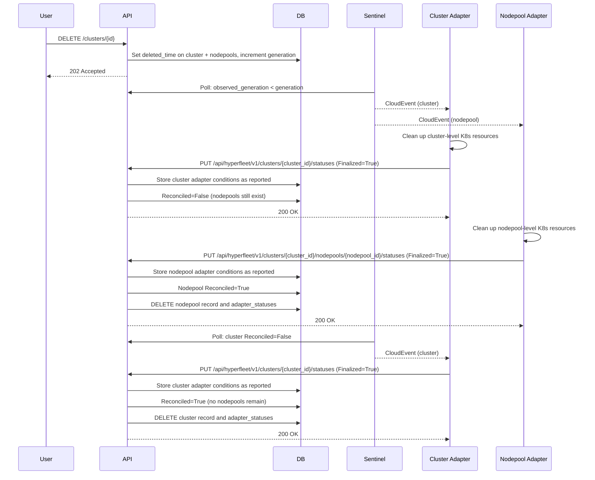
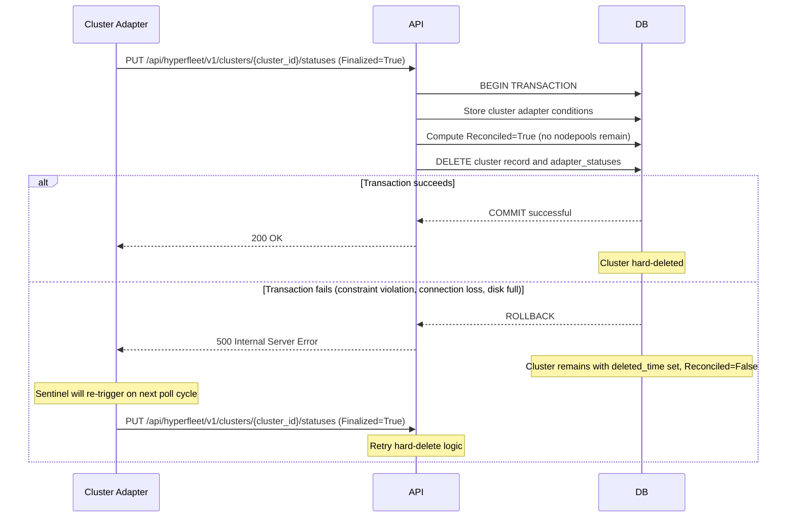

# Hard-Delete Design

**Jira**: [HYPERFLEET-904](https://redhat.atlassian.net/browse/HYPERFLEET-904)

## Terminology

| Term | Definition |
|------|-----------|
| **Soft Deletion** | Setting `deleted_time` (and `deleted_by`) on a resource to signal deletion intent. The resource remains in the database while adapters clean up Kubernetes resources. API resources in this state are pending for deletion. |
| **Hard Delete** | Permanently removing resource, subresource, and adapter status rows from the database. The data is gone and cannot be recovered. Triggered when `deleted_time` is set and `Reconciled=True`. |

> See [Adapter Deletion Flow Design § Terminology](../adapter/framework/adapter-deletion-flow-design.md#terminology) for the full terminology table including soft-delete disambiguation.

## What & Why

**What**: Define how the API hard-deletes database records (clusters, nodepools, adapter_statuses) after adapter reconciliation confirms cleanup is complete.

**Why**: A cluster can have multiple required adapters. No single adapter can own hard-delete because it only knows about its own resources, not whether sibling adapters have finished. When a cluster with 500+ nodepools is deleted, cluster adapters may finalize instantly while nodepool adapters take minutes per nodepool. Without ordering enforcement, the cluster would be hard-deleted while nodepools remain orphaned with real infrastructure still running.

**Related Documentation:**
- [ADR 0012 — Hard-Delete Ownership and Execution](../../adrs/0012-hard-delete-mechanism-after-adapter-reconciliation.md) — architectural decision and alternatives
- [Adapter Deletion Flow Design](../adapter/framework/adapter-deletion-flow-design.md) — adapter-side cleanup, status reporting, and DSL changes
- [API Service Design](./api-service.md) — API service architecture

### Scope

- Hard-delete execution mechanics within the API service layer — the "how" of hard-delete
- Service-layer ordering enforcement (Reconciled aggregation)
- Database-level safety constraints
- Transaction semantics and failure handling
- Adapter re-reporting behavior during deletion

### Out of Scope

- **Pending deletion** (setting `deleted_time`, cascading to subresources) — covered by [Adapter Deletion Flow Design](../adapter/framework/adapter-deletion-flow-design.md)
- **Force deletion** — covered by [Force Deletion Design](../../docs/force-deletion-design.md)
- **Retention window + CronJob** — viable but deferred; see [ADR 0012 Alternatives](../../adrs/0012-hard-delete-mechanism-after-adapter-reconciliation.md#alternatives-considered)

---

## How

### Overview

The API hard-deletes DB records within the same `PUT /api/hyperfleet/v1/clusters/{cluster_id}/statuses` request that computes `Reconciled=True`. No new endpoint or component is introduced. The API is the natural owner because it receives every adapter status report, aggregates conditions to compute `Reconciled`, and can hard-delete atomically within the same database transaction.

### Service-Layer Ordering Enforcement (Primary Control)

The **service layer** is the primary enforcement mechanism for bottom-up deletion ordering. This is a business rule, not a database concern.

When the API receives `PUT /api/hyperfleet/v1/clusters/{cluster_id}/statuses` with `Finalized=True`, the service layer:

1. Stores the adapter conditions as reported
2. Computes `Reconciled` by checking **both**:
   - Adapter conditions: all adapters report `Finalized=True`?
   - Dependent resources: all nodepool records gone?
3. If nodepools still exist: `Reconciled` stays `False` even though all cluster adapters report `Finalized=True`
4. Only when both checks pass does the service layer compute `Reconciled=True` and execute the hard-delete within the same transaction

Sentinel sees `Reconciled=False`, re-triggers the event, and cluster adapters report `Finalized=True` again idempotently. Once all nodepools are hard-deleted, the next status update computes `Reconciled=True` and hard-deletes the cluster and its associated adapter statuses.

### Database Safety Net (ON DELETE RESTRICT)

`ON DELETE RESTRICT` on the nodepool→cluster foreign key is a **database-level safety net**, not the primary enforcement mechanism. It catches bugs in the service layer — if somehow the service layer attempts to delete a cluster while nodepool rows still reference it, the database rejects the operation.

This is analogous to an airbag: you don't fire the airbag to stop the car, but it's there if the brakes fail. The service-layer Reconciled aggregation is the brakes.

### Bottom-Up Ordering Sequence

How bottom-up ordering works (click to expand)

### Atomic Transaction and Failure Handling

The `adapter_status` update and the `DELETE` statement execute in the same database transaction. If the `DELETE` fails (constraint violation, connection loss, disk full), the entire transaction rolls back — the status update is never committed, `Reconciled` remains `False`, and Sentinel will re-trigger the adapter to retry.

Atomic transaction failure and retry (click to expand)

**Why atomic transactions prevent partial deletes:** The `adapter_status` update and the `DELETE` statement execute in the same database transaction. If the `DELETE` fails, the entire transaction rolls back — the status update is never committed, `Reconciled` remains `False`, and Sentinel will re-trigger the adapter to retry.

### Adapter Re-Reporting Behavior

For large clusters (500+ nodepools), the cluster adapter will repeatedly report `Finalized=True` while waiting for nodepool cleanup to complete. Each report triggers the hard-delete check, sees nodepools still exist, and leaves `Reconciled=False`. This generates adapter status updates proportional to Sentinel's polling frequency × nodepool cleanup duration. This behavior is intentional and acceptable for the initial implementation; optimization deferred to future work.

### Observability

Deletion observability is tracked by [HYPERFLEET-856](https://redhat.atlassian.net/browse/HYPERFLEET-856). For existing conventions and deletion-specific areas to instrument, see:

- [Adapter Metrics](../adapter/framework/adapter-metrics.md) — MVP adapter metrics specification
- [Adapter Deletion Flow Design § Observability](../adapter/framework/adapter-deletion-flow-design.md#observability) — deletion-specific metric areas (adapter-level and API-level)
- [Metrics Standard](../../standards/metrics.md) — cross-component Prometheus naming and label conventions

---

## Trade-offs

### What We Gain

- Small implementation scope (few lines in API status path)
- Atomic transaction prevents partial-deletes
- Service-layer check prevents race condition by verifying nodepools are gone
- Clean database at scale (critical at 500+ nodepools)
- No new infrastructure or components
- Natural retry via Sentinel polling
- Consistent with Kubernetes finalizer semantics

### What We Lose / What Gets Harder

- No `GET` after hard-delete — investigation requires log tooling
- Premature `Finalized=True` from adapter bug = permanent data loss (mitigated by Health guard in post-processing that prevents `Finalized=True` when executor didn't complete successfully, and adapters reporting `Finalized=False` with reason `AdapterUnhealthy` when cleanup cannot be confirmed — see [Adapter Deletion Flow Design § Deletion Error Reporting](../adapter/framework/adapter-deletion-flow-design.md#deletion-error-reporting-11))
- For large clusters, adapter re-reporting generates load proportional to Sentinel polling frequency × nodepool cleanup duration

### Acceptable Because

- Race condition protection outweighs investigation inconvenience
- Adapter Health guard mitigates premature finalization
- Future event streaming for audits can be added without changing this mechanism
- The single-request approach evolves to a retention window by swapping `DELETE` for `SET reconciled_at` — no API contract changes required

---

## Alternatives Considered

See [ADR 0012 — Alternatives Considered](../../adrs/0012-hard-delete-mechanism-after-adapter-reconciliation.md#alternatives-considered) for the full analysis. Four alternatives were evaluated: adapter-triggered delete, Sentinel-triggered delete, retention window + CronJob (viable, deferred), and Sentinel audit event stream (future evolution).

---

## References

- [ADR 0012 — Hard-Delete Ownership and Execution](../../adrs/0012-hard-delete-mechanism-after-adapter-reconciliation.md)
- [Adapter Deletion Flow Design](../adapter/framework/adapter-deletion-flow-design.md)
- [HYPERFLEET-904](https://redhat.atlassian.net/browse/HYPERFLEET-904) — SPIKE: Design API hard-deletion mechanism
- [HYPERFLEET-560](https://issues.redhat.com/browse/HYPERFLEET-560) — SPIKE: Design deletion flow between API and Adapters
