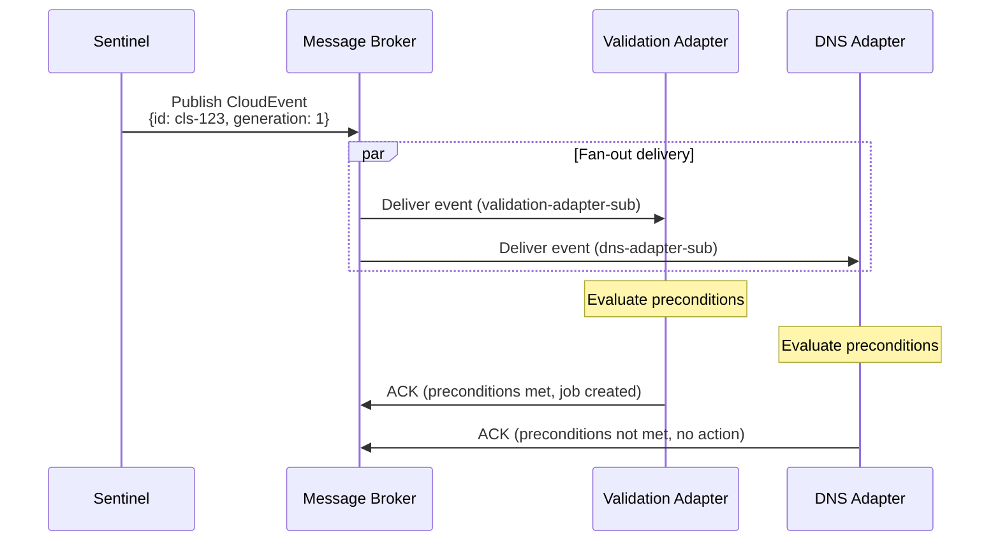

# HyperFleet Message Broker

## Overview

This document describes the hyperfleet-broker library purpose and main design decisions.

## What & Why

`hyperfleet-broker` is a golang library that abstracts the vendor-specific details to interact with a broker system. 

HyperFleet runs in different cloud providers, offering a different native service for messaging. There is no common protocol for these messaging products nor a widely product that is offered in every cloud (like it is for PostgreSQL as an example).

To avoid having application code dealing with each one of the messaging products, the `broker-library` encapsulates these differences and offers a simpler interface.

By changing configuration alone, the same application binary can use different brokers.

---

## How

`hyperfleet-broker` offers two main interfaces for publish and subscribe which is the basics for every messaging system. Then, it implements each interface for every messaging system supported (currently Google Pub/Sub and RabbitMQ)

The library contains code for all these implementations, and will be embedded in the final application.

By using different configuration, only the selected implementation will be used at runtime.

Application code only deals with the decision of what topic/subscription to use, but not how to connect to these.

For the concern to be completely abstracted away, the `hyperfleet-broker` library manages its own configuration, independently of the application configuration.

The `hyperfleet-broker` also manages the overall format of the messages that go into the broker by leveraging CloudEvent standard.

### CloudEvent Format

All events conform to the [CloudEvents 1.0](https://cloudevents.io/) specification, and the `hyperfleet-broker` provides support for working with CloudEvents

```json
{
  "specversion": "1.0",
  "type": "com.redhat.hyperfleet.cluster.reconcile.v1",
  "source": "sentinel-operator/cluster-sentinel-us-east",
  "id": "evt-abc-123",
  "time": "2025-10-21T14:30:00Z",
  "datacontenttype": "application/json",
  "data": {
    "kind": "Cluster",
    "id": "cls-abc-123",
    "href": "/clusters/cls-abc-123",
    "generation": 1
  }
}
```

The full contract is in [asyncapi.yaml](./asyncapi.yaml)

The event payload is intentionally minimal (anemic event pattern — see [Design Decisions](#design-decisions)). Adapters fetch full resource details from the API after receiving the event.

### Supported Broker Implementations

The broker library ([openshift-hyperfleet/hyperfleet-broker](https://github.com/openshift-hyperfleet/hyperfleet-broker)) is built on [Watermill](https://watermill.io/), a Go library providing a broker-agnostic pub/sub abstraction. Watermill handles the underlying transport; the HyperFleet broker library adds CloudEvents conversion, metrics, health checks, and a worker pool for parallel processing.

| Implementation | Broker Type Value | Environment | Notes |
|----------------|-------------------|-------------|-------|
| GCP Pub/Sub | `googlepubsub` | Production | Cloud-native, highly available, at-least-once delivery |
| RabbitMQ | `rabbitmq` | On-premise / self-hosted | AMQP-based, suitable for environments without GCP access |

The broker implementation is selected via the `broker.type` field in `broker.yaml`.

### Configuration

The library uses a YAML configuration file (`broker.yaml`). The path defaults to the executable directory but can be overridden with the `BROKER_CONFIG_FILE` environment variable. All fields support environment variable overrides using dot-notation (e.g., `BROKER_TYPE` overrides `broker.type`).


**Sentinel publisher configuration (`broker.yaml`):**

```yaml
broker:
  type: googlepubsub        # or "rabbitmq"
  googlepubsub:
    project_id: hyperfleet-prod
    # topic is passed at publish time via Publisher.Publish(ctx, topic, event)

subscriber:
  parallelism: 1            # number of concurrent message handlers per subscription
```

**Adapter subscriber configuration (`broker.yaml`):**

```yaml
broker:
  type: googlepubsub
  googlepubsub:
    project_id: hyperfleet-prod
    # subscription_id is passed at subscribe time via NewSubscriber(logger, subscriptionID, metrics)

subscriber:
  parallelism: 2            # increase for high-throughput adapters
```

### Event Flow



---

## Design Decisions

### Configuration with a separate config file and environment variables

**Decision**: the library is configured using a separate `broker.yaml` config file and environment variables

**Rationale**: To keep the application agnostic of the broker in use, the library has to manage all the details of the connection. Any broker-specific data is in the broker.yaml config file which makes clients of the library (sentinel, adapters) not to have broker vendor specific code nor parameters.


**Trade-off**: This adds complexity to the deployment of the application, since it has to deal with an additional `broker.yaml` file besides its own file.

And the same with environment variables since they are used to override settings in the `broker.yaml` file.

### Fan-out via Subscriptions (Not Routing Keys)

**Decision**: All adapters receive all events via independent subscriptions to a single topic. Adapters evaluate their own preconditions to decide whether to act.

**Rationale**: Routing events to specific adapters at the broker level would require the broker or Sentinel to know which adapters exist and what they respond to. Adapter-side precondition evaluation keeps adapter logic self-contained and makes it trivial to add or remove adapters without touching the broker or Sentinel.

### Pluggable Broker Abstraction via Watermill

**Decision**: The broker library is built on [Watermill](https://watermill.io/) and exposes its own `Publisher` / `Subscriber` interfaces with CloudEvents as the first-class message type.

**Rationale**: HyperFleet must support GCP-managed environments (GCP Pub/Sub) and on-premise environments (RabbitMQ). Watermill provides the broker-agnostic transport layer, while the HyperFleet broker library adds CloudEvents conversion, metrics, health checks, and worker pool parallelism on top. Components program against the `Publisher` / `Subscriber` interfaces and are not coupled to either Watermill or the underlying broker backend.

### Worker Pool for Parallel Processing

**Decision**: The Subscriber supports a configurable `parallelism` setting that registers multiple concurrent Watermill handlers per subscription.

**Rationale**: High-throughput adapters may need to process multiple events concurrently. The default parallelism of 1 provides safe sequential processing; adapters can increase it via `subscriber.parallelism` in `broker.yaml` without any code changes.

---

## Trade-offs

### What We Gain

- ✅ **Decoupling**: Sentinel and Adapters have zero direct knowledge of each other
- ✅ **Extensibility**: New adapters are added with zero changes to Sentinel or existing adapters
- ✅ **Parallel execution**: All adapters receive events simultaneously and run in parallel
- ✅ **Independent scaling**: Each adapter subscription scales independently
- ✅ **At-least-once delivery**: Broker guarantees events are not permanently lost
- ✅ **Pluggability**: Same codebase works with GCP Pub/Sub, RabbitMQ, or Stub

### What We Lose / What Gets Harder

- ⚠️ **Operational overhead**: Configuration is harder because of the required broker settings
- ⚠️ **Debug complexity**: An extra library is involved when debugging an issue with publish/subscribe messages
- ⚠️ **External dependency**: If there is any need for an specific broker detail not implemented in Watermill, we need to contribute to an external library.


---

## Alternatives Considered

### Implement broker-specific code in each application

**What**: Instead of factoring out a library, include all broker code in each application

**Why Rejected**:
- Encapsulation of responsibilities
- The broker library can be tested in isolation

### Implement our own library instead of using Watermill

What: Instead of using Watermill as the basis for `hyperfleet-broker`, build a library from scratch

**Why Rejected**:
- Watermill covers HyperFleet needs
- We implemented a thin wrapper over Watermill to shield from hard dependency, it can be changed in the future

---

## Dependencies

| Dependency | Purpose |
|-----------|---------|
| GCP Pub/Sub (production) | Managed message broker in GCP environments |
| RabbitMQ (on-premise) | Self-hosted broker for non-GCP environments |
| Sentinel | Publishes reconciliation events to the broker topic |
| Adapter Framework | Consumes events from adapter-specific subscriptions |

---

## Interfaces

From [openshift-hyperfleet/hyperfleet-broker](https://github.com/openshift-hyperfleet/hyperfleet-broker):

### Publisher Interface (used by Sentinel)

```go
// Publisher defines the interface for publishing CloudEvents
type Publisher interface {
    // Publish publishes a CloudEvent to the specified topic
    Publish(ctx context.Context, topic string, event *event.Event) error
    // Health checks if the underlying broker connection is healthy
    Health(ctx context.Context) error
    // Close closes the underlying publisher
    Close() error
    // BrokerType returns the configured broker type
    BrokerType() string
}
```

Instantiated via `broker.NewPublisher(logger, metrics)` or `broker.NewPublisher(logger, metrics, configMap)`.

### Subscriber Interface (used by Adapters)

```go
// HandlerFunc processes a received CloudEvent
type HandlerFunc func(ctx context.Context, event *event.Event) error

// Subscriber defines the interface for subscribing to CloudEvents
type Subscriber interface {
    // Subscribe subscribes to a topic and processes messages with the provided handler
    Subscribe(ctx context.Context, topic string, handler HandlerFunc) error
    // Errors returns a channel that receives errors from background operations
    Errors() <-chan *SubscriberError
    // Close closes the underlying subscriber
    Close() error
    // BrokerType returns the configured broker type
    BrokerType() string
}
```

Instantiated via `broker.NewSubscriber(logger, subscriptionID, metrics)`. The `subscriptionID` determines fan-out vs. load-balancing: different IDs = each subscriber gets every message (fan-out); same ID = messages are shared across instances (competing consumers).

---

## Related Documents

- [Architecture Summary](../../README.md) — system-level view of broker's role
- [Sentinel Design](../sentinel/sentinel.md) — how Sentinel publishes events
- [Adapter Framework Design](../adapter/framework/adapter-frame-design.md) — how adapters subscribe and process events
- [Adapter Design Decisions](../adapter/framework/adapter-design-decisions.md) — anemic event pattern rationale
