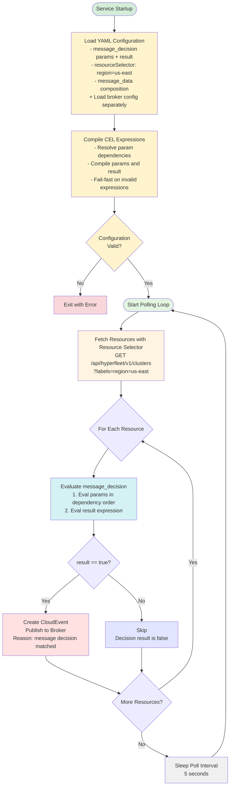
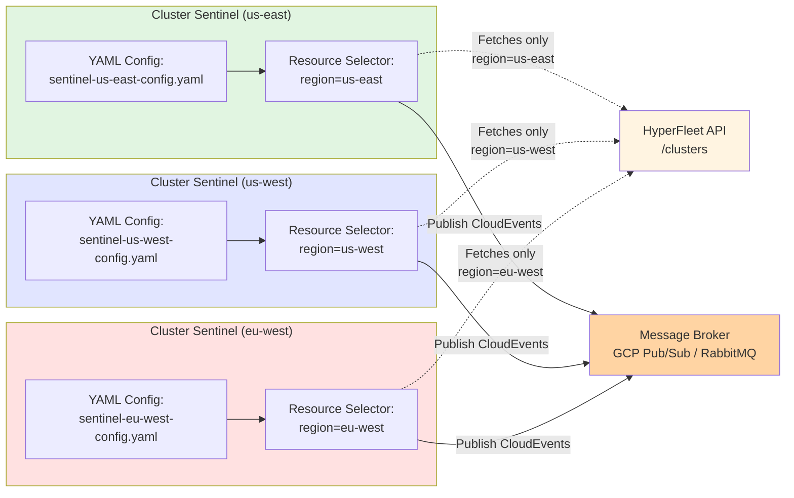

# HyperFleet Sentinel

Comprehensive design document for the HyperFleet Sentinel service — the central reconciliation loop that continuously polls the HyperFleet API, evaluates configurable CEL-based decision logic, and publishes CloudEvents to the message broker to trigger adapter processing. Covers the full architecture, configuration schema, decision algorithm, sharding strategy, and observability. The Sentinel is a generic pattern reusable for any HyperFleet resource type.

---

## Table of Contents

- [What & Why](#what--why)
- [Sentinel Architecture](#sentinel-architecture)
  - [The Problem: Stuck Workflows](#the-problem-stuck-workflows)
  - [The Solution: Continuous Reconciliation with Direct Broker Publishing](#the-solution-continuous-reconciliation-with-direct-broker-publishing)
  - [Decision Logic](#decision-logic)
  - [Message Decision](#message-decision)
  - [Adapter Status Update Contract](#adapter-status-update-contract)
  - [Resource Filtering Architecture](#resource-filtering-architecture)
- [Service Components](#service-components)
  - [1. Config Loader](#1-config-loader)
  - [2. Resource Watcher](#2-resource-watcher)
  - [3. Decision Engine](#3-decision-engine)
  - [4. Message Publisher](#4-message-publisher)
  - [5. Main Reconciler](#5-main-reconciler)
- [Decision Engine Test Scenarios](#decision-engine-test-scenarios)
  - [Message Decision Tests](#message-decision-tests)
  - [Edge Cases](#edge-cases)
  - [Test Requirements](#test-requirements)
- [Service Deployment](#service-deployment)
- [Trade-offs](#trade-offs)
  - [What We Gain](#what-we-gain)
  - [What We Lose / What Gets Harder](#what-we-lose--what-gets-harder)
  - [Technical Debt Incurred](#technical-debt-incurred)
  - [Acceptable Because](#acceptable-because)
- [Alternatives Considered](#alternatives-considered)
  - [Outbox Pattern (v1 Architecture)](#outbox-pattern-v1-architecture)
  - [Push-Based Triggering (Webhooks / API Watch)](#push-based-triggering-webhooks--api-watch)
  - [Hardcoded Decision Logic](#hardcoded-decision-logic)
  - [Kubernetes Controller Pattern](#kubernetes-controller-pattern)
- [Post-MVP Enhancements](#post-mvp-enhancements)
  - [Advanced Alerting](#advanced-alerting)

---

## What & Why

**What**

Implement a "HyperFleet Sentinel" service that continuously polls the HyperFleet API for resources (clusters, node pools, etc.) and publishes reconciliation events directly to the message broker to trigger adapter processing. The Sentinel acts as the "watchful guardian" of the HyperFleet system with configurable message decision logic using CEL expressions and composable boolean params. Multiple Sentinel deployments can be configured via YAML configuration files to handle different shards of resources for horizontal scalability.

**Pattern Reusability**: The Sentinel is designed as a generic reconciliation service that can watch ANY HyperFleet resource type, not just clusters. Future deployments can include:
- **Cluster Sentinel** (this epic) - watches clusters
- **NodePool Sentinel** (future) - watches node pools
- **[Resource] Sentinel** (future) - watches any HyperFleet resource

**Why**

Without the Sentinel, the cluster provisioning workflow has a critical gap:

1. **No Reconciliation Loop**: After adapters complete their work and put status updates, nothing triggers subsequent adapters to check if they can now proceed
2. **Stuck Clusters**: Clusters remain in "pending" state indefinitely with no mechanism to retry failed operations
3. **Manual Intervention Required**: Operators must manually trigger reconciliation or restart adapters
4. **No Failure Recovery**: Transient failures cannot self-heal without a retry mechanism

The Sentinel solves these problems by:
- **Closing the reconciliation loop**: Continuously polls resources and publishes events to trigger adapter evaluation
- **Uses adapter status updates**: Reads `status.conditions[].last_updated_time` and condition statuses (updated by adapters on every check) to determine when to create next event
- **Fully configurable decision logic**: Named CEL params and a boolean result expression define the complete decision logic (e.g., different age thresholds for ready vs not-ready resources)
- **Relies on API-computed Ready condition**: The API aggregates adapter statuses into a `Ready` condition — when `Ready != True` (including after spec changes that increment `generation`), the Sentinel's default rules trigger reconciliation
- **Self-healing**: Automatically retries without manual intervention
- **Horizontal scalability**: Resource filtering allows multiple Sentinels to handle different resource subsets
- **Event-driven architecture**: Maintains decoupling by publishing CloudEvents to message broker
- **Reusable pattern**: Same service can watch clusters, node pools, or any future HyperFleet resource
- **Direct publishing**: Publishes events directly to broker, simplifying architecture (no outbox pattern needed)

**Acceptance Criteria:**

- Configuration schema defined in Go structs with proper validation tags
- Service deployed as single replica per resource selector
- Service reads configuration from YAML files with environment variable overrides
- Broker configuration separated and shared with adapters
- Polls HyperFleet API for resources matching resource selector criteria
- Decision Engine evaluates configurable message_decision (CEL params + boolean result) to determine if a resource needs reconciliation
- Uses `status.conditions[].last_updated_time` and condition statuses from adapter status updates
- Creates CloudEvents for resources when message decision result is `true`
- CloudEvent data structure is configurable via message_data field
- Publishes events directly to message broker (GCP Pub/Sub or RabbitMQ)
- Configurable message decision via CEL expressions (params + result)
- Resource filtering support via label selectors in configuration
- Metrics exposed for monitoring (reconciliation rate, event publishing, errors)
- **Integration tests verify all test scenarios (message decision evaluation, edge cases)**
- **100% test coverage maintained on Decision Engine package**
- Graceful shutdown and error handling implemented
- Multiple services can run simultaneously with different resource selectors

---

## Sentinel Architecture

### The Problem: Stuck Workflows

**Without Sentinel**:
```
User creates cluster
  → Validation adapter processes
  → Validation reports status
  → STUCK - Nothing triggers next check

Adapter fails transiently
  → STUCK - No retry mechanism
```

### The Solution: Continuous Reconciliation with Direct Broker Publishing

**Reconciliation Loop (Per Resource Selector)**:



**Multiple Sentinel Deployments (Resource Filtering)**:



**Note on Resource Selector Flexibility**:

Resource filtering can be based on **any label criteria** of the cluster object being reconciled. The `resource_selector` uses a list of label/value pairs with AND logic (all labels must match), allowing for flexible filtering strategies:

- **Regional filtering**:
  ```yaml
  resource_selector:
    - label: region
      value: us-east
  ```
- **Environment-based**:
  ```yaml
  resource_selector:
    - label: environment
      value: production
  ```
- **Multi-label filtering** (all must match):
  ```yaml
  resource_selector:
    - label: region
      value: us-east
    - label: environment
      value: production
    - label: cluster-type
      value: hypershift
  ```
- **Tenant/Customer**:
  ```yaml
  resource_selector:
    - label: tenant
      value: customer-123
  ```

This flexibility allows you to:
- Scale horizontally by dividing clusters across multiple Sentinel instances
- Isolate blast radius (failures in one Sentinel don't affect others)
- Optimize configurations per Sentinel instance (different message decision params for prod vs dev)
- Deploy Sentinels close to their managed clusters (regional Sentinels in regional k8s clusters)

**Important caveat**: Since this is label-based filtering (not true sharding), operators must manually ensure:
- All resources are covered by at least one Sentinel (no gaps)
- Resource coverage is appropriate (overlaps may be intentional or problematic depending on use case)

### Decision Logic

The service uses a fully configurable decision logic based on the `message_decision` configuration. There is no hardcoded check — all decision logic is expressed as CEL rules:

**Publish Event IF**:
- Evaluate all `message_decision.params` in dependency order (each param is a CEL expression or duration literal)
- Params can reference other params (e.g., `is_ready` can be used in `ready_and_stale`)
- Evaluate `message_decision.result` boolean expression (standard CEL logical operators)
- If result is `true` → publish event

**Skip IF**:
- Message decision result is `false`

**Key Insight — Why No Hardcoded Generation Check**:

The API already aggregates adapter statuses into the `Ready` condition. When a user changes the resource spec (incrementing `generation`), the API sets `Ready` to `False` because not all adapters have reconciled the new generation yet. This means `Ready == False` already covers the generation mismatch case — there is no need for the Sentinel to duplicate this logic with a separate generation check.

This simplifies the Sentinel to a single unified rule engine:
- The `Ready` condition is the canonical signal for "this resource needs reconciliation"
- The `Available` condition is informational but not used for decision-making in the default configuration
- Operators can write custom rules using any condition type if their use case requires it

### Message Decision

The Sentinel uses a `message_decision` configuration with named **params** and a boolean **result** expression. This is the **sole decision mechanism** — there are no hardcoded checks.

**How It Works**:

1. **Params** are named variables defined as CEL expressions or duration literals
2. Params can reference other params (evaluated in dependency order via topological sort)
3. The **result** expression combines params using standard CEL logical operators (`&&`, `||`) to produce a boolean
4. If result is `true`, a reconciliation event is published

**Default Configuration** (equivalent to previous behavior):

| Param Name | Type | Expression | Purpose |
|------------|------|------------|---------|
| `ref_time` | CEL → string | `condition("Ready").last_updated_time` | Reference timestamp for age calculation |
| `is_ready` | CEL → bool | `condition("Ready").status == "True"` | Whether resource is ready |
| `is_new_resource` | CEL → bool | `!is_ready && resource.generation == 1` | Brand-new resource that needs immediate reconciliation |
| `ready_and_stale` | CEL → bool | `is_ready && now - timestamp(ref_time) > duration("30m")` | Ready resource whose last check is stale |
| `not_ready_and_debounced` | CEL → bool | `!is_ready && now - timestamp(ref_time) > duration("10s")` | Not-ready resource, debounce period elapsed |

**Result**: `is_new_resource || ready_and_stale || not_ready_and_debounced`

**Why debounce?**

The Sentinel polls every cycle (5s by default) and will publish a message for not-ready resources. This provides fast reaction time to changes including newly created resources, but can create unnecessary load in downstream services.

Debouncing is a programming technique that limits the rate at which a function fires by delaying its execution until a specified amount of time has passed since the last event. It groups multiple rapid, sequential events into a single action, improving performance by reducing unnecessary calculations or API calls.

By introducing a debounce interval (10s default), the Sentinel limits the messages published for a resource — ensuring adapters have time to complete their work before triggering the next reconciliation cycle. Brand-new resources (`is_new_resource`) bypass this debounce because no adapter has processed them yet — there is no "previous work" to wait for.

**Key Design Decisions**:
- All CEL expressions are compiled at startup (fail-fast on invalid configuration)
- Params are evaluated in dependency order (topological sort); circular dependencies are rejected at startup
- Duration literals (e.g., `30m`, `10s`) in params are auto-detected and converted to CEL duration values
- The `now` variable (current timestamp) is available in all expressions
- The `result` is the **sole decision maker** — all time-based checks, condition evaluations, and reconciliation triggers are encoded in params (no hardcoded checks)
- The `result` expression uses standard CEL logical operators (`&&`, `||`). No aliases or custom operator syntax — pure CEL.
- A single custom helper function `condition(name)` provides access to resource status data (see reference below). Fields are accessed directly (e.g., `condition("Ready").status`), keeping the API surface minimal.
- This aligns with the adapter framework's preconditions pattern (CEL-based evaluation)

#### Custom CEL Function Reference

A single custom function is registered at startup. The `resource` parameter is implicit — the function already knows the resource structure:

**`condition(name)`** — `(string) → Condition`

Returns the full condition object matching the given `type` name, with fields:
- `.status` — `"True"`, `"False"`, or `"Unknown"`
- `.observed_generation` — which generation this condition last reconciled
- `.last_updated_time` — ISO 8601 timestamp of last adapter check
- `.last_transition_time` — ISO 8601 timestamp of last status change

**When condition is missing**: Returns a zero-value Condition (`.status = ""`, `.observed_generation = 0`, `.last_updated_time` = zero time). This follows Go's zero-value convention and allows safe field access without null checks.

**Examples**:
```cel
condition("Ready").status == "True"              # check if resource is ready
condition("Ready").last_updated_time             # get timestamp for age calculation
condition("Available").observed_generation       # get last reconciled generation
```

**Notes**:
- Searches `resource.status.conditions[]` by the `type` field
- Works with **any** condition type present on the resource (e.g., `"Ready"`, `"Available"`, `"Applied"`, `"Health"`, or custom conditions)
- When accessing `.last_updated_time` on a missing condition, the zero time value will cause `timestamp()` conversion to produce a very old timestamp, which naturally triggers age-exceeded checks — acting as a fail-safe that ensures new or unknown resources get reconciled (see Test 7)

**Configuration** (via YAML files):

```yaml
# File: sentinel-config.yaml

resource_type: clusters  # Resource to watch: clusters, nodepools, manifests, workloads

# Polling configuration
poll_interval: 5s

# Message decision - configurable decision logic
message_decision:
  params:
    ref_time: 'condition("Ready").last_updated_time'
    is_ready: 'condition("Ready").status == "True"'
    is_new_resource: '!is_ready && resource.generation == 1'
    ready_and_stale: 'is_ready && now - timestamp(ref_time) > duration("30m")'
    not_ready_and_debounced: '!is_ready && now - timestamp(ref_time) > duration("10s")'
  result: 'is_new_resource || ready_and_stale || not_ready_and_debounced'

# Resource selector - only process resources matching these labels
resource_selector:
  - label: region
    value: us-east

# HyperFleet API configuration
hyperfleet_api:
  endpoint: http://hyperfleet-api.hyperfleet-system.svc.cluster.local:8080
  timeout: 10s

# Message data composition - define CloudEvent data payload structure
message_data:
  resource_id: .id
  resource_type: .kind
  region: .metadata.labels.region

---
# File: sentinel-broker-config.yaml (Sentinel-specific)
# Note: Adapters have their own broker ConfigMap with different fields (e.g., BROKER_SUBSCRIPTION_ID for consumers)
# Sentinel publishes events, Adapters consume events - they need different broker configurations

# Google Cloud Pub/Sub Example:
apiVersion: v1
kind: ConfigMap
metadata:
  name: hyperfleet-sentinel-broker
  namespace: hyperfleet-system
data:
  BROKER_TYPE: "pubsub"
  BROKER_PROJECT_ID: "hyperfleet-prod"

---
# RabbitMQ Example:
apiVersion: v1
kind: ConfigMap
metadata:
  name: hyperfleet-sentinel-broker
  namespace: hyperfleet-system
data:
  BROKER_TYPE: "rabbitmq"
  BROKER_HOST: "rabbitmq.hyperfleet-system.svc.cluster.local"
  BROKER_PORT: "5672"
  BROKER_VHOST: "/"
  BROKER_EXCHANGE: "hyperfleet-events"
  BROKER_EXCHANGE_TYPE: "fanout"
```

> **Note:** For topic naming conventions and multi-tenant isolation strategies, see [Naming Strategy](./sentinel-naming-strategy.md).

### Adapter Status Update Contract

**CRITICAL REQUIREMENT**: For the Sentinel message decision to work correctly, adapters MUST update their status on EVERY evaluation, regardless of whether they take action.

**Why This Matters**:

Without this requirement, adapters that skip work due to unmet preconditions would create an infinite event loop:

```
Time 10:00 - DNS adapter receives event
Time 10:00 - DNS checks preconditions: Validation not complete
Time 10:00 - DNS does NOT update status (skips work)
            ❌ cluster.status.last_updated_time remains at 09:50
Time 10:10 - Sentinel sees last_updated_time=09:50, age threshold exceeded (10s)
Time 10:10 - Sentinel publishes ANOTHER event
Time 10:10 - DNS receives event AGAIN...
            ↻ INFINITE LOOP until validation completes
```

**Required Adapter Behavior**:

Adapters MUST update status in ALL scenarios:

1. **Preconditions Met** → Create Job → Report status with `observed_time=now`
2. **Preconditions NOT Met** → Skip work → Report status anyway with:
   ```json
   {
     "adapter": "dns",
     "observed_generation": 1,
     "observed_time": "2025-10-17T10:00:00Z",
     "conditions": [
       {
         "type": "Available",
         "status": "False",
         "reason": "PreconditionsNotMet",
         "message": "Waiting for validation to complete"
       },
       {
         "type": "Applied",
         "status": "False",
         "reason": "PreconditionsNotMet",
         "message": "Waiting for validation adapter"
       },
       {
         "type": "Health",
         "status": "True",
         "reason": "NoErrors",
         "message": "Adapter is healthy"
       }
     ]
   }
   ```

**Note**: Adapters send `observed_time` in the request. API uses this to update `last_report_time` in AdapterStatus and aggregates to `last_updated_time` in ClusterStatus.

**Integration Testing**:

Integration tests MUST verify that:
- Adapters send `observed_time` when preconditions are met
- Adapters send `observed_time` when preconditions are NOT met
- Sentinel correctly calculates age from `cluster.status.last_updated_time` (aggregated from adapter reports) for message decision evaluation

---

**Status Tracking**:

The Sentinel reads the resource's status conditions to evaluate the message decision rules. The default configuration relies on the `Ready` condition, but custom rules can reference any condition:

```json
{
  "id": "cls-123",
  "generation": 2,
  "status": {
    "conditions": [
      {
        "type": "Available",
        "status": "True",
        "observed_generation": 1,
        "last_updated_time": "2025-10-21T12:00:00Z",
        "last_transition_time": "2025-10-21T10:00:00Z"
      },
      {
        "type": "Ready",
        "status": "False",
        "observed_generation": 1,
        "last_updated_time": "2025-10-21T12:00:00Z",
        "last_transition_time": "2025-10-21T10:00:00Z"
      }
    ]
  }
}
```

**Important distinction between fields:**

- **`generation`**: User's desired state version. Increments when the resource spec changes (e.g., user scales nodes from 3 to 5). This is the "what the user wants" field.

- **`condition.observed_generation`**: Which generation was last reconciled by a given adapter. The API uses this to compute the aggregated `Ready` condition — when any adapter's `observed_generation` is behind `resource.generation`, the API sets `Ready` to `False`.

- **`condition.last_transition_time`**: Updates ONLY when the condition status changes (e.g., Ready False → True)

- **`condition.last_updated_time`**: Updates EVERY time an adapter checks the resource, regardless of whether status changed

**How generation changes flow through the system:**

When a user changes the cluster spec (e.g., scales nodes), `generation` increments (1 → 2). The API detects that not all adapters have reconciled this generation and sets `Ready` to `False`. The Sentinel's default rules see `Ready != True` and trigger reconciliation — no separate generation check is needed in the Sentinel.

**Why this matters for age calculation in message decision:**

If a cluster stays in "Provisioning" state for 2 hours, `last_transition_time` would remain at the time it entered "Provisioning" (e.g., 10:00), even though adapters check it at 11:00, 11:30, 12:00. Using `last_transition_time` for age calculation would incorrectly trigger events too frequently. Using `last_updated_time` ensures age is calculated from the last adapter check, not the last status change.

**For complete details on generation and observed_generation semantics, see:**
- [HyperFleet Status Guide](../../docs/status-guide.md) - Complete documentation of the status contract, including how adapters report `observed_generation` and how the API aggregates it into the `Ready` condition

### Resource Filtering Architecture

> **MVP Scope**: For the initial MVP implementation (HYPERFLEET-33), we recommend deploying a **single Sentinel instance** watching all resources (`resource_selector: []` - empty list). Multi-Sentinel deployments with label-based filtering are documented below as a **post-MVP enhancement** for horizontal scalability.

**Why Resource Filtering?**
- Horizontal scalability - distribute load across multiple Sentinel instances
- Regional isolation - deploy Sentinel per region
- Blast radius reduction - failures affect only filtered resources
- Flexibility - different configurations per Sentinel instance (e.g., different message decision params for dev vs prod)

**Important: This is NOT True Sharding**
- True sharding guarantees complete coverage: all resources are handled by exactly one shard
- Sentinel uses `resource_selector` which is just label-based filtering
- No coordination between Sentinel instances
- Possible to have gaps (resources not selected by any Sentinel) or overlaps (resources selected by multiple Sentinels)
- Operators must ensure their resource selectors provide desired coverage

**How Resource Filtering Works**:
1. Each Sentinel deployment uses ONE YAML configuration file (sentinel-config.yaml)
2. Configuration file defines `resource_type` (clusters, nodepools, etc.) and `resource_selector` (label selector)
3. Sentinel only fetches resources matching the resource type and resource selector
4. Multiple Sentinels can run simultaneously with overlapping or non-overlapping selectors
5. Each Sentinel publishes to the same broker topic/exchange (fan-out to adapters)

**Example Resource Filtering Strategy**:

```yaml
# File: sentinel-us-east-config.yaml
# Deployment 1: US East clusters
resource_type: clusters
poll_interval: 5s
message_decision:
  params:
    ref_time: 'condition("Ready").last_updated_time'
    is_ready: 'condition("Ready").status == "True"'
    is_new_resource: '!is_ready && resource.generation == 1'
    ready_and_stale: 'is_ready && now - timestamp(ref_time) > duration("30m")'
    not_ready_and_debounced: '!is_ready && now - timestamp(ref_time) > duration("10s")'
  result: 'is_new_resource || ready_and_stale || not_ready_and_debounced'
resource_selector:
  - label: region
    value: us-east

hyperfleet_api:
  endpoint: http://hyperfleet-api.hyperfleet-system.svc.cluster.local:8080
  timeout: 10s

message_data:
  resource_id: .id
  resource_type: .kind
  region: .metadata.labels.region

---
# File: sentinel-us-west-config.yaml
# Deployment 2: US West clusters (different intervals!)
resource_type: clusters
poll_interval: 5s
message_decision:
  params:
    ref_time: 'condition("Ready").last_updated_time'
    is_ready: 'condition("Ready").status == "True"'
    is_new_resource: '!is_ready && resource.generation == 1'
    ready_and_stale: 'is_ready && now - timestamp(ref_time) > duration("1h")'      # Different!
    not_ready_and_debounced: '!is_ready && now - timestamp(ref_time) > duration("15s")' # Different!
  result: 'is_new_resource || ready_and_stale || not_ready_and_debounced'
resource_selector:
  - label: region
    value: us-west

hyperfleet_api:
  endpoint: http://hyperfleet-api.hyperfleet-system.svc.cluster.local:8080
  timeout: 10s

message_data:
  resource_id: .id
  resource_type: .kind
  region: .metadata.labels.region

---
# File: sentinel-nodepools-config.yaml
# Future: NodePool Sentinel (different resource type!)
resource_type: nodepools
poll_interval: 5s
message_decision:
  params:
    ref_time: 'condition("Ready").last_updated_time'
    is_ready: 'condition("Ready").status == "True"'
    is_new_resource: '!is_ready && resource.generation == 1'
    ready_and_stale: 'is_ready && now - timestamp(ref_time) > duration("10m")'
    not_ready_and_debounced: '!is_ready && now - timestamp(ref_time) > duration("5s")'
  result: 'is_new_resource || ready_and_stale || not_ready_and_debounced'

hyperfleet_api:
  endpoint: http://hyperfleet-api.hyperfleet-system.svc.cluster.local:8080
  timeout: 10s

message_data:
  resource_id: .id
  resource_type: .kind
  cluster_id: .ownerResource.id  # Link to parent cluster

---
# File: sentinel-broker-config.yaml (Same across all Sentinel deployments)
# Choose one of the following based on your environment:

# Google Cloud Pub/Sub:
apiVersion: v1
kind: ConfigMap
metadata:
  name: hyperfleet-sentinel-broker
  namespace: hyperfleet-system
data:
  BROKER_TYPE: "pubsub"
  BROKER_PROJECT_ID: "hyperfleet-prod"

---
# RabbitMQ:
apiVersion: v1
kind: ConfigMap
metadata:
  name: hyperfleet-sentinel-broker
  namespace: hyperfleet-system
data:
  BROKER_TYPE: "rabbitmq"
  BROKER_HOST: "rabbitmq.hyperfleet-system.svc.cluster.local"
  BROKER_PORT: "5672"
  BROKER_VHOST: "/"
  BROKER_EXCHANGE: "hyperfleet-events"
  BROKER_EXCHANGE_TYPE: "fanout"
```

---

## Service Components

### 1. Config Loader

**Responsibility**: Load configuration from YAML files with environment variable overrides

**Key Functions**:
- `Load(configPath)` - Load Sentinel configuration from YAML file
- `LoadBrokerConfig()` - Load broker configuration from environment or ConfigMap
- `BuildLabelSelector(cfg)` - Convert `resource_selector` to label selector
- `ParseMessageData(cfg)` - Parse message_data configuration for CloudEvent payload composition

**Implementation Requirements**:
- Load Sentinel configuration from YAML file path specified via command-line flag
- Parse duration strings (poll_interval, timeout)
- Parse `message_decision` section: params (CEL expressions or duration literals) and result expression
- Resolve param dependencies (topological sort) and compile all CEL expressions at startup for fail-fast validation
- Parse resource_type field to determine which HyperFleet resources to fetch
- Parse message_data configuration for composable CloudEvent data structure
- Load broker configuration separately (from environment variables or shared ConfigMap)
- Support environment variable overrides for sensitive fields (API tokens, credentials)
- Handle missing or invalid configuration gracefully
- Return structured configuration object for use by reconciler
- Validate required fields and enum values

### 2. Resource Watcher

**Responsibility**: Fetch resources from HyperFleet API that need reconciliation

**Key Functions**:
- `FetchResources(ctx, resourceType, selector)` - Fetch resources matching label selector and condition criteria

The Resource Watcher uses the API's condition-based search to selectively query only resources that need attention (not-ready or stale), rather than fetching all resources on every poll cycle. See the API and Sentinel component documentation for query details.

### 3. Decision Engine

**Responsibility**: Configurable decision logic via CEL-based message decision

**Key Functions**:
- `Evaluate(resource, now)` - Determine if resource needs an event

**Decision Logic**:
1. **Evaluate message decision params** in dependency order, building an activation map:
   - Duration literal params (e.g., `30m`) are converted to CEL duration values
   - CEL expression params are evaluated with access to `resource`, `now`, and previously evaluated params

2. **Evaluate result expression** with all params in scope:
   - Result uses standard CEL logical operators (`&&`, `||`)

3. **Return decision based on result**:
   - If result is `true` → publish event (reason: "message decision matched")
   - If result is `false` → skip (reason: "message decision not matched")

**Implementation Requirements**:
- All CEL expressions compiled at startup (fail-fast on invalid expressions)
- Param dependencies resolved via topological sort; circular dependencies rejected at startup
- Clear logging of decision reasoning

### 4. Message Publisher

**Responsibility**: Publish CloudEvents to message broker

**Key Functions**:
- `PublishEvent(ctx, resource, reason)` - Publish CloudEvent to broker

**CloudEvent Format** (CloudEvents 1.0):
```json
{
  "specversion": "1.0",
  "type": "com.redhat.hyperfleet.cluster.reconcile",
  "source": "hyperfleet-sentinel",
  "id": "evt-abc123",
  "time": "2025-10-21T12:00:00Z",
  "datacontenttype": "application/json",
  "data": {
    "resource_id": "cls-123",
    "resource_type": "cluster",
    "region": "us-east",
    "status": "Provisioning"
  }
}
```

**Message Data Composition (Go Templates)**:

The `data` field structure is defined by the `message_data` configuration in sentinel-config.yaml using **Go template syntax**. This allows Sentinel to be generic across different resource types (clusters, nodepools, etc.) by configuring which fields to extract and include in CloudEvents.

**Template Syntax**:
- Uses Go template language (`text/template` package)
- Resource object available as `.` (dot) in template context
- Supports dot notation for nested fields: `.metadata.labels.region`
- Supports simple conditionals and functions

**Configuration Format**:
```yaml
message_data:
  resource_id: .id                           # Simple field access
  resource_type: .kind                       # Top-level field
  region: .metadata.labels.region            # Nested field access
  cluster_id: .ownerResource.id              # For nodepools: parent cluster
  # Optional: conditional with default
  display_name: '{{if .metadata.displayName}}{{.metadata.displayName}}{{else}}{{.metadata.name}}{{end}}'
```

**Evaluation Context**:
- Template receives the resource object (cluster, nodepool, etc.)
- Field paths are relative to the resource root
- Missing fields result in empty string (not error)

**Error Handling**:
- Invalid template syntax → Sentinel fails at startup (fail-fast)
- Missing fields at runtime → Log warning, use empty string
- Type mismatches → Convert to string representation

**Validation**:
- Templates validated at startup (before starting polling loop)
- Invalid templates cause Sentinel to exit with error
- Provides clear error messages indicating which template failed

**Example Template Evaluation**:
```yaml
# Configuration:
message_data:
  resource_id: .id
  region: .metadata.labels.region

# Resource object:
{
  "id": "cls-123",
  "metadata": {
    "labels": {
      "region": "us-east"
    }
  }
}

# Resulting CloudEvent data:
{
  "resource_id": "cls-123",
  "region": "us-east"
}
```

**Implementation Requirements**:
- Support GCP Pub/Sub:
  - Use `cloud.google.com/go/pubsub` SDK
  - Publish to configured topic
  - Include CloudEvent attributes as message attributes
- Support RabbitMQ:
  - Use `github.com/rabbitmq/amqp091-go` SDK
  - Publish to configured exchange with routing key
  - Use fanout exchange for adapter broadcast
- Handle publishing errors gracefully
- Log event publishing success/failure
- Return error if publish fails
- Include retry logic with exponential backoff

### 5. Main Reconciler

**Responsibility**: Orchestrate reconciliation loop with periodic polling

**Key Functions**:
- `Run(ctx)` - Main reconciliation loop
- `Start()` - Initialize and start the service

**Initialization Steps** (executed once at startup):
1. **Load Configuration**:
   - Load Sentinel configuration from YAML file specified via command-line flag
   - Load broker configuration from environment or shared ConfigMap
   - Parse message_decision params/result, resource selector, message_data, and resource type
   - Apply environment variable overrides for sensitive fields
   - Initialize MessagePublisher with broker config
   - Log configuration details and validate all required fields

**Polling Loop Steps** (repeated every poll_interval):
1. **Fetch Resources**:
   - Build label selector from resource_selector configuration
   - Determine resource endpoint from resource_type (e.g., /clusters, /nodepools)
   - Call ResourceWatcher.FetchResources(ctx, resourceType, selector)
   - Log resource count and resource selector information
   - Record metric for pending resources

2. **Evaluate Each Resource**:
   - For each resource, call DecisionEngine.Evaluate(resource, now)
   - If decision is "publish event":
     - Create CloudEvent with resource metadata
     - Call MessagePublisher.PublishEvent(ctx, event)
     - Log event publishing
     - Increment events_published metric
     - Continue to next resource on error (don't stop reconciliation)
   - If decision is "skip":
     - Log skip reason at debug level
     - Increment resources_skipped metric

3. **Sleep and Repeat**:
   - Sleep for configured poll_interval (default: 5 seconds)
   - Repeat the loop

**Service Architecture**:
- **Single-phase initialization**: Load configuration once during startup, resolve param dependencies, compile CEL expressions, fail fast if invalid
- **Stateless polling loop**: No configuration reloading during runtime
- **Simple service model**: No Kubernetes controller pattern, just periodic polling
- **Graceful shutdown**: Support clean termination on SIGTERM/SIGINT (see [Graceful Shutdown Standard](../../standards/graceful-shutdown.md))

**Error Handling**:
- On config load failure: exit with error code
- On resource fetch failure: log error, wait poll interval, retry
- On event publishing failure: log error, record metric, continue to next resource

---

## Decision Engine Test Scenarios

The following test scenarios ensure the Decision Engine correctly implements the message decision behavior:

### Message Decision Tests

**Test 1: Ready resource with recent check → skip**
```
Given:
  - Resource Ready condition status: True
  - resource.generation = 2
  - condition("Ready").last_updated_time = now() - 5m (age < 30m)
Then:
  - Decision: SKIP
  - Reason: "message decision not matched"
  - Params evaluated: ref_time, is_ready=true, is_new_resource=false,
    ready_and_stale=false, not_ready_and_debounced=false
  - Result: false || false || false = false
```

**Test 2: Not-Ready resource with debounce elapsed → publish**
```
Given:
  - Resource Ready condition status: False
  - resource.generation = 2
  - condition("Ready").last_updated_time = now() - 15s (age > 10s)
Then:
  - Decision: PUBLISH
  - Reason: "message decision matched"
  - Params evaluated: ref_time, is_ready=false, is_new_resource=false,
    ready_and_stale=false, not_ready_and_debounced=true
  - Result: false || false || true = true
```

**Test 3: Not-Ready resource within debounce period → skip**
```
Given:
  - Resource Ready condition status: False
  - resource.generation = 2
  - condition("Ready").last_updated_time = now() - 5s (age < 10s)
Then:
  - Decision: SKIP
  - Reason: "message decision not matched"
  - Params evaluated: ref_time, is_ready=false, is_new_resource=false,
    ready_and_stale=false, not_ready_and_debounced=false
  - Result: false || false || false = false
```

**Test 4: Ready resource with stale check → publish (periodic health check)**
```
Given:
  - Resource Ready condition status: True
  - resource.generation = 2
  - condition("Ready").last_updated_time = now() - 31m (age > 30m)
Then:
  - Decision: PUBLISH
  - Reason: "message decision matched"
  - Params evaluated: ref_time, is_ready=true, is_new_resource=false,
    ready_and_stale=true, not_ready_and_debounced=false
  - Result: false || true || false = true
```

**Test 5: Brand-new resource (generation 1, not ready) → publish immediately**
```
Given:
  - Resource Ready condition status: False
  - resource.generation = 1
  - condition("Ready").last_updated_time = now() - 2s (within debounce period)
Then:
  - Decision: PUBLISH
  - Reason: "message decision matched"
  - Params evaluated: ref_time, is_ready=false, is_new_resource=true,
    ready_and_stale=false, not_ready_and_debounced=false
  - Result: true || false || false = true
Note:
  - Brand-new resources bypass the debounce because no adapter has
    processed them yet — there is no "previous work" to wait for.
```

**Test 6: Not-Ready resource due to generation mismatch → publish via debounce**
```
Given:
  - resource.generation = 2 (user changed spec)
  - API has set Ready condition status: False (because adapters haven't reconciled generation 2)
  - condition("Ready").last_updated_time = now() - 15s (debounce elapsed)
Then:
  - Decision: PUBLISH
  - Reason: "message decision matched"
  - Params evaluated: ref_time, is_ready=false, is_new_resource=false,
    ready_and_stale=false, not_ready_and_debounced=true
  - Result: false || false || true = true
Note:
  - The generation mismatch is handled implicitly: the API sets Ready=False when
    any adapter's observed_generation is behind resource.generation.
    The Sentinel's default rules pick this up via the not_ready_and_debounced path.
```

### Edge Cases

**Test 7: Missing Ready condition on resource (zero-value fail-safe)**
```
Given:
  - Resource has no Ready condition
  - resource.generation = 1
Then:
  - condition("Ready") returns zero-value Condition
  - is_ready = false (zero-value .status == "" != "True")
  - is_new_resource = true (generation == 1 && !is_ready)
  - Decision: PUBLISH
  - Reason: "message decision matched"
Note:
  - Brand-new resources with no conditions are caught by is_new_resource.
    Even without is_new_resource, the zero-value ref_time would produce
    a very old timestamp, making not_ready_and_debounced true as well.
```

**Test 8: CEL expression compilation failure at startup**
```
Given:
  - Configuration contains invalid CEL expression in params or result
Then:
  - Sentinel exits with error at startup (fail-fast)
  - Clear error message indicating which param/expression failed
```

**Test 9: Circular param dependency at startup**
```
Given:
  - Param A references Param B, and Param B references Param A
Then:
  - Sentinel exits with error at startup (fail-fast)
  - Clear error message indicating the circular dependency
```

**Test 10: Brand-new resource with no Ready condition and generation > 1**
```
Given:
  - Resource has no Ready condition (no adapter has reported yet)
  - resource.generation = 2 (created with a spec update before any adapter ran)
Then:
  - condition("Ready") returns zero-value Condition
  - is_ready = false (.status == "" != "True")
  - is_new_resource = false (generation != 1)
  - ref_time = zero time → age is effectively infinite
  - not_ready_and_debounced = true
  - Decision: PUBLISH
  - Reason: "message decision matched"
Note:
  - Even without is_new_resource, the zero-value ref_time produces a very old
    timestamp, so not_ready_and_debounced catches it as a fail-safe.
```

**Test 11: message_decision omitted from configuration**
```
Given:
  - Configuration YAML has no message_decision section
Then:
  - Sentinel exits with error at startup (fail-fast)
  - Error: "message_decision is required — params and result must be defined"
Note:
  - There is no implicit default configuration. The message_decision section
    is a required field. This ensures operators explicitly define their
    decision logic rather than relying on hidden defaults.
```

**Test 12: Params reference non-Ready condition types**
```
Given:
  - Configuration uses custom condition types:
    params:
      ref_time: 'condition("Applied").last_updated_time'
      is_applied: 'condition("Applied").status == "True"'
      age_exceeded: 'is_applied && now - timestamp(ref_time) > duration("5m")'
    result: age_exceeded
  - Resource has Applied condition with status "True" and last_updated_time = now() - 10m
Then:
  - Decision: PUBLISH
  - Reason: "message decision matched"
  - Params evaluated: ref_time=Applied.last_updated_time, is_applied=true, age_exceeded=true
Note:
  - The condition() function works with ANY condition type present in
    resource.status.conditions[], not just "Ready".
  - If the referenced condition type does not exist on the resource,
    condition() returns a zero-value Condition, which naturally triggers
    age-exceeded checks (zero timestamp = very old age).
```

### Test Requirements

**Unit Tests** (Decision Engine):

The Decision Engine logic should be tested with unit tests covering:
- All decision paths: param evaluation → result evaluation → publish/skip
- CEL expression compilation (valid and invalid expressions)
- CEL custom function behavior (condition() with zero-value handling)
- Param dependency resolution (topological sort, cycle detection)
- Duration literal detection and conversion
- Result expression evaluation with logical operators
- Zero-value Condition handling (missing conditions naturally trigger reconciliation)
- Edge cases handled gracefully (missing conditions, brand-new resources, etc.)

**Integration Tests** (End-to-End):

Integration tests should verify the complete Sentinel workflow:

1. **Event Publishing**: Sentinel successfully publishes CloudEvents to the message broker when message decision result is true

2. **Not-Ready triggers reconciliation**: When a resource's Ready condition is False (including after spec changes that increment generation), Sentinel publishes an event based on message decision rules

3. **Message decision evaluation**: Sentinel evaluates message_decision params and result to determine whether to publish

4. **Adapter feedback loop**: Adapters receive events, process resources, and update conditions correctly, which the API aggregates into the `Ready` condition for Sentinel to read in subsequent polls

---

## Service Deployment

For complete Kubernetes deployment manifests, configuration examples, and observability setup, see the [Sentinel Operator Guide](https://github.com/openshift-hyperfleet/hyperfleet-sentinel/blob/main/docs/sentinel-operator-guide.md) in the sentinel repository.

For logging configuration standards, see [Logging Specification](../../standards/logging-specification.md).

---

## Trade-offs

### What We Gain

- ✅ **Decoupled reconciliation**: Sentinel has no knowledge of which adapters exist; adapters have no knowledge of each other. New adapters can be added with zero changes to Sentinel.
- ✅ **Self-healing**: Transient failures are automatically retried on the next poll cycle without manual intervention.
- ✅ **Configurable decision logic**: CEL expressions allow different reconciliation thresholds and conditions per deployment (e.g., different debounce periods for prod vs. dev, or different logic per resource type) without code changes.
- ✅ **Horizontal scalability**: Multiple Sentinel instances with label-based resource selectors distribute load without inter-instance coordination.
- ✅ **Generic pattern**: The same service handles clusters, nodepools, or any future HyperFleet resource type — only the configuration changes.
- ✅ **Low implementation complexity**: A polling loop against a REST API is simpler to implement, test, and operate than a watch/push mechanism for MVP.

### What We Lose / What Gets Harder

- ❌ **Polling overhead**: Sentinel fetches all matching resources on every poll cycle (default 5s), even when most resources are stable. This creates constant API load proportional to resource count, not to activity level.
- ❌ **No guaranteed exactly-once delivery**: If Sentinel publishes to the broker and then crashes, the event may be re-published on the next cycle. Mitigated by requiring all adapters to be idempotent.
- ⚠️ **Gap/overlap risk with label-based sharding**: Resource selectors are label filters, not true shards. Operators must manually ensure full resource coverage — there is no automated verification that all resources are watched by at least one Sentinel instance.
- ⚠️ **Minimum reconciliation latency equals poll interval**: A resource spec change is not reconciled until the next poll cycle (up to 5s). This is acceptable for cluster provisioning use cases but unsuitable for latency-sensitive workflows.
- ⚠️ **Broker dependency**: If the message broker is unavailable, Sentinel cannot trigger reconciliation events. Adapters are not notified; the cluster remains in its current state until the broker recovers.

### Technical Debt Incurred

- **Single-instance MVP**: The initial deployment uses a single Sentinel watching all resources (`resource_selector: []`). Multi-Sentinel sharding requires manual operator coordination with no automated coverage verification.
  - **Impact**: Low at MVP cluster counts; becomes a reliability risk as the number of managed clusters grows.
  - **Remediation**: Post-MVP, add automated shard coverage validation or implement coordinated sharding with a registry.

- **Polling instead of watching**: Sentinel polls the API on a fixed interval rather than reacting to resource change events via a push mechanism. This wastes compute on stable resources and introduces latency proportional to the poll interval.
  - **Impact**: Constant background API load; up to 5s reaction time to spec changes.
  - **Remediation**: Post-MVP, consider an API watch endpoint or webhook-triggered publishing to reduce idle load.

### Acceptable Because

- MVP targets a small number of clusters where polling overhead is negligible.
- Adapters are designed to be idempotent, making duplicate events safe.
- CEL-based decision logic with debouncing controls event flood risk.
- Decoupling and self-healing are higher-priority reliability properties for MVP than polling efficiency.

---

## Alternatives Considered

### Outbox Pattern (v1 Architecture)

**What**: The API writes reconciliation events to an "outbox" database table; a separate Outbox Reconciler polls the table and publishes events to the broker.

**Why Rejected**: Introduces an extra service component (Outbox Reconciler), increases end-to-end latency (two polling hops: API poll + outbox poll), and adds operational complexity. The v2 direct Sentinel publishing approach removes the outbox entirely, reduces component count from 6 to 5, and simplifies the architecture. Adapters are idempotent, so the loss of strict transactional event delivery is an acceptable trade-off for MVP.

See: [Glossary: Outbox Pattern](../../docs/glossary.md)

### Push-Based Triggering (Webhooks / API Watch)

**What**: Instead of Sentinel polling the API, the API pushes notifications to Sentinel when resources change — via webhooks or a watch API similar to Kubernetes informers.

**Why Rejected**: Requires the API to know about Sentinel (coupling in the wrong direction), and adds webhook delivery reliability complexity (retry queues, failure handling). Polling is simpler to implement and operate at MVP scale. This remains a viable post-MVP enhancement to reduce idle API load.

### Hardcoded Decision Logic

**What**: Encode fixed reconciliation logic (e.g., "always publish if not ready for more than 10s") directly in Go code, removing the CEL configuration layer.

**Why Rejected**: Different resource types (clusters vs. nodepools), environments (production vs. dev), and tenants need different reconciliation thresholds and conditions. CEL expressions allow operators to tune behavior without redeploying Sentinel. The configurability cost (CEL expression management, topological sort, compile-time validation) is justified by the flexibility gained.

### Kubernetes Controller Pattern

**What**: Implement Sentinel as a Kubernetes controller using `controller-runtime`, watching Kubernetes CRDs rather than polling the HyperFleet REST API.

**Why Rejected**: HyperFleet resources live in the HyperFleet REST API, not as Kubernetes CRDs. Adopting `controller-runtime` would require converting all HyperFleet resources to CRDs — a significant API design change outside current scope. A simple polling loop against the REST API is sufficient for MVP and avoids introducing a Kubernetes API server dependency.

---

## Post-MVP Enhancements

### Advanced Alerting

- **Dead Man's Switch**: Alerting when no messages are received within a configured time period.
- **Queue Lag Monitoring**: Alerting when messages in the queue are not being consumed or backlog is increasing.
