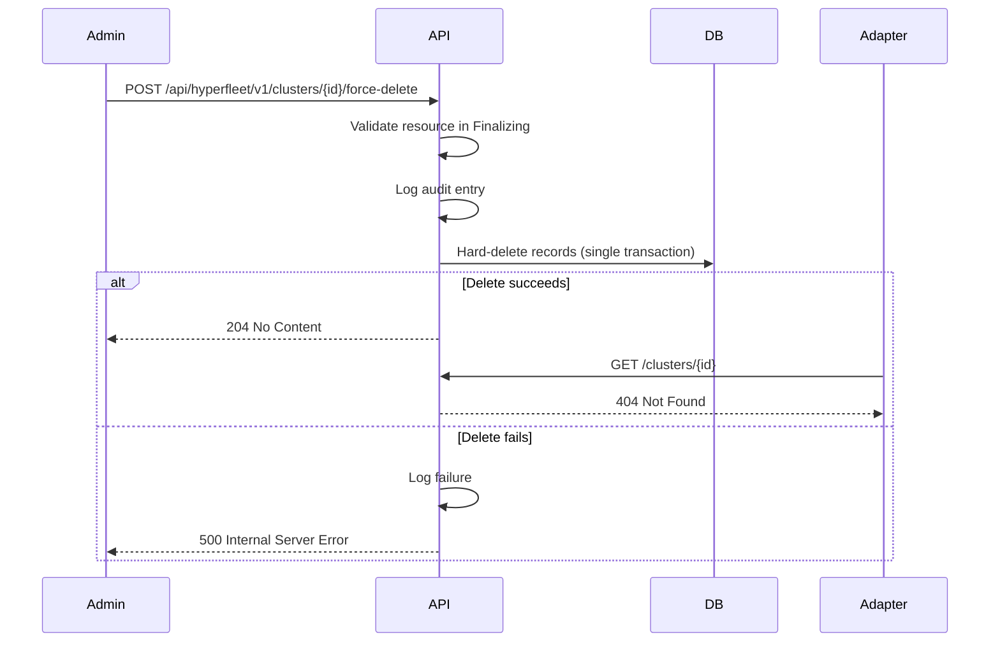

# Force Deletion Design

**Jira**: [HYPERFLEET-895](https://redhat.atlassian.net/browse/HYPERFLEET-895)

**Related**:
- [Adapter Deletion Flow Design](../components/adapter/framework/adapter-deletion-flow-design.md)
- [Hard Delete Design](../components/api-service/hard-delete-design.md)
- [ADR 0013 — Force Delete Scope: Database-Only](../adrs/0013-force-delete-scope-db-only.md)

---

## Table of Contents

- [Problem Statement](#problem-statement)
- [API Contract for Force Delete](#api-contract-for-force-delete)
- [Database Impact](#database-impact)
- [Cascade Semantics for Resource and Subresource Deletion](#cascade-semantics-for-resource-and-subresource-deletion)
- [Interaction with Normal Delete Flow](#interaction-with-normal-delete-flow)
- [Timeout and Stuck Detection Ownership](#timeout-and-stuck-detection-ownership)
- [Audit Logging Approach](#audit-logging-approach)
- [Trade-offs](#trade-offs)
- [Alternatives Considered](#alternatives-considered)

---

## Problem Statement

The existing deletion flow ([Adapter Deletion Flow Design](../components/adapter/framework/adapter-deletion-flow-design.md)) relies on all adapters confirming cleanup (`Finalized=True`) before the API hard-deletes records. If an adapter is stuck, unreachable, or permanently unable to clean up its resources, the resource remains in `Finalizing` state indefinitely with no recovery path.

Force deletion must provide an escape hatch that allows operators to hard-delete resource and subresource records from the database when the normal deletion flow is blocked.

---

## API Contract for Force Delete

Force delete is a synchronous API action. The API immediately hard-deletes records from the database, bypassing the `Reconciled=True` gate.

`POST /api/hyperfleet/v1/clusters/{id}/force-delete`
`POST /api/hyperfleet/v1/clusters/{cluster_id}/nodepools/{nodepool_id}/force-delete`

Force delete follows the standard `/api/hyperfleet/{version}/` convention (see [API Versioning](../components/api-service/api-versioning.md)) as a custom action on a versioned resource.

The resource must already be in `Finalizing` state (`deleted_time` set), meaning a normal `DELETE` was issued first. Force delete is an escalation for stuck deletions, not a replacement for normal delete. The API rejects force delete on resources that are not in `Finalizing`.

The request body requires a `reason` field explaining why the admin is force-deleting. See [Audit Logging Approach](#audit-logging-approach).

Response codes:

- `204 No Content`: force delete succeeded, records removed
- `400 Bad Request`: missing or empty `reason` in request body
- `404 Not Found`: resource does not exist (already deleted or invalid ID)
- `409 Conflict`: resource is not in `Finalizing` state
- `500 Internal Server Error`: delete failed due to unexpected server error

All error responses follow the [HyperFleet Error Model](../standards/error-model.md) (RFC 9457 Problem Details format).

---

## Database Impact

No new columns or tables. Force delete removes the same records as normal hard-delete (adapter statuses, subresources, then the resource) in a single transaction without waiting for `Reconciled=True`. Despite bypassing the Reconciled gate, the API code enforces the same bottom-up deletion ordering within the transaction. `ON DELETE RESTRICT` on foreign keys acts as a safety net, not the primary enforcement mechanism (see [Hard Delete Design](../components/api-service/hard-delete-design.md)).

---

## Cascade Semantics for Resource and Subresource Deletion

Force-deleting a resource also removes all its subresources and their adapter statuses in the same transaction, using bottom-up ordering (e.g., force-deleting a Cluster removes adapter statuses and NodePool records before the Cluster itself).

Force delete also works on individual subresources. For example, a single stuck NodePool and its adapter statuses can be force-deleted without affecting the Cluster or other NodePools.

---

## Interaction with Normal Delete Flow

Force delete requires no changes to Sentinel's polling or event publishing. Once records are removed from the DB, Sentinel has nothing to poll.

Adapters may receive events for resources that have been force-deleted. When an adapter tries to GET the resource as a precondition or PUT its status back to the API, the API returns 404. Adapters must handle this gracefully (log and move on, do not retry).

---

## Timeout and Stuck Detection Ownership

Force delete is always manually triggered by an admin. There is no automatic escalation from normal delete to force delete.

The API owns stuck detection via deletion observability metrics and alerts. To identify specific stuck resources, operators query the API via TSL filtering on `deleted_time`.

---

## Audit Logging Approach

The API logs a structured log entry before hard-deleting records, following the [Logging Specification](../standards/logging-specification.md). The log entry includes the caller identity, resource ID, resource type, timestamp, subresources being removed, and adapter statuses at time of force delete. If the delete fails, the API logs the failure with the error.

The force-delete endpoint requires a `reason` in the request body. The reason is included in the audit log entry, recording why the admin chose to force-delete.

---

## Trade-offs

### What We Gain

- Recovery path for resources stuck in `Finalizing` indefinitely

### What We Lose / What Gets Harder

- K8s resources managed by adapters may be orphaned if adapters did not finish cleanup before force delete. Force delete is scoped to DB records only and does not attempt infrastructure cleanup. See [ADR 0013 — Force Delete Scope: Database-Only](../adrs/0013-force-delete-scope-db-only.md) for the full decision and extension path.
- Audit trail for force-delete actions depends on log retention, which the team does not control. If logs expire before an incident investigation, the record of when and why a force-delete occurred is lost.

### Acceptable Because

- Force delete is a privileged, manual operation. The admin accepts the consequences when they invoke it.
- Orphaned K8s resources can be cleaned up manually. If orphaned infrastructure becomes a recurring problem, the design can be extended with a dedicated cleanup endpoint or cleanup adapter/controller without changing the existing force-delete API contract (see [ADR 0013](../adrs/0013-force-delete-scope-db-only.md#extension-path)).
- Force-delete is expected to be rare (manual escape hatch for stuck deletions). Structured logging with the required `reason` field provides sufficient auditability for the expected volume. If log-based audit proves insufficient, the design can be extended with a dedicated audit table that the team controls, without changes to the API contract.

---

## Alternatives Considered

### DeletionStuck Condition via Sentinel

**What**:
- When a resource exceeds a configurable deletion timeout, Sentinel POSTs a `DeletionStuck=True` condition to the resource's `status.conditions` via the API. Operators search for stuck resources via TSL: `GET /clusters?search=status.conditions.DeletionStuck='True'`.

**Why Rejected**:
- Sentinel is read-only by design. It polls the API and publishes CloudEvents. Adding write capabilities changes Sentinel from observer to actor, violating single-responsibility (see [ADR 0012](../adrs/0012-hard-delete-mechanism-after-adapter-reconciliation.md)).
- The API-owned deletion observability metrics and TSL filtering on `deleted_time` provide equivalent operator visibility without changing Sentinel's role.

### Per-Adapter Skip Annotations

**What**:
- An annotation (`hyperfleet.io/skip-cleanup-ADAPTER_NAME`) on a resource tells the system to skip a specific adapter during the normal deletion flow, allowing the remaining adapters to finalize while bypassing the stuck one.

**Why Rejected**:
- Force delete already covers the "adapter is stuck" scenario. The skip flag adds a middle ground (skip one, wait for the rest) that touches API, Sentinel, and the adapter framework for a narrow case.
- If the healthy adapters are running, they handle 404s gracefully when a force-deleted resource disappears. The practical difference between letting them finish cleanup and force-deleting while they no-op on 404 is minimal.
- Keeping deletion binary (normal waits for all, force bypasses all) is simpler to reason about and implement.

### Separate `/admin/` Endpoint Path

**What**:
- Expose force-delete under a dedicated `/admin/clusters/{id}/force-delete` path, outside the versioned `/api/hyperfleet/{version}/` convention.

**Why Rejected**:
- Introduces a second routing convention to maintain alongside the existing versioned API.
- Force-delete is still an operation on a HyperFleet resource. Placing it outside `/api/hyperfleet/` implies it is not part of the API.

### Hybrid `/api/hyperfleet/v1/admin/` Path

**What**:
- Nest an `admin` segment inside the versioned path: `/api/hyperfleet/v1/admin/clusters/{id}/force-delete`.

**Why Rejected**:
- `admin` in the path breaks the convention that path segments represent resources or collections, creating ambiguity about what `admin` refers to.

### Action-Prefixed Endpoint (`admin-force-delete`)

**What**:
- Embed the access level in the action name: `/api/hyperfleet/v1/clusters/{id}/admin-force-delete`.

**Why Rejected**:
- Mixes access control with the action name. The action should describe what it does, not who can call it.

### Async Force Delete

**What**:
- Admin calls the delete endpoint with `?force=true`.
- Instead of immediately hard-deleting, the API sets a `force_delete` signal on the resource in the DB.
- Sentinel polls, detects the change, publishes an event.
- Adapters receive the event, skip or attempt cleanup, report `Finalized=True` back to the API.
- API sees `Reconciled=True` and hard-deletes the records.
- A variation adds a timeout: if adapters do not respond, a background job in the API hard-deletes the records anyway.

**Why Rejected**:
- If adapters are reachable, the async path round-trips through Sentinel and adapters only to report `Finalized=True`. The records get hard-deleted either way.
- If adapters are unreachable, the async path is blocked for the same reason as normal deletion.
- The timeout variation requires code changes in all three components (API, Sentinel, adapters) instead of just the API, a background job in the API to monitor expired timeouts, and still needs sync hard-delete as a fallback.

