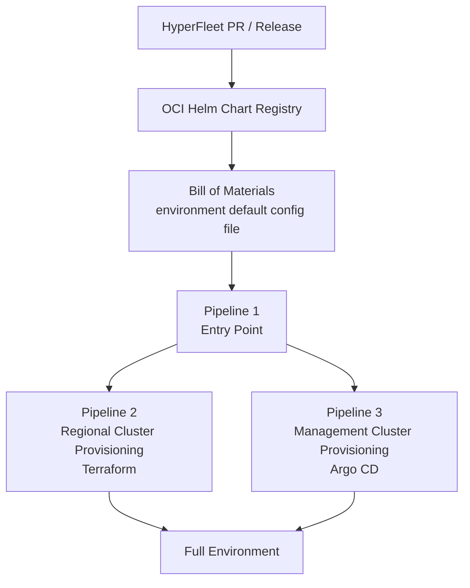
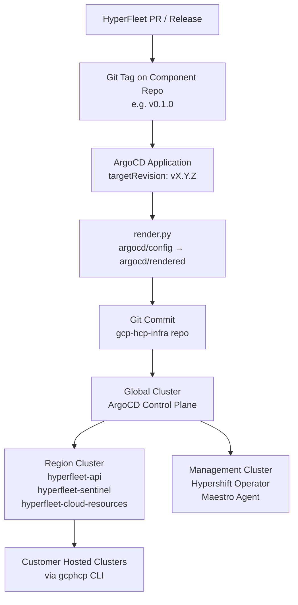

# HyperFleet Release Contract

## What & Why

### What

This document defines the formal release contract between the HyperFleet team and its consumer teams (GCP Offering Team and ROSA Regional Platform Team). It covers:

- **Release handoff contract**: what artifacts are produced, how consumers are notified, and what SLAs apply
- **Integration testing strategy**: how each team gates HyperFleet changes and how tests are coordinated across teams
- **Test ownership map**: which team owns which layer of testing to eliminate redundancy and close coverage gaps

### Why

- Without a defined contract, release handoffs are ad-hoc and require manual coordination between teams, slowing delivery and increasing error risk
- Unclear test ownership creates either coverage gaps (bugs reaching production) or overlapping test suites (longer pipelines without benefit)
- Consumer teams deploying HyperFleet via Argo CD and Terraform need predictable, machine-consumable artifacts (OCI Helm charts) to automate rollout
- A shared testing strategy is required before building confidence in continuous delivery pipelines end-to-end

### Out of scope

- No automated deployment of HyperFleet releases to consumer integration environments

---

## Consumer Teams

| Team | Platform | Deployment Method |
|------|----------|-------------------|
| GCP Offering Team | GCP | Argo CD + Terraform + Tekton Pipelines |
| ROSA Regional Platform | AWS ROSA | Argo CD + Terraform + AWS CodePipelines |

### ROSA Platform Architecture

The ROSA regional platform consumes HyperFleet as part of a GitOps deployment pipeline. Each deployment initiates three pipelines:

Environment configuration is centralized in a `default` file that acts as the bill of materials for Argo CD reconciliation. Component versions, Git revisions, and domain names are defined there and can be overridden per environment.

### GCP Platform Architecture

The GCP platform uses a **three-tier multi-region model**: a single global control plane manages one or more region clusters, each of which may host one or more management clusters for Hypershift-based customer control planes.

HyperFleet is deployed as three ArgoCD applications on each region cluster:

| Application | Source | Version Pinning |
|-------------|--------|-----------------|
| `hyperfleet-api` | `github.com/openshift-hyperfleet/hyperfleet-api` | Git tag (`targetRevision: vX.Y.Z`) |
| `hyperfleet-sentinel` | `github.com/openshift-hyperfleet/hyperfleet-sentinel` | Git tag (`targetRevision: vX.Y.Z`) |
| `hyperfleet-cloud-resources` | `gcp-hcp-infra` repo (local Helm chart) | Repository revision — provisions GCP Pub/Sub topics and IAM bindings |

Versions are hardcoded in ArgoCD Application manifests under `argocd/config/region/{app}/template.yaml`. Updating a HyperFleet version requires editing that file, re-rendering with `uv run argocd/scripts/render.py`, and committing — ArgoCD then auto-syncs.

GCP-specific infrastructure (Pub/Sub topics and subscriptions, IAM bindings for Sentinel) is deployed by `hyperfleet-cloud-resources` ahead of the HyperFleet applications (sync wave −5 vs wave 0) using Config Connector managed by Argo CD.

Integration tests run as **Tekton Pipelines on-cluster** (no Prow or GitHub Actions). The `gcp-region-e2e-pipeline` pipeline provisions a full GCP environment via Terraform, verifies ArgoCD sync on both region and management clusters, and optionally runs hosted cluster lifecycle tests (`hostedcluster-e2e` task). A nightly CronJob triggers this pipeline at 02:00 UTC against the `main` branch. Cleanup always runs in a finally block, deleting the ephemeral GCP project and clearing Terraform state.

---

## Release Handoff Contract

### Release Artifacts

For each HyperFleet release, the following artifacts are produced and made available to consumer teams:

| Artifact | Location | Format | Notes |
|----------|----------|--------|-------|
| Container images | `quay.io/openshift-hyperfleet/hyperfleet-{component}:{version}` | OCI image | Built automatically by Prow on GA tag |
| Helm charts | OCI registry (see [Helm Chart Distribution](#helm-chart-distribution)) | OCI artifact | Required for ROSA/Argo CD consumption |
| Release notes | `hyperfleet-release` repo, `releases/release-X.Y/` | Markdown | Compatibility matrix, breaking changes, upgrade guide |
| Compatibility matrix | `hyperfleet-release` repo | Markdown table | Maps validated component version combinations |
| Git tags | Per-component repos + `hyperfleet-release` | `vX.Y.Z` / `release-X.Y` | See [Release Process](hyperfleet-release-process.md) |

When a GA release is published, it will have detail of which ROSA/GCP versions have passed the integration tests to use as compatibility matrix. This allows to potentially introduce a breaking change in one release, that may be only deployable by another pillar.

### Helm Chart Distribution

**Current state**: ROSA consumes HyperFleet charts via Argo CD ApplicationSets that point directly to GitHub repos with a pinned `targetRevision` Git tag (e.g., `targetRevision: v0.1.1` on `https://github.com/openshift-hyperfleet/hyperfleet-adapter`). A freshly configured Argo CD instance does not support Git-sourced Helm charts without a plugin, which ROSA has not installed. This creates a tight coupling between HyperFleet Git tags and ROSA's deployment cadence.

**Agreed path**:

1. **Short-term (Q2 2026)**: ROSA team sets up a temporary OCI registry to publish HyperFleet Helm charts. This unblocks integration testing immediately.
2. **Q2 target**: HyperFleet team publishes charts to an OCI-compliant registry via Conflux as part of the release pipeline, eliminating the temporary workaround and the Git coupling.

### Notification SLA

When a HyperFleet GA release is published:

| Event | Channel | Timeline | Recipients |
|-------|---------|----------|------------|
| Release candidate available | `#hyperfleet-releases` Slack | RC cut day | GCP team, ROSA team |
| GA release published | `#hyperfleet-releases` Slack | GA day | GCP team, ROSA team |
| Breaking change in next release | `#hyperfleet-releases` Slack | ≥ 1 sprint before GA | GCP team, ROSA team |
| Hotfix / patch release | `#hyperfleet-releases` Slack | Within 2 hours of GA tag | GCP team, ROSA team |

At this point in time (April 26) breaking changes are not blockers to HyperFleet releases as ROSA/GCP teams do not have to keep long running clusters and migrate data.

### Rollback / Recovery

HyperFleet uses a **roll-forward** strategy for MVP: issues are fixed via patch releases rather than rollback. See [Release Process — Release Recovery Strategy](hyperfleet-release-process.md#55-release-recovery-strategy).

HyperFleet commits to (exact times TBD):

- Producing a patch release within **48 hours** for Blocker/Critical regressions
- Producing a patch release within **1 week** for Major regressions
- Maintaining N-1 backward compatibility so consumer teams can remain pinned to the previous validated release while a fix is in flight

---

## Integration Testing Strategy

### Decision: Nightly Runs with OCI Chart Injection

**Agreed approach** (as of March 31, 2026 meeting):

- Start with **nightly runs** against HyperFleet `main` branch, not presubmit jobs
- Test against the **latest known-good stable version** of the ROSA regional platform (production Maestro version), replacing only the HyperFleet component under test
- The ROSA team will **temporarily enable OCI chart pushing** so the HyperFleet team can inject PR-built charts into the ROSA deployment pipeline
- Evaluate **non-blocking presubmit** integration with the HyperFleet release repository as a follow-up

**Rationale**: Running full ROSA environment provisioning (~40 minutes + E2E duration) as a presubmit would significantly impact development velocity without proportional benefit at the current team scale. Nightly runs provide meaningful feedback without blocking day-to-day development.

**Note on ROSA's existing pre-merge capability**: The ROSA repo already has a working cross-component E2E pre-merge mechanism (triggered via Prow comment on PRs). The decision to start with nightly runs is about HyperFleet's readiness to onboard to that mechanism — not a limitation of the ROSA infrastructure. Per-PR testing remains the target once the OCI chart injection step is stable.

### Team Test Ownership

| Layer | Owner | Scope | Runs on |
|-------|-------|-------|---------|
| Unit tests | HyperFleet | Each component in isolation | Every PR (presubmit) |
| Integration tests | HyperFleet | Cross-component API contracts | Every PR (presubmit) |
| HyperFleet E2E | HyperFleet | HyperFleet stack end-to-end | Nightly (main branch) |
| ROSA integration | ROSA Team | Full ROSA region + HyperFleet override | Nightly (HyperFleet main) |
| GCP integration | GCP Team | GCP deployment + HyperFleet | Nightly (HyperFleet main) via Tekton `gcp-region-e2e-pipeline` |
| Release gate | HyperFleet | All of the above must pass | Before GA tag |

### Testing Gaps Identified

| Gap | Owning Team | Mitigation |
|-----|-------------|------------|
| HyperFleet not yet onboarded to ROSA's pre-merge E2E mechanism | HyperFleet | Onboard to `openshift/release` Prow config + create `quay.io/rrp-dev-ci/` image repos (see onboarding steps above) |
| Helm chart override (OCI) not yet wired into ROSA CI | ROSA + HyperFleet | Temporary OCI setup by ROSA team (Q2 2026, immediate action); replaced by Conflux Q2 target |
| GCP integration tests not yet publishing chart overrides into HyperFleet CI | GCP + HyperFleet | Blocked on GCP-334 (CLM/Argo CD integration in progress); nightly Tekton pipeline already exists but consumes pinned tags, not PR-built charts |
| Multi-component PR testing (API + Adapter in same PR) | HyperFleet | Nightly tests use `main` for all other components; single-component override per nightly run is the starting point |
| Presubmit integration gate for HyperFleet release repo | HyperFleet | Future action: non-blocking presubmit on `hyperfleet-release` repo |

---

## Alternatives Considered

### 1. Non-blocking Presubmit on HyperFleet Release Repository

Run the full ROSA integration pipeline as an optional, non-blocking presubmit job triggered on the `hyperfleet-release` repo.

**Rejected for now**: A ~40-minute+ non-blocking job provides weak signal — developers may ignore it, especially if failures are infrequent. Starting with nightly runs builds confidence in the pipeline before promoting it to presubmit. This remains a **future action**.

### 2. Consumer-Driven Contract Testing (Pact-style)

Define formal API contracts using a consumer-driven contract testing tool (e.g., Pact). ROSA and GCP publish their expectations; HyperFleet CI verifies them on every PR.

**Rejected for MVP**: The integration surface between HyperFleet and consumer teams is primarily at the Helm chart / deployment configuration level, not a REST API contract boundary. Consumer-driven contract testing tools are better suited to service-to-service REST contracts. Helm value schema validation is a lighter-weight alternative to investigate post-MVP.

### 3. Automated Rollout to Integration Environments on GA

Trigger automatic deployment of each HyperFleet GA release to ROSA and GCP integration environments via webhooks.

**Rejected for MVP**: ROSA's pipeline takes ~40 minutes per run and requires environment-specific configuration overrides. Automating this safely requires tooling (OCI charts via Conflux, pipeline webhooks) not yet in place. Deferred to post-Q2 2026.

---

## Related Documents

- [HyperFleet Release Process](hyperfleet-release-process.md) — release cadence, branching, artifacts
- [Versioning Trade-offs](versioning-trade-offs.md) — SDK versioning, rollback considerations
- [E2E Testing Framework Spike Report](e2e-testing/e2e-testing-framework-spike-report.md)
- [E2E Run Strategy Spike Report](e2e-testing/e2e-run-strategy-spike-report.md)
- [ROSA — Adding a Component for Pre-merge E2E Testing](https://github.com/openshift-online/rosa-regional-platform/blob/main/docs/adding-component-pre-merge.md) — onboarding guide for the `/test rosa-regionality-compatibility-e2e` Prow trigger
- [ROSA — Testing Strategy Design](https://github.com/openshift-online/rosa-regional-platform/blob/main/docs/design/testing-strategy.md) — three CI workflows (pre-merge, nightly integration, nightly ephemeral)
- GCP-334 — CLM Components Deployment (linked Jira epic)
- HYPERFLEET-633 — Define release contract and integration testing strategy
