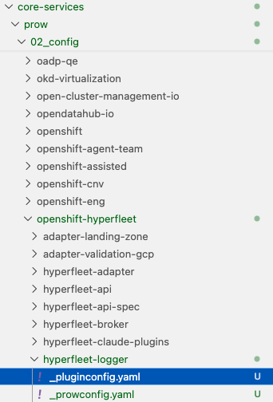

# Onboarding a New Component for Testing and Merge Automation
This document provides an overview of the workflow for onboarding new public component repositories to the Openshift CI. 

**Metadata**
- **Date:** 2025-12-23
- **Authors:** Ying Zhang


## Granting Robots Privileges
In order to add labels, move PRs and issues into milestones, merge PRs, etc., the robots will need write access to your repository.

There is a team named  **automation-bots** created that has added bot **openshift-ci-robot** and **openshift-merge-robot**. The two bots are using to handle CI jobs triggering and code merging behaviors. For the repositories under **openshift-hyperfleet** organization they just need to added team **automation-bots** to grant the same permission for the two bots. And if it has already been done by referring to the [repository-creation-guidelines.md](../docs/repository-creation-guidelines.md) when create the new repository just skip the above step.

**Note**
 - If your component repository is not in the **openshift-hyperfleet** Github organization, you can refer to the guidance [Granting Robots Privileges and Installing the GitHub App](https://docs.ci.openshift.org/docs/how-tos/onboarding-a-new-component/#granting-robots-privileges-and-installing-the-github-app) to grant robots premission


## Prow Configuration
### 1. Bootstrap the Prow configuration

[Prow](https://docs.prow.k8s.io/docs/overview/) is the k8s-native upstream CI system, source code hosted in the kubernetes-sigs/prow repository. Prow interacts with GitHub to provide the automation UX that developers use on their pull requests, as well as orchestrating test workloads for those pull requests.

From the root of the [openshift/release](https://github.com/openshift/release) repository, run the following target and use the interactive tool to bootstrap a configuration for your repository:
  ```bash
  make new-repo
  ```
This will place a new **_pluginconfig.yaml** file in the **/core-services/prow/02_config/$org/$repo** directory. This file is used to configure the specific plugins for your repository.

### 2. Setting Up Team Ownership

If your repository does not have **OWNERS** files, you will not be able to opt into the /approve process or automatic pull request review assignment. **OWNERS** file format and interaction details can be found [upstream](https://docs.prow.k8s.io/docs/components/plugins/approve/approvers/).

After creating the **OWNERS** file in your new repository when preparing the new repository via [repository-creation-guidelines.md](../docs/repository-creation-guidelines.md), copy it to the **/core-services/prow/02_config/$org/$repo** directory

## Detailed steps

<details>
<summary>Cmd "make new-repo" interactive mode step by step</summary>

```bash
make new-repo
false || podman pull --platform linux/amd64 quay.io/openshift/ci-public:ci_repo-init_latest
Trying to pull quay.io/openshift/ci-public:ci_repo-init_latest...
Getting image source signatures
Copying blob sha256:ba43106cd07089f95e6d0b5bbf7b7556fccce4ce0fc50e2d5a6b4adabd12b074
Copying blob sha256:46a9484471e55e0e501c08ff903616330af0505ba749ef70e8c87e103e07844a
Copying config sha256:3f60382c63fffb91f15cc9bc815ece77915d5c81a84c31e23580140500b37210
Writing manifest to image destination
3f60382c63fffb91f15cc9bc815ece77915d5c81a84c31e23580140500b37210
podman run --platform linux/amd64  --rm -it -v "/Users/yingzhan/ying-work/code/release:/release" quay.io/openshift/ci-public:ci_repo-init_latest --release-repo /release
Welcome to the repository configuration initializer.
In order to generate a new set of configurations, some information will be necessary.

Let's start with general information about the repository...
Enter the organization for the repository: openshift-hyperfleet
Enter the repository to initialize: hyperfleet-logger
Enter the development branch for the repository: [default: main] 

Now, let's determine how the repository builds output artifacts...
Does the repository build and promote container images?  [default: no] 

Now, let's configure how the repository is compiled...
What version of Go does the repository build with? [default: 1.13] 
[OPTIONAL] Enter the Go import path for the repository if it uses a vanity URL (e.g. "k8s.io/my-repo"): 
[OPTIONAL] What commands are used to build binaries in the repository? (e.g. "go install ./cmd/...") 
[OPTIONAL] What commands are used to build test binaries? (e.g. "go install -race ./cmd/..." or "go test -c ./test/...") 

Now, let's configure test jobs for the repository...

First, we will configure simple test scripts. Test scripts
execute unit or integration style tests by running a command
from your repository inside of a test container. For example,
a unit test may be executed by running "make test-unit" after
checking out the code under test.

Are there any test scripts to configure?  [default: no] yes
What is the name of this test (e.g. "unit")?  unit
What commands in the repository run the test (e.g. "make test-unit")?  make test     
Are there any more test scripts to configure?  [default: no] no

Next, we will configure end-to-end tests. An end-to-end test
executes a command from your repository against an ephemeral
OpenShift cluster. The test script will have "cluster:admin"
credentials with which it can execute no other tests will
share the cluster.

Are there any end-to-end test scripts to configure?  [default: no] no

Repository configuration options loaded!
In case of any errors, use the following command to re-
create this run without using the interactive interface:

/usr/bin/repo-init --release-repo /release --config="{\"org\":\"openshift-hyperfleet\",\"repo\":\"hyperfleet-logger\",\"branch\":\"main\",\"base_images\":null,\"images\":null,\"canonical_go_repository\":\"\",\"promotes\":false,\"promotes_with_openshift\":false,\"needs_base\":false,\"needs_os\":false,\"go_version\":\"1.13\",\"build_commands\":\"\",\"test_build_commands\":\"\",\"tests\":[{\"as\":\"unit\",\"from\":\"src\",\"command\":\"make test\"}],\"custom_e2e\":null,\"release_type\":\"\",\"release_version\":\"\",\"operator_bundle\":null}"

Updating Prow configuration ...

Updating Prow plugin configuration ...
......
/Library/Developer/CommandLineTools/usr/bin/make boskos-config
cd core-services/prow/02_config && ./generate-boskos.py
```
</details>

The command generates the Prow configuration files automatically under **$org/$repo** as shown below:


Additionally, the command generates a test configuration file at ci-operator/config/$org/$repo/$org-$repo-$branch.yaml. This file configures test presubmit jobs, which are covered in detail in hyperfleet/test-release/add-prow-presubmit-jobs.md. If you only want to enable Prow configuration without tests, you can delete this file and configure it later.

Here are some useful configuration options for the approve plugin that you may want to customize for your repository. You can update these settings in the _pluginconfig.yaml file generated after running **make new-repo**:

```yaml
approve:
- commandHelpLink: https://go.k8s.io/bot-commands
  lgtm_acts_as_approve: true  # An approver's /lgtm is simultaneously interpreted as an /approve
  repos:
  - openshift-hyperfleet/hyperfleet-api
  require_self_approval: true # Even if the author is a approver in OWNER, their /approve command is ignored for their own PR.
```

Here is the example to enable the Prow configures (You can set it in one PR)
 - [Enable the prow configures](https://github.com/openshift/release/pull/72693/files)
 - [Set the lgtm_acts_as_approve to true](https://github.com/openshift/release/pull/72902/files)

## References

For more detailed information, refer to the official OpenShift CI documentation:
- [Onboarding a New Component](https://docs.ci.openshift.org/docs/how-tos/onboarding-a-new-component/)